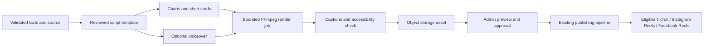

# Content, variants and video strategy

Design record, 2026-10-03. The [engineering blueprint](ENGINEERING_BLUEPRINT.md) defines the implementation contracts; this document preserves the editorial intent. Nothing here authorizes automatic publication today.

## Shared principles

AuditGava explains Kenyan public finance in clear, nonpartisan language. Every financial claim must trace to structured facts, reporting period, unit, accounting basis, source and publication status. Generated wording must not invent amounts, percentages, dates, entities or audit conclusions. “Unsupported expenditure” is not synonymous with proven theft. Audit opinion and finding severity are distinct concepts.

Use exact typed quantities/Decimal calculations before wording generation. Store facts separately from copy. A reviewer sees the source and derived calculation alongside the draft. A refreshed source can invalidate scheduled content; dispatch rechecks freshness and approval against the immutable revision.

## Repeatable content categories

“Automatable” below means deterministic preparation is feasible. Initial publication still follows human approval. Any later auto-approval requires an explicit low-risk policy and measured quality history.

| Category | Example with placeholders, not real claims | Production approach |
|---|---|---|
| New dataset available | “FY {year} expenditure data for {county} is now available.” | Deterministic after successful commit, completeness and source checks; future low-risk auto-approval candidate |
| Coverage expansion | “You can now explore {count} additional source reports for {period}.” | Deterministic counts of newly published eligible records; semantic deduplication |
| Routine dataset refresh | “The {dataset} page now includes figures published on {source_date}.” | Deterministic, only if change is meaningful; no post for a no-op ETL run |
| Methodology/data correction notice | “We corrected {field/basis}; the change and original source are documented.” | Generated draft requiring human approval; do not silently replace past claims |
| Debt update | “Reported public debt changed by KSh {amount} between {comparable_dates}.” | Fact-bound draft; require comparable valuation dates, exchange-rate/basis checks and approval |
| Budget/expenditure update | “{entity} reported spending {share}% of its {basis} budget for {period}.” | Validate numerator/denominator and reporting period; approval |
| Audit finding | “The Auditor-General reported {finding}, concerning KSh {amount}, for {entity/period}.” | Approval always initially; cite original finding and avoid allegations beyond source |
| County comparison | “Compare {county_a} and {county_b} for the same reporting period.” | Approval; verify comparable scope, denominators and completeness, avoid misleading league tables |
| Pending bills / project progress | Explain published changes and what is still uncertain | Approval; distinguish stocks from flows and planned from paid/completed |
| Explainer / glossary | “What does an adverse audit opinion mean?” | Reviewed evergreen template; later template-based scheduling after periodic editorial review |
| How to use AuditGava | “Find the original report behind a chart in three steps.” | Template or manual editorial content; verify current UI |
| Data quality / missing evidence | “What this dataset can and cannot tell us.” | Editorial; transparency about uncertainty, not generated certainty |
| Release / feature announcement | New datasets, accessible charts, fiscal years or product tools | Draft from an actual released change; avoid announcing unmerged work |
| Weekly digest | Three significant verified updates, with links | Rank deterministically, draft wording, human review; avoid duplicating daily posts |
| Public-finance calendar | Explain a verified reporting milestone or document release | Editorial verification of dates; do not infer deadlines from old calendar years |

Manual editorial content also includes interviews, corrections, policy-context commentary and sensitive findings. The system should not generate partisan targeting or content optimized primarily for outrage. Posting volume is subordinate to accuracy.

## One fact package, different presentations

Shared fields: source event identity/version, structured facts, canonical AuditGava URL, evidence references, verified calculation, content type, materiality and freshness. Platform overrides change presentation; they must not change the underlying factual claim without creating a new reviewed revision.

| Platform | Default treatment |
|---|---|
| Facebook | Brief headline plus useful context and source link; image/chart when helpful; organization Page destination |
| Instagram | Readable visual card/carousel or Reel, supporting caption and platform-appropriate link-in-profile call to action; no text-only feed fallback |
| Threads | Concise sourced update or short sequence where supported; links can carry the reader to the full evidence |
| X | Short variant respecting weighted text/link rules; one useful link; paid API budget explicitly considered |
| TikTok | Captioned vertical explainer or eligible photo format; use approved route and required creator controls/consent |

The master body/media/hashtags are inherited unless a target explicitly overrides them. “Reset to master” removes the override. Blank intentionally and inherit are different states. UI validation must never silently truncate a financial claim or drop a source citation to make a platform fit.

Use canonical article/data links. Apply consistent `utm_source`, `utm_medium=social` and a stable campaign/content identifier only where links are usable and analytics can consume them. Avoid personal identifiers and unnecessary long URLs. Instagram/TikTok captions should not promise universally clickable external links. Hashtags remain restrained and independently customizable per platform.

## Graphics and accessibility

Charts/cards should include units, fiscal period, source label, comparison basis and an AuditGava reference. Use the existing brand and truthful scales; label provisional/modelled values. Preserve an accessible text summary and alt text where the API supports it. If alt text cannot be sent through a provider, record the limitation rather than pretending it was published.

Reusable template concepts: national debt update; county audit finding; budget versus spending; new report; glossary explainer; weekly digest. Begin with a small reviewed template set. Keep the facts-to-template mapping deterministic and versioned. No template marketplace or elaborate design editor is required initially.

## Lightweight video proposal

Target format: **15–45 seconds, vertical 9:16**, legible captions, calm delivery, one defensible idea. A source card and end card lead back to AuditGava. This is a later project, not a prerequisite for the manual composer.

Start with programmatic charts/Pillow or SVG cards plus FFmpeg composition and caption files. Reuse an existing renderer only after checking deployment resources, maintenance and licensing. Template rendering avoids a paid video-generation subscription; voice/model usage can still have costs. Voiceover is optional—clear captions and graphics can provide a zero-model-cost first version.

Render asynchronously with time/memory/concurrency limits, input validation, deterministic asset/version IDs and a preview. Review final encoded output, not just the script. Cache reusable cards and use one original plus compatible derivatives. Never render inside a public API request. Retain source/script/caption provenance; object storage holds the binary.

Scheduling and publication use the same target engine as manual posts. Video processing can remain pending at a platform after upload. A successful upload is not proof of public availability. Keep publication status polling/reconciliation and manual fallback for routes that do not authorize unattended publishing.

Before video implementation, approve a media-egress/storage budget and hosting location. See the [low-cost profile](LOW_COST_OPERATING_PROFILE.md); free database headroom is not a free unlimited video CDN.
