# AuditGava social publishing: engineering blueprint

**Status:** proposed engineering blueprint; the admin visual direction was approved. Design and research, not an implemented system.
**Research date:** 2026-10-03.
**Repository baseline inspected:** `629a5bdac87e75d00b5132957a389e966045e6fa`, plus the then-current working files.
**Audience:** future human maintainers, Codex agents, Claude agents and other implementation agents.

The user authorized saving this documentation after the design-only audit. This document does **not** authorize implementation, migrations, dependency installation, deployment changes, OAuth connections, live publications or interference with other workstreams. Those require the scope of the later implementation task. The repository contained unrelated active changes during inspection; file observations are not proof of the deployed configuration.

This is the durable specification previously discussed in chat. It includes the decisions, contracts, failure semantics, diagrams, UI wireframes and phased handoff needed to implement without relying on chat history. Current platform limits must be rechecked before each adapter is enabled. An available endpoint is not evidence that AuditGava has permission to use it.

The companion [Supabase egress investigation](../infrastructure/supabase-egress/README.md) is the supplemental operational analysis. The [low-cost operating profile](LOW_COST_OPERATING_PROFILE.md) governs cost-sensitive polling, storage and telemetry choices where it amends this baseline. Do not infer database capacity or current traffic from this blueprint alone.

## Contents

1. [Executive decision](#1-executive-decision)
2. [Existing architecture audit](#2-existing-architecture-audit)
3. [Reuse and gaps](#3-reuse-and-gaps)
4. [Alternatives and dependencies](#4-alternatives-and-dependencies)
5. [Target boundaries](#5-target-boundaries)
6. [Domain and inheritance](#6-domain-and-inheritance)
7. [Database specification](#7-database-specification)
8. [State machines](#8-state-machines)
9. [Scheduler and concurrency](#9-scheduler-and-concurrency)
10. [Adapter contracts](#10-adapter-contracts)
11. [Platform capabilities](#11-platform-capabilities)
12. [OAuth and security](#12-oauth-and-security)
13. [Media architecture](#13-media-architecture)
14. [Manual publishing and composer](#14-manual-publishing-and-composer)
15. [Generated content and provenance](#15-generated-content-and-provenance)
16. [Future automation](#16-future-automation)
17. [API specification](#17-api-specification)
18. [UI wireframes](#18-ui-wireframes)
19. [Failure, retry and duplicate protection](#19-failure-retry-and-duplicate-protection)
20. [Audit and observability](#20-audit-and-observability)
21. [Deployment and cost](#21-deployment-and-cost)
22. [Content, graphics and video strategy](#22-content-graphics-and-video-strategy)
23. [Implementation phases](#23-implementation-phases)
24. [Testing and acceptance](#24-testing-and-acceptance)
25. [Parallel-agent handoff](#25-parallel-agent-handoff)
26. [Decision record and unresolved gates](#26-decision-record-and-unresolved-gates)
27. [Explicit answers and quality gate](#27-explicit-answers-and-quality-gate)

## 1. Executive decision

Build the publishing workflow inside the existing Python application. PostgreSQL is the durable source of truth. A small dedicated Python worker calls official social APIs through AuditGava-owned adapters. The existing Next.js admin provides composition, previews, approval, scheduling and result inspection.

**No Redis, Celery deployment, paid scheduling service or separate application database is required for the anticipated volume.** Use maintained libraries for HTTP, OAuth, encryption and media processing rather than writing those primitives ourselves.

The supplied Social SDK is **not** the foundation. The inspected package was **0.5.0**, at commit [`a76fb612c8abd5926fbfa40c9a3f556a523531ea`](https://github.com/opencoredev/social-sdk/tree/a76fb612c8abd5926fbfa40c9a3f556a523531ea). Its TypeScript/Node runtime, direct Facebook support gap and remaining workflow responsibilities make it a weaker fit than Python adapters in the existing backend. The proposed UI and architecture are AuditGava designs, not SDK-provided components. We are not proposing to import or fork the whole SDK.

Two external constraints cannot be solved by choosing another open-source library:

- **X API publication is paid under the inspected current pricing.** Exact-zero-spend operation must leave X as a manual handoff. It remains a first-class modeled platform and adapter, with a zero-budget gate until spending is authorized.
- **TikTok needs an access/eligibility decision.** Its Business Accounts API is the candidate for an internal owned-account publisher. Standard Direct Post guidelines exclude tools whose purpose is only posting to accounts managed by the developer/team. Accounts API approval and unattended-publication permission are not yet established.

Manual, generated and future automatically approved posts share one downstream engine. The initial product can automatically dispatch a **human-approved scheduled post**, while automatic approval of generated material remains off. These are different controls.

Three invariants govern every implementation:

1. Publish the exact content and media that were authorized.
2. Track each destination independently; one failure does not erase another success.
3. If a remote platform may have accepted a publication, reconcile before resending.

Exactly-once external publication cannot be guaranteed across APIs without dependable idempotency. This design prevents ordinary duplicates and makes ambiguous cases explicit and recoverable.

## 2. Existing architecture audit

### 2.1 Frontend

Observed dependencies include Next.js 15.5.19, React 19.2.4, TypeScript, Tailwind 3, React Query 5, Axios and Supabase client/SSR packages. Versions here describe inspected package declarations, not a dependency upgrade request.

The existing admin has a shared `AdminGuard`, a sticky horizontally scrollable navigation row and responsive overview cards. Its visual language is forest/cream/gold and already supports a queue-and-preview layout. The user approved that direction. Keep it; no brand redesign is necessary.

Relevant files:

- [`frontend/package.json`](../../frontend/package.json)
- [`frontend/app/admin/layout.tsx`](../../frontend/app/admin/layout.tsx)
- [`frontend/app/admin/page.tsx`](../../frontend/app/admin/page.tsx)
- [`frontend/lib/auth/admin.tsx`](../../frontend/lib/auth/admin.tsx)
- [`frontend/lib/api/axios.ts`](../../frontend/lib/api/axios.ts)
- [`frontend/lib/supabase/middleware.ts`](../../frontend/lib/supabase/middleware.ts)

The API client uses the configured backend plus `/api/v1` and attaches the Supabase session bearer token. Its response interceptor retries certain network/502/504 failures, including mutations. New commands therefore require server-persisted idempotency, regardless of UI button disabling.

Middleware currently protects all `/admin` routes using the admin profile role. Adding future editor/publisher access requires a narrow social-route authorization change in both middleware and the layout guard, not just new backend permissions. Preserve the restrictions on unrelated admin sections.

The frontend uses Jest/Testing Library and Playwright. Static inspection supports a responsive design, but it was not a live mobile usability test. Do not claim mobile QA has already passed.

The configured public domain redirects to `www.auditgava.com`. Generated links should honor the actual canonical URL convention rather than add avoidable redirects.

### 2.2 Backend, database and authentication

FastAPI combines a large [`backend/main.py`](../../backend/main.py) with modular routers/services. New social behavior should live in its own package and routers, with minimal registration changes.

[`backend/database.py`](../../backend/database.py) provides synchronous SQLAlchemy sessions and psycopg2. The discrete connection configuration defaults to Supabase's transaction-pooler port 6543. The observed API engine pool is five connections plus overflow. A worker needs a separate small connection budget; do not assume the web pool is free capacity.

[`backend/supabase_auth.py`](../../backend/supabase_auth.py) verifies Supabase JWTs and resolves roles server-side. Supabase authenticated actor IDs are UUIDs. Legacy application users include integer identifiers. The authentication project and application database can differ; new social actor columns must not invent cross-database foreign keys to profiles or map identity by mutable email.

[`backend/routers/admin.py`](../../backend/routers/admin.py) establishes `/api/v1/admin` and paginated response conventions: `page`, `page_size`, `total`, `has_more`. Social routes should follow these patterns.

Alembic and SQLAlchemy models already exist. Future social migrations should follow the migration chain under one owner; do not use production `create_all` as migration machinery.

### 2.3 Scheduling and execution paths

Actual inspected paths:

- FastAPI lifespan starts `_startup_sequence`, which calls `_setup_etl_scheduler` in `backend/main.py`.
- That path constructs an `AsyncIOScheduler` with the default **in-memory** job store. Its schedules belong to each web process.
- [`etl/worker.py`](../../etl/worker.py) reads YAML schedule information, maintains local timing and uses a session advisory lock. Its scheduling and lock lifetime are not the durable publication semantics required here.
- [`etl/parliament_orchestrator.py`](../../etl/parliament_orchestrator.py) uses another advisory lock. Do not reuse ETL lock identifiers for social work.
- [`etl/scheduler.py`](../../etl/scheduler.py) contains a separate process-local scheduling mechanism.
- [`backend/services/auto_seeder.py`](../../backend/services/auto_seeder.py) maintains in-memory refresh timing and background tasks.
- Some manual ETL handling uses an in-memory executor/dictionary.
- [`backend/routers/etl_admin.py`](../../backend/routers/etl_admin.py) writes a pending ingestion job for a manual trigger, but the inspection did not establish a corresponding consumer implementing the pickup promised by its docstring. Do not reuse that promise as a functioning queue.
- [`backend/seeding/cli.py`](../../backend/seeding/cli.py) contains explicit job lifecycle, dry-run rollback and real-commit handling.
- GitHub scheduled seeding workflows are another execution path. They are not a low-latency social scheduler.

APScheduler, Celery and Redis appear in dependencies. That does **not** mean a configured Celery task system is running. None was established in this audit.

### 2.4 Data, provenance and generated content

[`backend/models.py`](../../backend/models.py) contains source documents, extraction records, entities, fiscal periods and financial data with actual/modelled/projected distinctions and publication/quarantine-related metadata.

[`backend/services/publication_gate.py`](../../backend/services/publication_gate.py) provides useful checks but does not establish every claim's truth. A non-null URL is not proof that a document exists, supports the number, or has the correct page/period. Do not interpret a `publishable` flag as sufficient automatic social approval.

[`backend/provenance.py`](../../backend/provenance.py) and source metadata can seed evidence. Keep source publication date separate from retrieval date.

The existing alert helper is not a durable social outbox. No complete social content-generation, OAuth-account or publishing domain was found. Quiz/question systems are not evidence of a social copy pipeline.

### 2.5 Storage and uploads

Optional boto3/S3 mirroring exists for source documents in [`etl/kenya_pipeline.py`](../../etl/kenya_pipeline.py), and document resolution can issue signed S3 URLs. This establishes reusable code patterns, not an operational general-purpose media bucket.

The document upload handler in `backend/main.py` is a placeholder. It is not a working media-upload service. No provisioned Supabase Storage media bucket or complete admin media library was established.

### 2.6 Security, audit and operations

- [`backend/utils/audit.py`](../../backend/utils/audit.py) opens its own session, commits separately and catches failures. It cannot provide atomic approval/publication history.
- Existing cache middleware can attach public caching headers to successful admin GET responses unless the route already sets its own header. Social admin responses must explicitly be `Cache-Control: private, no-store`.
- [`backend/config/settings.py`](../../backend/config/settings.py) can generate an application secret when missing. Never use such an ephemeral fallback to encrypt persisted OAuth tokens.
- [`backend/config/secrets.py`](../../backend/config/secrets.py) supports environment/default and optional external secret sources. Reuse explicitly named, validated keys; do not assume AWS/Vault is deployed.
- [`backend/monitoring/instrumentation.py`](../../backend/monitoring/instrumentation.py) defines monitoring helpers. Their existence did not establish that Sentry/Prometheus is wired into the active app.
- Production Docker starts Gunicorn with web workers. A social worker must not import the module that starts web schedulers.
- Actual hosting plan, deployed ETL worker, spare memory/CPU and storage quota were not verified from repository files.

### 2.7 Tests

The backend has pytest, a SQLite-compatible fixture layer and network guards. The current core CI excludes some integration paths even though a PostgreSQL service appears in workflow configuration. SQLite tests cannot prove `SKIP LOCKED`, transaction isolation or lease concurrency. A dedicated real-PostgreSQL test lane is required.

Relevant files: [`backend/conftest.py`](../../backend/conftest.py), [`.github/workflows/ci.yml`](../../.github/workflows/ci.yml), [`frontend/playwright.config.ts`](../../frontend/playwright.config.ts).

## 3. Reuse and gaps

| Reuse | Application |
|---|---|
| Supabase authentication | Existing identities, sessions and role lookup |
| FastAPI dependencies | Authenticated actor, database session, permission checks |
| SQLAlchemy/Alembic | Models, transactions, future migrations |
| PostgreSQL | Durable schedules, targets, audit events and command receipts |
| HTTPX | Platform transport |
| Existing secret boundary | Explicit social encryption/app keys |
| Existing admin shell | Navigation, styling, responsive layout |
| React Query | Lists, details, command invalidation and bounded polling |
| Existing object storage, if verified | Private media and provider fetch URLs |
| Provenance/source records | Reviewable evidence |
| Test frameworks | Fake adapters, unit/API/UI/E2E tests |

Missing components are account connections and token encryption, immutable post revisions, approvals, durable target delivery, worker recovery, provider adapters, real uploads, media inspection/library, transactional social audit, event deduplication, automation policies and operational visibility.

Do not refactor unrelated ETL systems as a prerequisite. Social components should be additive and isolated.

## 4. Alternatives and dependencies

### 4.1 Scheduler comparison

| Option | Reliability and restart behavior | Scaling/duplicate behavior | Burden and cost | Decision |
|---|---|---|---|---|
| APScheduler + PostgreSQL + dedicated worker | Persistent trigger state survives restarts; application approval/delivery state still needed | APScheduler 3.x does not support freely sharing one job store among scheduler processes; remote ambiguity remains | Extra schedule/domain coordination | Acceptable only as a tick source; not selected |
| Narrow asyncio polling worker + PostgreSQL | Domain records are durable independently of worker memory | Transactional claims, leases and explicit recovery; requires focused tests | No new broker/service beyond a worker | **Selected** |
| Celery + Redis | Mature distributed task machinery; delivery settings matter | At-least-once/redelivery still needs external idempotency | Additional broker, worker/beat operations and potential cost | Excessive for present scope |
| Procrastinate + PostgreSQL | Mature durable PostgreSQL task queue | Built-in locking/retries/heartbeats; stalled side effects still need reconciliation | Additional schema/library and domain/task state coordination | Reconsider if a general job platform becomes necessary |

Research versions: APScheduler 3.11.3, Celery 5.6.3, Procrastinate 3.10.0. APScheduler 4 was still a prerelease consideration, not the default production recommendation. These are researched versions, not installed/pinned changes.

Sources: [APScheduler sharing restrictions](https://apscheduler.readthedocs.io/en/3.x/faq.html), [APScheduler version history](https://apscheduler.readthedocs.io/en/master/versionhistory.html), [Celery Redis delivery behavior](https://docs.celeryq.dev/en/stable/getting-started/backends-and-brokers/redis.html), [Procrastinate 3.10.0](https://github.com/procrastinate-org/procrastinate/releases/tag/3.10.0), [Procrastinate connections](https://procrastinate.readthedocs.io/en/stable/howto/production/connections.html), [stalled jobs](https://procrastinate.readthedocs.io/en/stable/howto/production/retry_stalled_jobs.html).

The selected worker is a domain-specific dispatcher, not a homegrown general task framework. It uses mature database/HTTP primitives while owning the business state transitions we need regardless of queue library.

### 4.2 Open-source and commercial alternatives

| Option | Useful aspects | Limitations for this application |
|---|---|---|
| Social SDK 0.5.0 | MIT TypeScript helpers and provider abstractions | Extra Node boundary; direct Facebook gap; not the approval/queue/security system; standard TikTok route does not remove eligibility restriction |
| Postiz self-hosted 2.25.0 | Broad platform coverage, existing UI, TikTok Business provider | Full extra application stack/operations; documented approval comments are not AuditGava's enforced authorization gate; AGPL licensing must be respected |
| Mixpost Lite | Free self-hosted publishing product | Free edition does not cover the complete required platform/API set |
| Buffer | Quick human-operated starting point | Free plan has three channels and limited queue; five-platform fact-review workflow remains custom |
| Hootsuite | Mature scheduling and analytics | Paid workspace and substantial vendor workflow ownership |
| Make/Zapier | Fast connector prototypes | Usage limits, vendor execution state, custom provenance/recovery complexity |

Sources: [Social SDK package](https://github.com/opencoredev/social-sdk/blob/a76fb612c8abd5926fbfa40c9a3f556a523531ea/packages/social-sdk/package.json), [Postiz integration source](https://github.com/gitroomhq/postiz-app/blob/v2.25.0/libraries/nestjs-libraries/src/integrations/integration.manager.ts), [Postiz requirements](https://docs.postiz.com/self-host/installation/system-requirements), [Postiz approvals](https://docs.postiz.com/general/approvals), [Mixpost pricing](https://mixpost.app/pricing), [Buffer pricing](https://buffer.com/pricing), [Hootsuite Standard](https://www.hootsuite.com/plans/standard), [Make pricing](https://www.make.com/en/pricing), [Zapier Free plan](https://help.zapier.com/hc/en-us/articles/32337438839565-What-s-included-in-Zapier-s-Free-plan).

Optional future Python dependencies: Authlib for OAuth2/PKCE, cryptography for authenticated encryption, Pillow for image inspection/transformation, FFmpeg/ffprobe for bounded video inspection/rendering. HTTPX/SQLAlchemy already fit the application. Meta's Python SDK can help individual endpoint calls, but the AuditGava contract should not depend on it. No dependency installation is part of this document.

## 5. Target boundaries

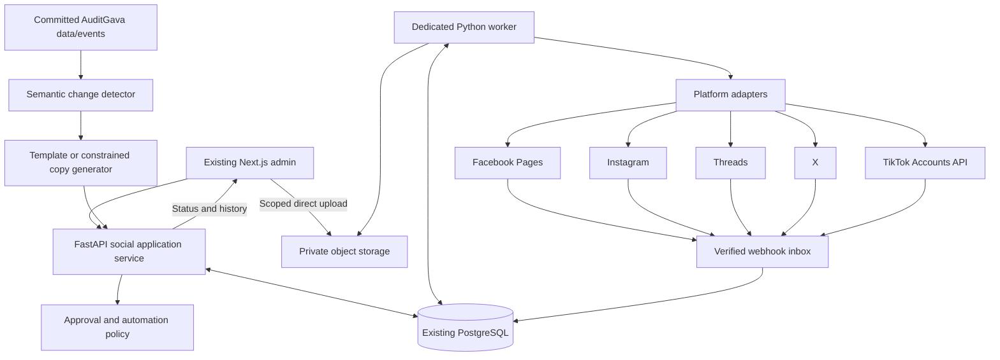

Logical responsibilities:

- **Content source/detector:** decides what changed; creates evidence, not publication.
- **Content service:** creates and edits drafts/revisions.
- **Approval policy:** authorizes an exact revision or requires review.
- **Scheduling service:** records when authorized work may start and its deadline.
- **Publishing orchestrator:** claims work and persists every checkpoint/outcome.
- **Adapter:** validates provider-specific payloads and executes explicit API operations.
- **Admin UI:** sends authorized commands and displays backend state; never calls social APIs with permanent credentials.

Proposed future code layout:

```text
backend/social/
  models.py                 schemas.py
  permissions.py            repository.py
  service.py                validation.py
  approvals.py              scheduling.py
  worker.py                 claims.py
  credentials.py            oauth.py
  media.py                  reconciliation.py
  automation.py             source_events.py
  adapters/
    base.py facebook.py instagram.py threads.py x.py tiktok_accounts.py
backend/routers/
  admin_social.py
  social_integrations.py
frontend/app/admin/social/
frontend/components/admin/social/
frontend/lib/api/social.ts
frontend/types/social.ts
```

This layout is a target specification. File registration, migration order, router inclusion and shared admin guards require a single integration owner.

## 6. Domain and inheritance

### 6.1 Four central concepts

| Concept | Meaning |
|---|---|
| Post | Stable editorial identity, e.g. October debt update |
| Revision | Immutable master content, selected accounts, sparse overrides and evidence |
| Publication | Authorization and schedule for one exact revision |
| Target | Delivery of that publication to one connected account |

Use `origin_type = manual | generated`, plus `creation_method = admin | pipeline | duplicate`. Automatic approval is an authorization method, not a third content origin.

A duplicate creates a **new manual draft** initiated by an admin, links `duplicated_from_id`, preserves source/evidence references as appropriate, and clears approval, schedule, remote IDs and success state. Duplicating generated copy never carries forward policy authorization.

### 6.2 Revision document

```json
{
  "schema_version": 1,
  "master": {
    "text": "Explore the latest public debt figures.",
    "link": "https://www.auditgava.com/debt",
    "hashtags": ["PublicFinance"],
    "media": [
      {"asset_id": "uuid", "alt_text": "Description of the chart", "caption_asset_id": null}
    ]
  },
  "targets": [
    {"account_id": "facebook-account-uuid", "format": "image", "overrides": {}},
    {
      "account_id": "x-account-uuid",
      "format": "image",
      "overrides": {"text": {"mode": "replace", "value": "Latest debt figures, explained."}}
    }
  ]
}
```

Rules are explicit:

1. Absent override, or `{"mode":"inherit"}`, inherits the master field.
2. `{"mode":"replace","value":""}` intentionally clears text.
3. Replacing media with `[]` intentionally removes media for that target.
4. Replacing link with `null` intentionally removes the link.
5. Hashtag replacement replaces the list; do not implicitly concatenate it.
6. Changing master data changes inheriting targets only.
7. Reset to master removes the override.
8. Selected destinations are **account UUIDs**, not platform booleans. More accounts can be added later.
9. An unselected destination has no target record; `NOT_SELECTED` is only a UI concept.
10. Backend resolution is authoritative. Preview and dispatch use the same deterministic resolver.

### 6.3 Approval snapshot

At approval, resolve content for every selected account and persist its payload/hash. Include:

- API product/account identity and chosen format;
- exact text/link/hashtags and link-tracking decisions;
- ordered asset IDs, checksums, alt text and captions;
- visibility/disclosure options;
- rules/capability version and evidence hash.

Exclude tokens, expiring signed URLs, temporary upload IDs and retry metadata from the approved content hash. Those are execution state.

Intentional duplication of final approved payloads is justified: it preserves what was authorized even if shared master content or rules later change. Drafts retain sparse overrides rather than five unnecessary full copies.

## 7. Database specification

### 7.1 Conventions and invariants

- UUID primary keys generated by the application.
- All times are `timestamptz`; claims use database time.
- External IDs are `text`, never JavaScript numbers.
- Decimal financial values are strings with explicit unit/scale in validated JSON, not floating point.
- Constrained string states with Pydantic validation and database checks.
- Actor IDs are authenticated Supabase UUIDs, without a cross-project profile FK.
- All new tables deny direct browser access. API/worker database roles receive the least privileges needed.
- Use soft archive/retention rules for business history. Do not cascade-delete publication evidence.
- `created_at` defaults to database `now()`; update timestamps/version increments are explicit.
- JSON columns have versioned schemas; JSONB does not mean arbitrary unvalidated provider data.
- Keep financial source records outside social tables; store only the evidence needed for a specific claim.

There is no separate social schedule table and no generic second queue: target rows are the durable publication queue. Source-event/media inspection state can use the same claim helper with their own typed records.

### 7.2 Editorial records

| Table | Columns | Keys, constraints, indexes |
|---|---|---|
| `social_posts` | `id uuid`; `origin_type text`; `creation_method text`; `title text`; `content_type text`; `editorial_state text`; `current_revision_id uuid`; `source_event_id uuid null`; `duplicated_from_id uuid null`; `replaces_post_id uuid null`; `created_by uuid null`; `row_version bigint`; `created_at`; `updated_at`; `archived_at null` | PK id; self-FKs for duplicate/correction; source-event FK when source phase exists; `(editorial_state, updated_at)` and source-event indexes |
| `social_post_revisions` | `id uuid`; `post_id uuid`; `revision_no integer`; `document jsonb`; `content_hash char(64)`; `evidence_snapshot jsonb`; `generator_metadata jsonb null`; `created_by uuid null`; `created_at` | FK post; unique `(post_id, revision_no)` and `(id, post_id)`; immutable content after insert |
| `social_revision_assets` | `revision_id uuid`; `asset_id uuid` | Composite PK; FKs to revision/asset; all assets referenced by master or overrides included; prevents removal of retained evidence |
| `social_publications` | `id uuid`; `post_id uuid`; `revision_id uuid`; `authorization_kind text`; `approved_by uuid null`; `approved_at`; `policy_id uuid null`; `policy_version integer null`; `approved_hash char(64)`; `scheduled_for null`; `schedule_timezone text null`; `requested_local_time text null`; `start_deadline null`; `retry_deadline null`; `content_valid_until null`; `dispatch_requested_at null`; `revoked_at null`; `cancel_requested_at null`; `version bigint`; `created_at`; `updated_at` | Composite revision/post FK; unique revision; partial unique post where `revoked_at IS NULL`; due schedule index |

`current_revision_id` can be assigned after revision creation in the same transaction or use a deferred FK. Enforce that it belongs to the same post.

Authorization checks:

- Human authorization requires `approved_by` and no policy authorization.
- Policy authorization requires immutable policy identity/version and a recorded decision.
- Approved-but-unscheduled publications have `scheduled_for = null` and targets `ready`.
- One publication per revision prevents a second accidental distribution under a new HTTP idempotency key.
- One non-revoked publication per post prevents competing active authorizations.

**Cancellation/reapproval clarification:** cancelling delivery does not erase approval history. Resuming a cancelled, never-dispatched publication is an explicit audited command on the same publication/targets, subject to validity checks; it does not insert another publication for that revision. A content edit creates a new revision and revokes the old unsent publication. Once a public dispatch has begun, use a new linked post/revision for content corrections. After successful publication, intentional repetition always uses Duplicate.

### 7.3 Delivery records

| Table | Columns | Keys, constraints, indexes |
|---|---|---|
| `social_post_targets` | `id uuid`; `publication_id uuid`; `account_id uuid`; `resolved_payload jsonb`; `payload_hash char(64)`; `capability_version text`; `state text`; `next_action text null`; `next_action_at null`; `lease_owner text null`; `lease_token uuid null`; `lease_epoch bigint`; `lease_expires_at null`; `submit_count integer`; `checkpoint jsonb`; `primary_remote_id text null`; `remote_refs jsonb`; `remote_url text null`; `visibility_state text`; `confirmation_kind text null`; `error_code text null`; `safe_error_message text null`; `published_at null`; `created_at`; `updated_at` | FK publication/account; unique `(publication_id, account_id)`; partial unique `(account_id, primary_remote_id)` where present; partial due index `(next_action_at,id)` for actionable states; expired-lease index |
| `social_publish_attempts` | `id uuid`; `target_id uuid`; `sequence integer`; `operation_id uuid`; `operation text`; `request_fingerprint char(64)`; `lease_epoch bigint`; `dispatch_started_at null`; `completed_at null`; `outcome text`; `http_status integer null`; `provider_code text null`; `provider_request_id text null`; `receipt jsonb`; `estimated_cost_microusd bigint`; `cost_reservation_state text`; `duration_ms integer null`; `created_at` | FK target; unique `(target_id,sequence)` and operation ID; index target/time; budget query index |
| `social_audit_events` | `id uuid`; `post_id uuid null`; `target_id uuid null`; `account_id uuid null`; `actor_id uuid null`; `actor_kind text`; `action text`; `previous_state text null`; `new_state text null`; `reason text null`; `details jsonb`; `request_id text`; `created_at` | Optional local FKs with retained history; append-only ordinary app permissions; indexes post/account/actor/time |

An attempt is one external operation: upload, create container, finalize, publish, poll, reconcile or delete. `submit_count` counts public publication submissions; harmless status polls do not consume its five-submission limit. `remote_refs` is typed and can retain container/media IDs, multiple thread segments and X edit chains.

Do not overwrite an attempt receipt from an old worker just because its lease expired. Preserve late evidence and reconcile it; only the holder of the current lease epoch can make the normal target transition.

### 7.4 Accounts, credentials and controls

| Table | Columns | Keys, constraints, indexes |
|---|---|---|
| `social_accounts` | `id uuid`; `platform text`; `api_product text`; `connection_method text`; `external_account_id text`; `display_name text`; `handle text null`; `profile_url text null`; `credential_id uuid null`; `connection_state text`; `granted_scopes text[]`; `capability_snapshot jsonb`; `capabilities_checked_at null`; `last_api_success_at null`; `publishing_enabled boolean`; `hold_reason text null`; `rate_state jsonb`; `publish_lease_target_id uuid null`; `publish_lease_token uuid null`; `publish_lease_expires_at null`; `created_at`; `updated_at` | Unique `(platform,api_product,external_account_id)`; credential FK; connection-state index |
| `social_credentials` | `id uuid`; `provider text`; `credential_kind text`; `parent_credential_id uuid null`; `encrypted_bundle bytea`; `key_version text`; `access_expires_at null`; `refresh_expires_at null`; `data_access_expires_at null`; `version bigint`; `refresh_lease_token uuid null`; `refresh_lease_expires_at null`; `last_refresh_at null`; `revoked_at null`; `created_at`; `updated_at` | Parent FK for Meta grant/Page relationship; expiry indexes; no client access |
| `social_oauth_flows` | `id uuid`; `actor_id uuid`; `provider text`; `state_hash char(64)`; `binding_hash char(64)`; `encrypted_verifier bytea null`; `encrypted_pending_grant bytea null`; `return_path text`; `status text`; `expires_at`; `consumed_at null`; `created_at`; `updated_at` | Unique state hash; expiry index; short retention |
| `social_command_receipts` | `id uuid`; `actor_key text`; `route_key text`; `idempotency_key uuid`; `request_hash char(64)`; `resource_id uuid null`; `http_status integer`; `response jsonb`; `created_at`; `expires_at` | Unique `(actor_key,route_key,idempotency_key)`; expiry index |
| `social_controls` | `id smallint`; `publishing_enabled boolean`; `generation_enabled boolean`; `auto_approve_enabled boolean`; `auto_schedule_enabled boolean`; `auto_publish_enabled boolean`; `platform_controls jsonb`; `budget_controls jsonb`; `version bigint`; `updated_by uuid`; `updated_at` | Singleton `id=1`; typed/versioned control documents |
| `social_worker_heartbeats` | `worker_id uuid`; `deployment_version text`; `started_at`; `heartbeat_at`; `last_scan_at null`; `last_success_at null`; `active_claims integer`; `state text`; `last_error_code text null` | PK worker ID; heartbeat index |
| `social_webhook_inbox` | `id uuid`; `provider text`; `provider_event_id text null`; `dedupe_hash char(64)`; `account_id uuid null`; `event_type text`; `payload jsonb`; `received_at`; `processing_state text`; `next_action_at`; lease token/epoch/expiry; `processed_at null`; `error_code text null` | Unique `(provider,dedupe_hash)`; due processing index |

Keep command receipts initially for 30 days; domain uniqueness continues protecting a revision after receipt expiry. Duplicate external IDs can be absent for asynchronous processing until confirmed. Account deletion means disconnect/archive, not destructive removal of delivery history.

### 7.5 Media

| Table | Columns | Keys, constraints, indexes |
|---|---|---|
| `social_media_assets` | `id uuid`; `parent_asset_id uuid null`; `storage_provider text`; `bucket text`; `storage_key text`; `original_filename text`; `mime_type text null`; `byte_size bigint null`; `sha256 char(64) null`; `width integer null`; `height integer null`; `duration_ms bigint null`; `frame_rate numeric null`; `codec_metadata jsonb`; `default_alt_text text null`; `state text`; `inspection_error text null`; inspection lease token/epoch/expiry; `created_by uuid`; `created_at`; `updated_at`; `deleted_at null` | Unique `(storage_provider,bucket,storage_key)`; parent FK; positive byte/dimension checks; indexes state/checksum/creation; Ready state requires non-null inspected MIME, size and checksum |

During an incomplete upload, metadata that has not yet been inspected may be null; schema validation must distinguish upload intent from ready asset. A ready asset requires confirmed type, length and checksum. Do not fill these fields with untrusted browser claims.

Checksums support duplicate warnings, not automatic merging of assets with different provenance or authorization. Immutable object keys avoid changing approved bytes in place.

### 7.6 Generated-content additions

| Table | Columns | Keys, constraints, indexes |
|---|---|---|
| `social_source_state` | `source_type text`; `source_key text`; `current_fingerprint char(64)`; `event_version bigint`; `last_seen_at`; `last_event_id uuid null` | Composite PK `(source_type,source_key)` |
| `social_source_events` | `id uuid`; `source_type text`; `source_key text`; `event_version bigint`; `previous_fingerprint char(64) null`; `current_fingerprint char(64)`; `facts jsonb`; `evidence jsonb`; `source_job_id integer null`; `source_url text null`; `detector_version text`; `occurred_at`; `detected_at`; `processing_state text`; `next_action_at`; generation lease/retry fields | Unique `(source_type,source_key,event_version)`; local ingestion-job FK where valid; processing index |
| `social_automation_rules` | `id uuid`; `rule_key uuid`; `name text`; `version integer`; `priority integer`; `enabled boolean`; `content_types text[]`; `platforms text[]`; `conditions jsonb`; `actions jsonb`; `created_by uuid`; `created_at` | Immutable rule-version rows; unique `(rule_key,version)`; publications reference exact row/version |

Rule-version design is deliberately immutable: changing a rule creates a new version. Enablement/retirement changes are audited; historical decisions retain their exact conditions. Do not store arbitrary executable Python/SQL in rules.

### 7.7 ER diagram

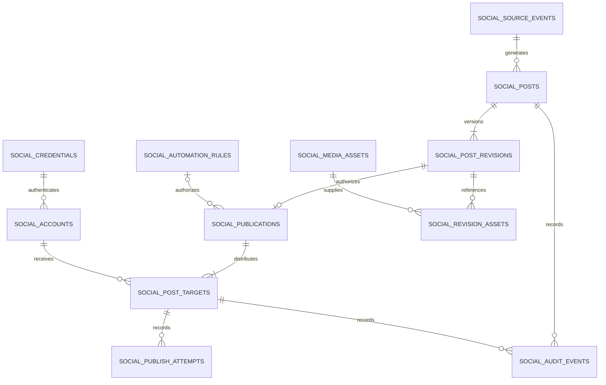

## 8. State machines

### 8.1 Editorial state

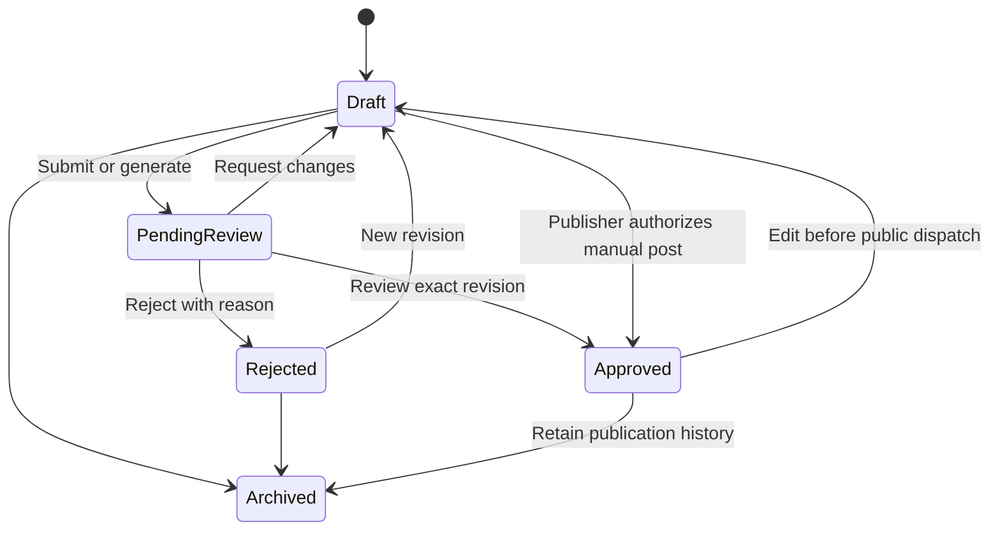

Generated content starts as a draft and enters pending review when ready for inspection. A publisher can authorize their manually written revision as part of Publish/Schedule without an artificial generation-review step. Future policy may require a second person for certain topics/roles.

### 8.2 Target state

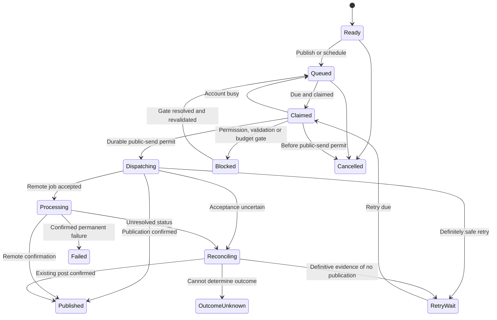

The diagram shows business transitions. Claim ownership is also tracked in lease columns; a status/reconciliation read can acquire a lease without pretending it is a new public dispatch. A non-public upload/container operation records its own operation type and checkpoint. `dispatching` means a publication-capable operation has a durable permit.

Due-work scans include queued/retry states and due processing/reconciliation checks. Never scan only `queued` and thereby strand remote video processing.

### 8.3 Derived UI summary

Do not store contradictory post-level delivery status:

- all selected targets published → Published;
- some published and some failed/blocked/cancelled/unresolved → Partially published;
- executing work with no success yet → Publishing;
- future queued work → Scheduled;
- all targets cancelled → Cancelled;
- no success and all terminal failure → Failed;
- unknown outcome → Needs attention prominently, regardless of other successes.

Published targets are never put back into the ordinary retry queue. Deletion/retraction is a separate operation with its own result, not a reversal to Draft.

## 9. Scheduler and concurrency

### 9.1 Initial settings

| Setting | Initial design value |
|---|---:|
| Worker processes | 1 |
| Concurrent external operations | 2 |
| Concurrent mutating operation per account | 1 |
| Active polling interval | 5 seconds with small jitter |
| Empty/idle polling interval | 30 seconds; wake earlier for a known due target |
| Heartbeat | 15 seconds active; 60 seconds idle |
| Claim lease | 120 seconds |
| Lease renewal | 20 seconds |
| Automatic public submission attempts | At most 5 |
| Retry lifetime | At most 24 hours, shortened by content validity |
| Default late-start allowance | 60 minutes |

These are product defaults, not API limits. Do not transfer full payloads every five seconds. One compact indexed due-work query and small heartbeat updates are the intended shape. Claim only minimal identifiers and retrieve the immutable payload after a successful claim. An idle worker can take up to approximately 30 seconds to notice Publish Now, plus processing time; the UI must not promise instantaneous dispatch. A known earlier scheduled time shortens the next wait. No unimplemented external wakeup is assumed. The provisional incremental budget for queue/metadata traffic is at most 200 MB/month, to be measured before production and tuned under the low-cost operating profile. The authoritative database kill-switch check remains mandatory immediately before each public dispatch.

Use bounded `asyncio` concurrency with HTTPX. Synchronous SQLAlchemy work can run through a small thread executor; each operation owns its session. Do not share a session across concurrent tasks. Budget an initial worker pool of about two connections, then validate against actual connection limits.

### 9.2 Claiming and fencing

Use a short transaction with `SELECT ... FOR UPDATE SKIP LOCKED` and an atomic update/return, ordered by `next_action_at`, creation and ID. Claim only as many targets as there are free execution slots.

Record a random lease token and incrementing lease epoch. Every normal completion update checks the token/epoch. Expired workers cannot overwrite a newer state.

Account admission is also enforced in the database, not only an in-memory semaphore. Enforce one mutating operation per account and reserve paid API budget under the same consistent lock order.

Do not hold a SQL row lock across an HTTP request. Do not use a session advisory lock over a transaction-pooled connection as if it were a stable process lock.

Sources: [PostgreSQL locking](https://www.postgresql.org/docs/current/sql-select.html#SQL-FOR-UPDATE-SHARE), [Supabase connection modes](https://supabase.com/docs/guides/database/connecting-to-postgres).

### 9.3 Dispatch ordering point

Before an operation can make a public post, commit a durable dispatch permit:

1. Lock controls.
2. Lock account admission/budget state.
3. Lock publication.
4. Lock target.
5. Verify lease, authorization/hash, cancellation, deadlines, capabilities and pause state.
6. Reserve estimated API cost if relevant.
7. Insert operation intent and dispatch marker.
8. Commit, then call the provider.

All commands that acquire these rows must follow the same lock order. A lock-order test/design review is required.

Cancellation or pause that commits **before** the permit prevents the send. After the permit, a request may already be in flight. The UI must say so; a global switch cannot recall an external HTTP request.

### 9.4 Worker algorithm

```text
startup:
    validate explicit configuration, stable secret keys and schema version
    validate database connectivity
    create worker identity
    never import backend.main or start web/ETL schedulers

loop:
    write a compact heartbeat when due

    recover expired claims:
        no public dispatch marker -> return safely to due work
        possible public dispatch -> reconciliation, never blind resubmission

    process a bounded number of webhook inbox events
    process due credential maintenance
    process media inspection with its own CPU/concurrency budget

    while an external-operation slot is available:
        claim one due target atomically and commit
        load its immutable payload only after successful claim
        resolve the next adapter operation from checkpoint

        for status/reconciliation reads:
            execute bounded read
            persist result/checkpoint and next check
            release claim
            continue

        validate publication, hash, media, account, scopes and validity
        obtain database-enforced account admission
        obtain durable permit for every publication-capable operation
        record non-public operations as well, with their safe replay class

        execute one bounded adapter operation

        definite success:
            save returned external IDs immediately
            mark published or schedule status polling

        definite temporary rejection:
            schedule bounded retry respecting provider headers

        ambiguous result:
            preserve receipt/checkpoint
            move to reconciliation
            hold affected account publication if necessary

        permanent rejection:
            mark failed with safe actionable reason

        expired credentials:
            coordinate one refresh where supported
            otherwise block for reconnect

        release lease or schedule continuation

    wait until next due work, scan, wakeup or shutdown
```

Long video processing is a saved future status check, not a tight loop occupying a worker slot. Chunked upload work has bounded operations and checkpoints. HTTP timeouts must be shorter than the lease or renewals must remain reliable.

### 9.5 Restart and scheduling semantics

All schedules and next actions are database records. On restart, recover unsent abandoned claims, reconcile dispatched ones, and surface stale content. Do not silently publish an announcement days late.

`start_deadline` applies to the first public dispatch. `retry_deadline` applies after a definite retryable failure. `content_valid_until` is an independent hard freshness bound. Human scheduling may choose a different approved deadline; record it. A status/reconciliation read can continue after a deadline to discover an already-existing publication, but a fresh publication cannot.

One due time applies to all selected targets initially. They start through bounded concurrency, not an atomic cross-platform transaction or guaranteed simultaneous remote appearance.

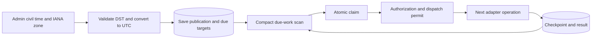

## 10. Adapter contracts

Do not hide multiple side effects in one uncheckpointed `publish()` method. A platform upload/container/finalize workflow must expose operation boundaries to the orchestrator.

```python
class SocialPlatformAdapter(Protocol):
    def capabilities(self, account) -> CapabilitySet: ...
    def validate(self, payload, capabilities) -> ValidationResult: ...
    def next_operation(self, payload, checkpoint) -> OperationPlan: ...
    async def execute(self, operation, credential, media_access) -> OperationResult: ...
    async def reconcile(self, payload, checkpoint, attempt) -> ReconciliationResult: ...
    async def refresh_credentials(self, credential) -> CredentialUpdate: ...
    async def delete(self, remote_reference, credential) -> OperationResult: ...
```

This is a contract sketch, not implementation code. Adapters do not own database commits, approval, schedule policy or global retry loops.

| Contract | Required fields/semantics |
|---|---|
| `ResolvedPostPayload` | Schema version; account/API product; format; exact text/link/hashtags; ordered assets/checksums; alt text/captions; visibility/disclosures; content hash |
| `CapabilitySet` | Provider/API version; account eligibility/scopes; feature states; limits/counters; format rules; price class; source links; verified time |
| `ValidationResult` | Validity; errors/warnings with stable codes and field paths; target IDs; rules version; resolved preview |
| `OperationPlan` | Operation UUID; operation type; publication-capable flag; safe replay class; checkpoint input; timeout; estimated charge |
| `OperationResult` | Confirmed success, processing, definite failure or ambiguous; remote refs; safe error; provider request ID; checkpoint; next-check time |
| `RetryDecision` | Retry/block/fail/reconcile; reason; earliest next action; retry/deadline limits |
| `ReconciliationResult` | Confirmed published; definitively unpublished; still processing; unknown; evidence |
| `CredentialUpdate` | Provider-specific encrypted-bundle input, returned expiries, scopes, prior version for compare-and-swap |

Feature state is `supported | restricted | requires_review | paid | unsupported | unverified`. Unknown maximum lengths are null, not guessed values.

Effective capability is the intersection of API product/version, account type, scopes, application access, selected format, AuditGava's product limits and spending policy. Frontend hints can mirror these rules, but backend validation runs at authorization and again before dispatch.

Facebook and Instagram share Meta transport, error parsing and selected credential helpers. They have separate adapters. Threads has separate auth/endpoints. Add platforms by implementing these contracts, not adding conditionals throughout the scheduler.

## 11. Platform capabilities

### 11.1 Matrix

The following describes inspected official API contracts on 2026-10-03. It is not proof that AuditGava has the required account/application grants. Provider documentation can contain conflicting limits; query runtime account limits when exposed and preserve the observed API version.

| Capability | Facebook Page | Instagram professional | Threads | X | TikTok Accounts API |
|---|---|---|---|---|---|
| Text only | Supported | Unavailable | Supported | Supported, paid | Not found |
| Single image | Supported | Supported | Supported | Supported | Supported |
| Multiple images | Supported; maximum not established in reviewed reference | Up to 10 | 2–20 | Up to 4 | Up to 35 |
| Video | Supported | Reels/carousel video | Supported | Supported; account-dependent limits | Supported with access |
| External links | Clickable/link previews | Caption URL is not a dependable clickable CTA | Clickable/previews | Clickable, special counting/pricing | No guaranteed clickable caption CTA |
| Native scheduling | Some formats | Not in reviewed contract | Not in reviewed contract | Not in reviewed organic contract | Not found |
| Edit published copy | Restricted Page edits | No caption/media edit found | Not found | Restricted, entitlement/eligibility-dependent | Not found |
| Delete | Supported | Facebook Login route plus extra permission | Supported with scope | Supported | Not found |
| Analytics | Scoped/restricted | Scoped/restricted | Scoped/restricted | Paid, scoped | Scoped/restricted |
| Replies/threads | Format-specific | Separate comments feature | Supported | Restricted; unrestricted self-threads unverified | Separate comments APIs |
| Reels | Supported | Supported | Ordinary video | Ordinary video | Ordinary video |
| Stories | Supported, restrictions | Business accounts, restrictions | No distinct Stories format | Unavailable | Not found |
| OAuth | Facebook Login | Facebook Login recommended | Separate Threads flow | OAuth2 + PKCE recommended | Accounts API account-holder flow |
| Per-post API fee | No organic tariff found | Same | Same | Pay-per-use | No public tariff found; terms unverified |
| Main gate | Page tasks and permissions | Professional account and access mode | App grants/review | Developer access, scopes, credits | Accounts API application/access |

### 11.2 Facebook

Pin Graph API **v26.0** during initial implementation and establish an upgrade policy. Core operations:

- `POST /{page_id}/feed` for text/link posts.
- `POST /{page_id}/photos` for photos; persist returned photo/post IDs.
- Multiple images: create unpublished photos and submit their IDs with the feed post.
- Video/Reels: start/upload/status/finish workflow with the video ID checkpointed before final publication.
- Personal Facebook profiles are not the publishing destination. Use the AuditGava Page.

Permissions/tasks include `pages_show_list`, `pages_manage_posts`, relevant read scopes and the appropriate Page content-creation task. General public use can require review/advanced access. Page Publishing Authorization or account-security prerequisites can block operation; report them rather than changing ownership/security settings.

Important media limits observed:

- Photo formats include JPEG/BMP/PNG/GIF/TIFF up to 10 MB; AuditGava can support a narrower JPEG/PNG intake and normalized output.
- The inspected feed reference did not establish a universal message maximum. Keep provider maximum unknown and apply a separately labelled editorial cap, initially 5,000 characters if desired.
- Initial product multi-image cap: four, pending verification of larger batches. Do not label this as Facebook's universal maximum.
- Reels: 3–90 seconds, 9:16, minimum 540×960, 24–60 fps; 30 API Reels/rolling 24 hours in the inspected guide.
- Story documentation contains a duration inconsistency. Use a conservative 3–60-second product limit until contract testing resolves it.
- Native scheduling windows differ across feed/Reels guides. AuditGava-owned scheduling avoids depending on those discrepancies.

Edit is restricted to supported fields and same-app-created posts. Deletion is supported. Analytics uses relevant insights permissions and versioned metric names. Page webhooks need Page/app subscriptions and appropriate management permission. Parse Graph error JSON/subcodes and usage headers, not just HTTP 429.

Sources: [Pages overview](https://developers.facebook.com/documentation/pages-api/overview), [posts](https://developers.facebook.com/documentation/pages-api/posts), [feed reference](https://developers.facebook.com/docs/graph-api/reference/page/feed), [photos](https://developers.facebook.com/docs/graph-api/reference/page/photos), [Reels](https://developers.facebook.com/documentation/video-api/guides/reels-publishing), [Stories](https://developers.facebook.com/documentation/video-api/page-stories-api), [insights](https://developers.facebook.com/documentation/pages-api/platforminsights/page), [webhooks](https://developers.facebook.com/documentation/pages-api/webhooks-for-pages), [Graph limits](https://developers.facebook.com/docs/graph-api/overview/rate-limiting).

### 11.3 Instagram

Recommended connection: Facebook Login with the linked professional Instagram account. A different Instagram Login route can avoid Page linkage, but capabilities and token/scopes differ; do not mix both modes casually in one app.

Publishing sequence:

```text
POST /{ig-user-id}/media
  -> save container ID
GET /{container-id}?fields=status_code,status
  -> wait for ready
POST /{ig-user-id}/media_publish
  -> save media ID and retrieve permalink
```

Constraints:

- No text-only posts.
- Caption limit 2,200; maximum 30 hashtags and 20 mentions in inspected references.
- JPEG images up to 8 MB, supported ratio 4:5–1.91:1, width 320–1440, sRGB.
- Carousel maximum ten children; one parent caption; image/video child rules differ from standalone Reels.
- Image alt text up to 1,000 characters; do not promise the same API field for every video/story format.
- Reels MOV/MP4, supported H.264/HEVC video and AAC audio; current reference allows 3 seconds–15 minutes and **300 MB**. Older examples listing 1 GB should not override the current reference.
- Stories publishing is restricted to Business accounts; no assumption of interactive link/sticker support.
- Containers expire after 24 hours and have a creation quota. Build near dispatch, not days before a scheduled time.
- Official publishing-quota pages/examples disagree between 50 and 100 posts/rolling 24 hours. Inspect `/content_publishing_limit?fields=quota_usage,config`; do not hardcode one universal daily value.
- **Deletion is now supported through Facebook Login** with `instagram_manage_contents`, subject to media restrictions. No caption/media editing endpoint was established.

Own managed-business use with Standard Access may avoid App Review. Serving other businesses or requiring Advanced Access generally changes that requirement. Profile setup is not API approval.

Sources: [content publishing](https://developers.facebook.com/documentation/instagram-platform/content-publishing), [media creation](https://developers.facebook.com/documentation/instagram-platform/instagram-graph-api/reference/ig-user/media), [container status](https://developers.facebook.com/documentation/instagram-platform/instagram-graph-api/reference/ig-container), [quota](https://developers.facebook.com/documentation/instagram-platform/instagram-graph-api/reference/ig-user/content_publishing_limit), [media deletion reference](https://developers.facebook.com/documentation/instagram-platform/reference/instagram-media), [changelog](https://developers.facebook.com/documentation/instagram-platform/changelog), [review requirements](https://developers.facebook.com/documentation/instagram-platform/app-review), [Instagram Login alternative](https://developers.facebook.com/documentation/instagram-platform/instagram-api-with-instagram-login/business-login).

### 11.4 Threads

Threads has its own app credentials/authorization, even when the consumer profile is linked to Instagram. Prefer the documented `graph.threads.com` host and versioned route; inspected examples also support `.net`.

- Container creation: `POST /v1.0/{user-id}/threads`.
- Publish: `POST /v1.0/{user-id}/threads_publish`.
- Text: 500 under documented provider counting rules. Implement provider-specific Unicode/counting fixtures; do not use JavaScript string length as a universal counter.
- Images: JPEG/PNG up to 8 MB with dimension/ratio constraints.
- Carousel: 2–20 image/video children.
- Video: MOV/MP4 with supported codecs, up to five minutes and 1 GB in inspected documentation.
- Alt text is supported for image/video inputs with its documented maximum.
- Text links/link attachments support previews; a documented maximum of five unique URLs applies to the combined relevant inputs.
- One topic tag has special constraints; it is not an unrestricted copied hashtag list.
- Replies use saved parent references.
- Quotas include 250 posts, 1,000 replies and 100 deletions per rolling day; runtime limit endpoints remain authoritative.
- Deletion needs `threads_delete`; no published edit endpoint was established.
- Publish/delete/reply/mention webhooks exist, with business verification/review conditions.

Do not enable Threads auto-publish-text or cross-reshare-to-Instagram flags merely because they exist. The orchestrator should own explicit target delivery to avoid duplicate distribution.

Sources: [get started](https://developers.facebook.com/documentation/threads/get-started), [posts](https://developers.facebook.com/documentation/threads/posts), [publishing reference](https://developers.facebook.com/documentation/threads/reference/publishing), [overview/limits](https://developers.facebook.com/documentation/threads/overview), [delete](https://developers.facebook.com/documentation/threads/posts/delete-posts), [retrieve own posts](https://developers.facebook.com/documentation/threads/retrieve-and-discover-posts/retrieve-posts), [webhooks](https://developers.facebook.com/documentation/threads/webhooks), [insights](https://developers.facebook.com/documentation/threads/insights).

### 11.5 X

X is first-class in schema, UI, adapter contracts and roadmap. It is not a free API for this use case.

Inspected pricing lists **$0.015 for ordinary post creation** and **$0.200 for a post containing a URL**. For example, 90 URL-bearing creations cost approximately $18 before other billable operations. API billing is separate from consumer X Premium. Record estimated/reserved usage and preserve unknown charges after ambiguous sends until reconciled. Do not release a cost reservation merely because a response was lost.

- Post create/edit: `POST /2/tweets`; deletion has its own endpoint.
- Baseline text: 280 weighted characters; URLs have special counting rules.
- Up to four photos, or one GIF/video according to media compatibility rules.
- Current API video references document 0.5 seconds–20 minutes/8 GB for the ordinary path, with different Premium limits. Do not repeat outdated 140-second/512-MB assumptions. AuditGava's own intake is intentionally much smaller.
- Chunked upload INIT/APPEND/FINALIZE/status operations require saved checkpoints.
- Image alt text and subtitles have separate supported APIs.
- Editing is restricted, returns a new ID and has returned `edit_controls`; current help/API pages differ on time windows. Use actual eligibility/deadline, retain the edit chain, and do not promise consumer Premium long-post entitlement through the API.
- Current central rate table specifies 100 post operations/user/15 minutes and an application daily limit; headers/actual product grants govern operation.
- Self-service reply restrictions mean unrestricted self-thread publishing remains a verification gate. Do not promise it based on historical behavior.
- Analytics and own-post reconciliation reads can be billed.
- Activity webhooks can provide create/delete signals where available; do not assume free unlimited delivery.
- No native organic future-scheduling contract was established.

Sources: [pricing](https://docs.x.com/x-api/getting-started/pricing), [access](https://docs.x.com/x-api/getting-started/getting-access), [create/edit](https://docs.x.com/x-api/posts/create-post), [character counting](https://docs.x.com/fundamentals/counting-characters), [media best practices](https://docs.x.com/x-api/media/quickstart/best-practices), [edit controls](https://docs.x.com/x-api/fundamentals/edit-posts), [rate limits](https://docs.x.com/x-api/fundamentals/rate-limits), [reply restrictions](https://docs.x.com/x-api/posts/manage-tweets/integrate).

### 11.6 TikTok

**Do not base AuditGava's internal-only publisher on standard Direct Post.** Its guidelines exclude utilities intended only for accounts managed by the developer/team. Unaudited clients have additional private-publication restrictions. Browser automation is not an acceptable substitute for denied API access.

Investigate **API for Business → Organic → Accounts API**:

- It explicitly covers owned brand/creator accounts.
- Access/new scopes require an application; a consumer Business-account switch is not approval.
- Documented coverage includes Business and Personal accounts, but AuditGava eligibility is unverified.
- Whether the approved workflow permits future unattended automatic publication must be confirmed separately from manual publishing.
- Account authorization uses `tt_user` OAuth endpoints, not advertiser access-token endpoints.
- Video upload/publish is asynchronous and returns a `share_id`; persist it and inspect publishing status.
- Video: up to 1 GB, 3–600 seconds, subject to account settings.
- Photo: up to 35 JPEG/WebP images, up to 20 MB each, with current dimension constraints.
- Video caption and photo caption/title limits differ; inspected values are 2,200 for video caption, 4,000 for photo caption and 90 for photo title, with UTF-16 counting requirements where specified.
- Verify owned media domain/URL prefix. Do not assume any public storage URL qualifies.
- Publishing endpoint limits include 6/minute and 15/day/account. Do not assume photo/video quotas can be added together.
- General account/app limits also apply; use returned/account settings and explicit retry timing.
- No published edit/delete/native scheduling endpoint was established in the inspected Accounts API contract.
- Analytics/comments are separate capabilities and permissions.

Completion of upload/processing is not proof of public availability. Store `visibility_state` and use status/webhook evidence. A flow that sends material to the TikTok inbox for the user to finish is **Needs manual action**, not Published.

Sources: [standard Content Sharing Guidelines](https://developers.tiktok.com/docs/en/content-sharing-guidelines), [Accounts overview](https://business-api.tiktok.com/portal/docs/accounts-api-overview/v1.3), [authorization](https://business-api.tiktok.com/portal/docs/accounts-api-authorization/v1.3), [authentication](https://business-api.tiktok.com/portal/docs/accounts-api-authentication/v1.3), [video publication](https://business-api.tiktok.com/portal/docs/publish-a-public-video-post-to-an-owned-account/v1.3), [photo publication](https://business-api.tiktok.com/portal/docs/publish-a-photo-post-to-an-owned-account/v1.3), [account publication settings](https://business-api.tiktok.com/portal/docs/get-the-post-privacy-settings-of-a-tiktok-account/v1.3), [status](https://business-api.tiktok.com/portal/docs/get-the-publishing-status-of-a-tiktok-post/v1.3), [events](https://business-api.tiktok.com/portal/docs/post-publishing-events/v1.3).

### 11.7 Review, analytics and native scheduling policies

| Platform | Access preparation |
|---|---|
| Facebook | Developer app, Page identity/tasks, justified scopes, reviewed access where required |
| Instagram | Professional account; linked Page for chosen route; own-business Standard Access versus Advanced Access decision |
| Threads | Threads app/use case, accepted testers for development, live/reviewed access for broader use |
| X | Developer onboarding/use case, authorized user/scopes, credits and feature entitlement |
| TikTok | Accounts API application, approved scopes/workflow, verified media origin |

No published per-post tariff was found for the organic Meta APIs. TikTok did not expose a public per-call tariff in the inspected docs. These are planning assumptions, not contractual guarantees or evidence of AuditGava approval.

Store analytics as later namespaced metrics with provider, metric name, value, period and collection time. Missing/unavailable does not mean zero. Follower minimums and historical windows vary. Preserve all remote IDs now so later metrics attach correctly.

Use AuditGava-owned scheduling for consistency. Native Facebook scheduling would introduce a second cancellation/edit/kill-switch authority. Add it only if a measured reliability benefit justifies tracking remote scheduled state and propagating cancellation. The global pause cannot stop a post already handed to a native scheduler unless cancellation succeeds.

## 12. OAuth and security

### 12.1 Common browser/backend flow

Reuse existing Supabase login. Only an authorized administrator can start/confirm an account connection.

1. Authenticated POST creates a short-lived OAuth flow.
2. Backend returns a single-use backend start URL.
3. Top-level navigation to that URL sets a secure, HttpOnly, SameSite=Lax flow-binding cookie.
4. Backend redirects to the provider with random state and PKCE where appropriate.
5. Registered backend callback checks state, cookie binding, expiry and one-time use.
6. Backend exchanges code and reads provider identity.
7. Frontend receives only an opaque flow ID and non-secret account choices.
8. Authenticated admin confirms the exact account/Page.
9. Backend stores encrypted credentials and account capabilities.

Allowlist callback/return paths; no arbitrary open redirects. Local flow lifetime initially ten minutes, even if the provider permits longer. PKCE verifiers and pending grants are encrypted server-side. Do not put permanent credentials in browser local storage, URL fragments or frontend environment variables.

### 12.2 Facebook and Instagram

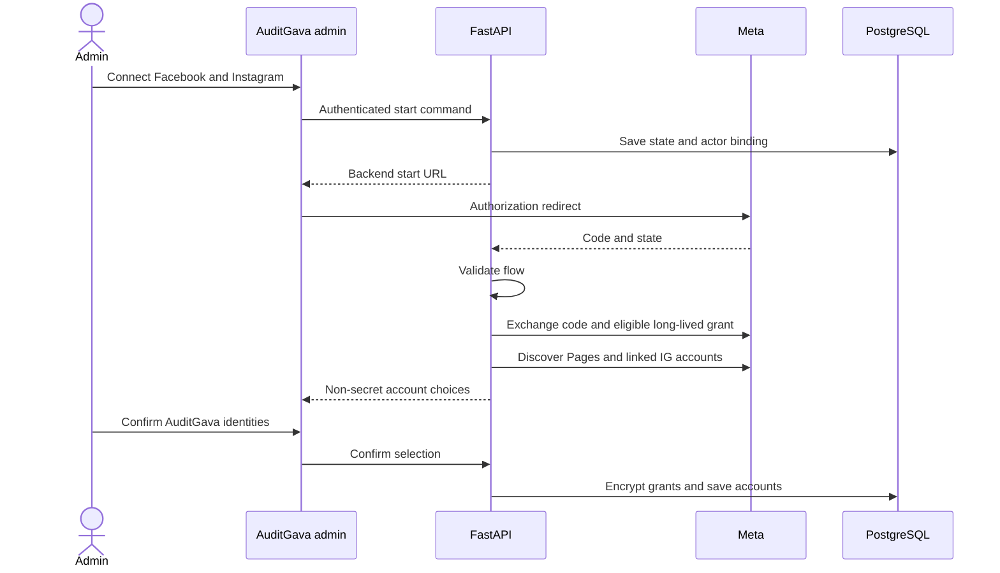

Authorize at `https://www.facebook.com/v26.0/dialog/oauth`; exchange at the versioned Graph OAuth endpoint. Discover Page identity/tasks and `instagram_business_account` via `/me/accounts` with justified fields.

Initial least-privilege scopes include Page listing/posting and relevant read scopes; Instagram uses `instagram_basic` and `instagram_content_publish` for the selected Facebook Login route. Optional insights/deletion/webhook scopes are requested only when those features are implemented. Business Manager arrangements may require additional permissions; inspect the actual grant instead of always asking for advertising access.

Keep parent user grants and derived Page credentials distinct. Long-lived user tokens are generally around 60 days. Derived long-lived Page tokens can lack a scheduled expiry but remain revocable. There is no universal Meta refresh token. Store actual expiry and data-access expiry separately.

The alternate Instagram Login flow uses `instagram_business_*` scopes and its own token exchange/refresh. Do not apply its refresh rules to Facebook Login credentials. It is not selected initially because Page-linked capabilities and the Facebook Login deletion path fit this setup.

Sources: [manual OAuth flow](https://developers.facebook.com/documentation/facebook-login/guides/advanced/manual-flow), [long-lived tokens](https://developers.facebook.com/documentation/facebook-login/guides/access-tokens/get-long-lived), [Instagram Login](https://developers.facebook.com/documentation/instagram-platform/instagram-api-with-instagram-login/business-login).

### 12.3 Threads

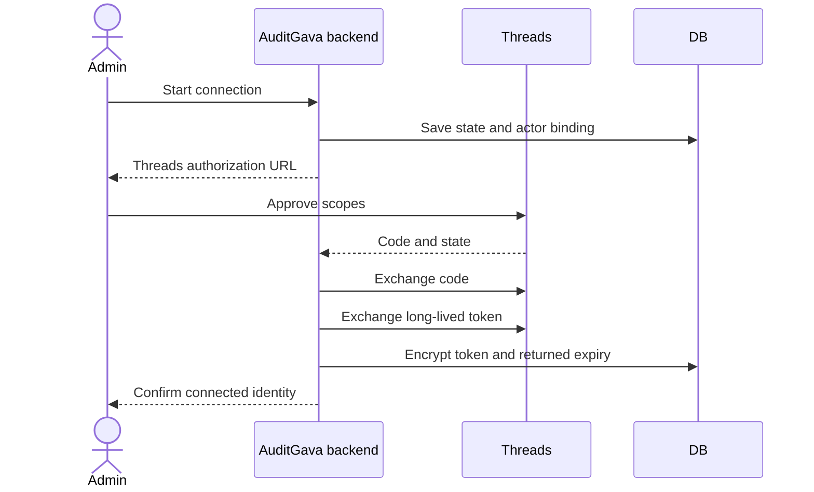

Use a Threads app ID/secret and `https://threads.com/oauth/authorize`. Initial scopes are `threads_basic` and `threads_content_publish`; optional deletion/insights scopes follow features. Short-lived tokens can be exchanged for long-lived tokens, generally 60 days. Refresh is provider-specific and requires a valid token satisfying the minimum-age condition; there is no generic separate refresh-token assumption.

Sources: [access tokens](https://developers.facebook.com/documentation/threads/get-started/get-access-tokens-and-permissions), [long-lived tokens](https://developers.facebook.com/documentation/threads/get-started/long-lived-tokens).

### 12.4 X

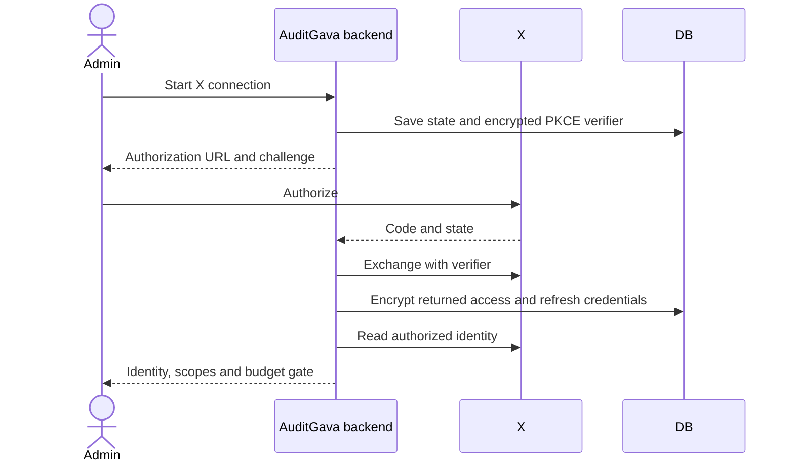

Recommended OAuth2 scopes: `tweet.read users.read tweet.write media.write offline.access`. Access tokens normally last two hours. Persist returned expiries and rotated refresh credentials; do not invent a refresh-token lifetime. Reading identity/reconciliation may itself incur API cost.

Source: [X OAuth2 authorization code](https://docs.x.com/fundamentals/authentication/oauth-2-0/authorization-code).

### 12.5 TikTok Accounts API

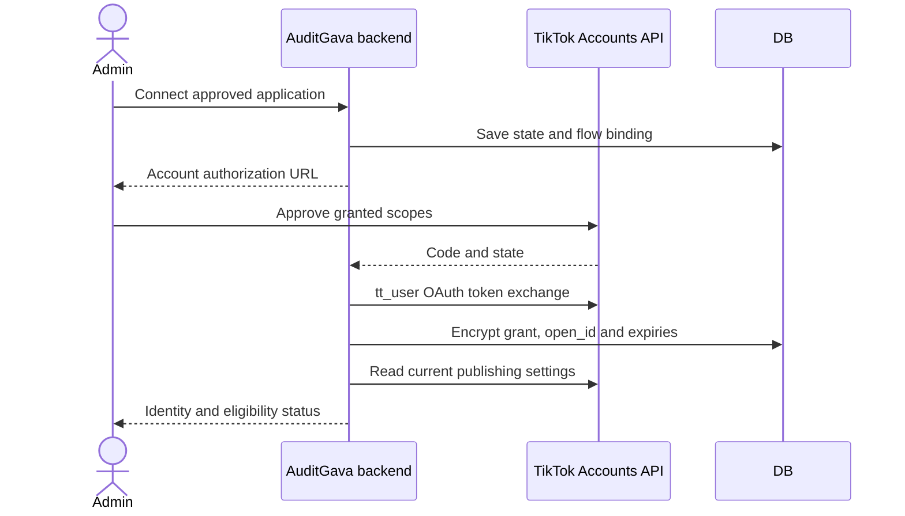

Use `/open_api/v1.3/tt_user/oauth2/token/` and the corresponding `tt_user/oauth2/refresh_token/` flow, not advertiser OAuth endpoints. Documented token durations are one day for access and one year for refresh; use returned values and atomically save rotation. The authorization code is short-lived and one-use.

### 12.6 Encryption, refresh and permissions

- Use maintained authenticated encryption such as Fernet/MultiFernet; never invent cryptography.
- Dedicated stable social-token key ring, retrieved through existing secrets infrastructure, must fail closed if missing. Do not generate a replacement key at startup.
- Store key version with ciphertext; rotate by decrypting with old keys and re-encrypting with the active key.
- Bind encrypted envelopes to credential ID/provider and validate after decryption.
- Only OAuth handlers and worker credential services can read raw credential bundles.
- API DTOs expose connection health, scopes and expiries, not ciphertext or token suffixes.
- Serialize token refresh via a short database lease and credential version compare-and-swap. Never hold a row lock through the provider request.
- If a provider rotates a refresh token and the new token cannot be persisted, treat the outcome carefully; repeated use of an old token can fail. Reconnect may be required.
- Disconnect disables new publication first, handles provider revocation where supported and records retained history.
- Add required provider deauthorization/data-deletion callbacks as part of integration review.

Sources: [Fernet](https://cryptography.io/en/stable/fernet/), [Authlib HTTP clients](https://docs.authlib.org/en/stable/oauth2/client/http/index.html).

### 12.7 Webhooks

Verify signatures against the **raw** request bytes using provider-specific rules. Validate challenge handshakes only for configured subscriptions. Deduplicate and durably store an accepted event before acknowledging. Process asynchronously and idempotently; do not perform lengthy social API work in the callback.

Use provider event IDs where trustworthy, otherwise a stable normalized event/hash key. Out-of-order webhook events cannot regress a confirmed published record into a stale processing state. Polling remains available when a webhook is absent or missed.

Protect against replay as the provider protocol permits. Store only necessary, redacted event data, with a retention policy. Meta HMAC logic is not assumed identical to X/TikTok signature logic.

## 13. Media architecture

### 13.1 Storage selection and limits

Reuse a verified existing suitable S3-compatible bucket first. If none exists, evaluate Supabase Storage in an existing project against measured egress and storage quotas. Do not make migration a prerequisite.

Supabase Free has a 50 MB per-file maximum and finite storage/egress. A platform accepting 1–8 GB does not mean AuditGava can host that video at zero cost. Initial product intake should be JPEG/PNG images up to 10 MB and MP4 video up to 50 MB, with tighter target-specific validation. Prefer short 15–45-second videos.

Sources: [file limits](https://supabase.com/docs/guides/storage/uploads/file-limits), [pricing](https://supabase.com/pricing).

### 13.2 Upload flow

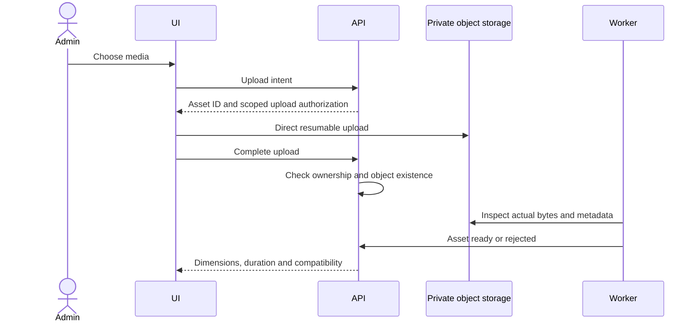

Use direct browser uploads rather than routing large bodies through Vercel or normal JSON endpoints. TUS/resumable uploads support progress and interruptions; Supabase recommends resumable uploads above roughly 6 MB. Authorization is scoped to one owned asset/key and size/type policy.

Source: [resumable uploads](https://supabase.com/docs/guides/storage/uploads/resumable-uploads).

### 13.3 Inspection and derivatives

- Allocate unique immutable keys in a quarantine/non-publishable state.
- Verify real MIME/magic bytes, size and checksum; do not trust extension/browser metadata.
- Inspect dimensions, duration, codecs and frame rate with bounded tools.
- Reject SVG/HTML and unsupported ambiguous/executable formats initially.
- Strip unnecessary image metadata in published derivatives.
- Run media tools without network access, shell interpolation or unbounded resource use.
- Preserve original and derivative relationships/checksums.
- Only `ready` assets can be authorized for publication.
- Alt text is part of revision/target content; library default alt text is only a starting value.

Initial behavior is warning/blocking for incompatible media. Later, an explicit **Create compatible version** action can use Pillow/FFmpeg. Do not silently crop chart labels, change numbers or transform approved bytes. The resulting derivative must be previewed and included in the approved hash.

Source libraries: [Pillow](https://pillow.readthedocs.io/en/stable/reference/Image.html), [FFmpeg](https://ffmpeg.org/ffmpeg.html).

### 13.4 Private previews and provider access

Keep originals private. Issue short-lived preview URLs only to authenticated admins. At dispatch, mint a provider-fetch URL with a validity window sufficient for processing. Do not create a 24-hour-expiring URL weeks before a scheduled publication.

TikTok requires a verified owned media domain/prefix. A generic Supabase hostname is not automatically eligible. Prefer a verified existing object origin; if necessary, a future AuditGava-owned media delivery route can stream authorized bytes with content length/range support. Avoid sending all video through Vercel functions. A redirect to an unverified origin is not assumed acceptable.

Signed URLs are bearer access. Redact them from logs. Revoking one does not guarantee immediate disappearance from CDN caches or recipients that downloaded the file. Public social publication makes the distributed bytes public in practice.

Sources: [private storage](https://supabase.com/docs/guides/storage/buckets/fundamentals), [downloads](https://supabase.com/docs/guides/storage/serving/downloads), [CDN behavior](https://supabase.com/docs/guides/storage/cdn/smart-cdn).

### 13.5 Library and retention

A small reusable media library is worthwhile: upload, choose existing, search filename, filter images/videos, inspect metadata/alt text and see references. Defer folders, advanced design tools and complex library permissions.

Suggested policy subject to storage measurements:

- Incomplete orphan uploads: remove after 24 hours.
- Unreferenced unpublished assets: configurable 30–90-day retention.
- Referenced revision/publication evidence: retain according to explicit editorial/storage policy.
- Never delete bytes while a provider may still fetch them.
- Archive bytes only with a recorded policy; retain checksums and provenance after archival.

Budget provider fetches and repeated previews as egress. A private bucket is not an egress exemption.

## 14. Manual publishing and composer

Manual posting is first-class, using the same domain and worker as generated material.

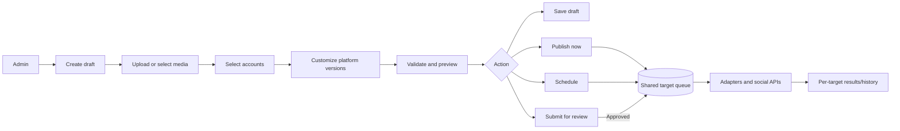

### 14.1 Detailed composer

```text
AuditGava / Admin / Social / Create post

┌──────────────────────────────────────────────────────────────────────┐
│ Create post                                      Draft • Not saved   │
│ Internal title [ October debt update                            ]    │
├───────────────────────────────────────┬──────────────────────────────┤
│ MASTER CONTENT                        │ PREVIEW                      │
│                                       │ [FB] [IG] [Threads] [X] [TT] │
│ Post text                             │                              │
│ ┌───────────────────────────────────┐ │ AuditGava                    │
│ │ Write the main post here...       │ │ [Selected image/video]       │
│ │                                   │ │ Resolved platform text...    │
│ └───────────────────────────────────┘ │ Link behavior explained      │
│                                       │                              │
│ Reference / website URL               │ Approximate preview          │
│ [ https://www.auditgava.com/...      ] │                              │
│ Hashtags [ ...                      ] │ VALIDATION                   │
│                                       │ Facebook  Ready              │
│ MEDIA                                 │ Instagram Ready              │
│ [Upload] [Choose from library]         │ Threads   Ready              │
│ [image 1] [image 2]                    │ X         Text too long      │
│ Reorder • Alt text • Remove            │ TikTok    Access not granted │
│                                       │                              │
│ DESTINATIONS                          │ 3 ready • 2 need attention   │
│ ☑ Facebook  AuditGava                  │ [Review problems]            │
│ ☑ Instagram @auditgava                 │                              │
│ ☑ Threads   @auditgava                 │                              │
│ ☑ X         @auditgava                 │                              │
│ ☑ TikTok    @auditgava                 │                              │
│                                       │                              │
│ CUSTOMIZATION                         │                              │
│ [Facebook] [Instagram] [Threads] [X]   │                              │
│ Text: Inherits master [Customize]     │                              │
│ Media: Inherits master [Customize]    │                              │
└───────────────────────────────────────┴──────────────────────────────┘
│ [Save draft]                 [Schedule ▾] [Publish to 5 — disabled]   │
└──────────────────────────────────────────────────────────────────────┘
```

Behavior:

1. Enter master text and optional reference/link/hashtags.
2. Upload or select ready library assets; set ordering/alt text/captions.
3. Select any connected-account subset.
4. Show local validation hints plus debounced authoritative backend validation.
5. Customize one platform without changing others.
6. Preview each resolved target, explicitly labelled approximate.
7. Save Draft remains available for incomplete content.
8. Publish/Schedule require all **selected** targets to validate.
9. Three ready and two invalid produces a clear action to remove the two blocked destinations. It never silently omits them.
10. Platform removal changes the revision/approval scope; the next command references that updated revision.
11. Publisher-created manual posts can authorize as part of Publish/Schedule. Editors submit for review.
12. Generated content opens in this same editor with evidence and review attestation.

### 14.2 Scheduling and editing

Schedule control: date, time, IANA timezone, resolved offset and UTC preview. Default editorial timezone is Africa/Nairobi, configurable per admin. Example: October 5, 2026 at 10:00 Africa/Nairobi is 07:00 UTC.

Reject nonexistent DST civil times. Require offset selection for ambiguous times. Store UTC plus original zone/civil representation. Do not rely on the browser's current offset for a future date.

One schedule applies to all selected targets initially. Per-platform times add complexity without a current need; the domain can later add target due-time overrides.

Editing content before any public dispatch creates a revision, revokes prior authorization and cancels old unsent delivery. The new revision must be authorized. Rescheduling unchanged content can preserve authorization only within its validity window. After public dispatch begins, lock content and offer a linked Duplicate as correction workflow.

### 14.3 Cascade behavior

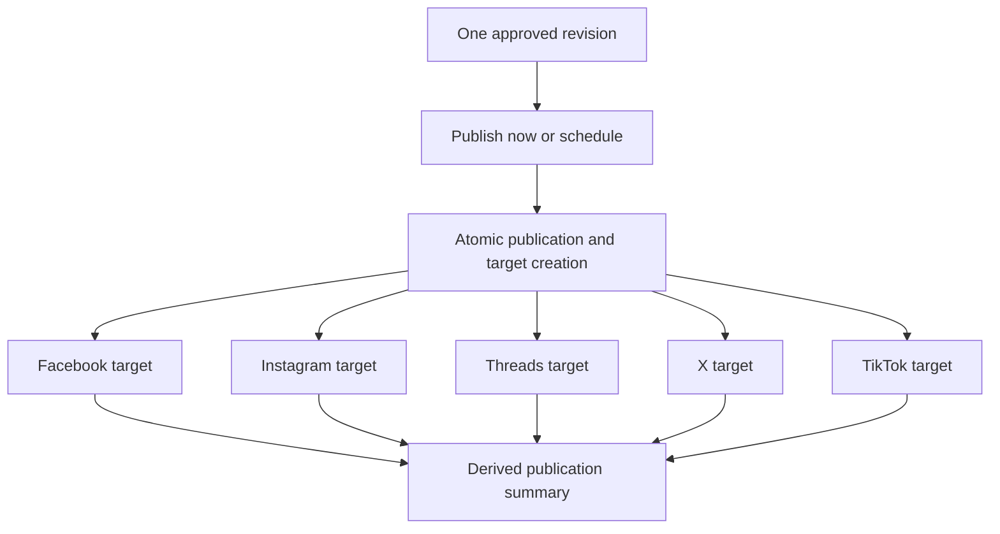

API acceptance means Queued, not Published. The UI displays per-target progress and external links when confirmed. Do not optimistically mark a remote post successful before backend evidence.

### 14.4 Duplicate versus retry

Retry continues one existing target with its exact approved payload after a known-safe failure. Duplicate creates a new draft and intentional publication identity. It clears all remote IDs, approvals and scheduling. A duplicate can select only X to correct an X-specific permanent content error without republishing Facebook.

## 15. Generated content and provenance

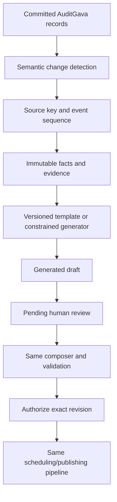

### 15.1 Initial event integration

Start with a semantic detector reading committed application records. Existing ingestion paths have different transaction patterns; a universal job-finished hook is not safe without further work.

- Exclude dry runs, fixture data, quarantined/unpublishable records and failed/rolled-back transactions.
- Do not equate `items_updated` with an important change.
- Compare meaningful fields and version the detector.
- Atomically update source fingerprint/version and insert the unique event.
- Repeated unchanged ETL produces no new event.
- A real A → B → A transition receives two sequential events even though the final content hash existed before.
- On first deployment, establish a baseline without generating a historic flood. Backfill is an explicit admin operation.
- Later, add transactional outbox hooks one audited writer at a time if worthwhile.

### 15.2 Required facts

```text
source type and stable source key
entity/county and metric definition
reporting period and comparison basis
decimal value, unit and scale
actual/modelled/projected classification
document URL, page/table reference and checksum where available
publisher publication date
retrieval and verification timestamps
AuditGava canonical URL
source ingestion/event identifiers
```

The generator receives facts. It does not independently invent debt, dates, percentages, findings or county expenditure. Template output is cheapest and easiest to validate initially. Optional AI output must remain structured, cite fact IDs and pass numeric/entity/reference checks. A model's self-reported confidence is not factual verification.

Manual announcements can omit structured source events. For manually written financial claims, the UI should request references/review attestation; do not claim a text classifier can guarantee every statement has evidence.

## 16. Future automation

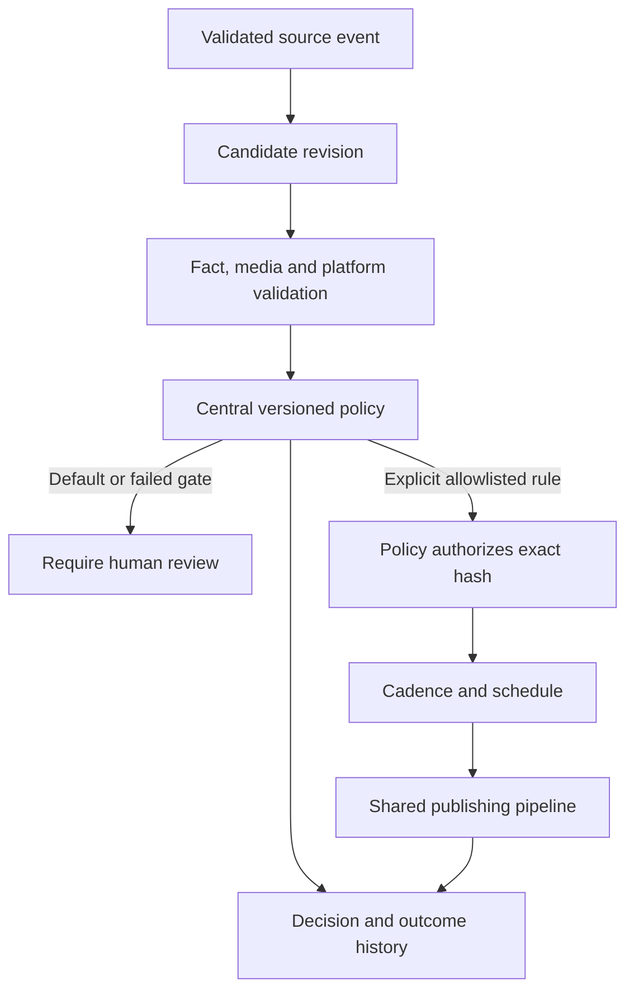

### 16.1 Controls

| Control | Initial production default |
|---|---|
| Generate automatically | Only selected validated sources |
| Approve automatically | OFF |
| Schedule automatically | OFF |
| Publish policy-authorized content automatically | OFF |
| Dispatch human-approved scheduled content | Enabled after manual launch |

An environment-level emergency ceiling can force all publication off. Database runtime controls provide immediate global/platform/account pauses without deployment. Effective permission is the intersection; a UI toggle cannot override an environment ceiling.

Global pause prevents new public-dispatch permits. Draft creation, schedule data, status reads and reconciliation continue. Nothing is deleted. Operations already past the durable permit can complete. Display this limitation explicitly.

### 16.2 Policy gates

Require verified source/publication status, compatible periods and metric definitions, freshness, materiality, nonduplication, numeric/entity consistency, evidence completeness, no pending correction/retraction, platform capability, budget, cadence and sensitive-topic policy.

Version rules centrally. Initial automation cadence can be three posts/account/day with at least one hour between automated posts; these are conservative editorial defaults. Manual urgent overrides require a reason and do not bypass hard API budgets or permissions.

Rollout:

1. Generate drafts only.
2. Record shadow decisions while humans continue approving.
3. Compare policy suggestions with human outcomes and corrections.
4. Enable one narrow deterministic class, such as a newly available dataset announcement.
5. Expand only with evidence of accuracy/reliability.

Audit allegations, contested comparisons, corrections and reputational claims retain human review. TikTok automation additionally requires confirmation that its approved product/workflow permits unattended publication.

### 16.3 Links, hashtags and tracking

Store canonical destination separately from copy. Resolve per-platform link treatment:

- Facebook: link preview or caption link as appropriate.
- Threads/X: inline clickable URL under platform counting rules.
- Instagram: caption/profile-link CTA; do not promise a clickable caption URL.
- TikTok: permitted profile/CTA behavior, not invented caption-link support.

Optional UTM generation is deterministic: `utm_source=<platform>`, `utm_medium=social`, stable campaign/content IDs. Do not duplicate parameters or track sensitive personal data. Preserve readable caption copy; link-preview URLs can carry tracking. Track the resolved URL in the approved snapshot. An X URL changes current API price classification even if shortened.

Hashtags are master-plus-explicit-replacement fields. Respect Threads topic-tag rules separately. No automatic block of identical hashtags on all networks.

## 17. API specification

Base: `/api/v1/admin/social`. Existing pagination style: `page`, `page_size`, `total`, `has_more`. Every admin response, including errors, uses `Cache-Control: private, no-store`.

### 17.1 Authorization

| Permission | Initial admin | Future editor | Future publisher |
|---|---:|---:|---:|
| `social:view` | Yes | Yes | Yes |
| `social:create`, `social:edit`, upload | Yes | Yes | Yes |
| Submit for review | Yes | Yes | Yes |
| `social:approve`, reject | Yes | No | Yes |
| `social:publish`, `social:schedule`, cancel | Yes | No | Yes |
| `social:retry`, reconcile | Yes | No | Yes |
| `social:configure`, accounts, budgets/policy | Yes | No | No |

Map permissions from existing profile roles. Do not add another identity system. Initial implementation can remain admin-only while the permission functions establish later role flexibility. Two-person review is a configurable policy for selected categories, not a universal initial requirement.

### 17.2 Endpoints

| Method/path | Request/effect | Authorization and state constraints |
|---|---|---|
| `GET /posts` | Filters origin/editorial/delivery status/account/type/date/search; compact summaries | View; never return full evidence/media payload on list unnecessarily |
| `POST /posts` | Create manual draft and revision | Create; generated origin is internal-only |
| `GET /posts/{id}` | Current editor document, evidence summary, publication and targets | View; heavy evidence loaded separately/on demand if needed |
| `PATCH /posts/{id}` | Expected version + changed document; create immutable revision | Edit; reject after public dispatch has begun |
| `DELETE /posts/{id}` | Archive, not remote deletion | Edit/configured ownership policy; preserve history |
| `POST /posts/{id}/validate` | Resolve current candidate; return per-target validation/previews/hash | Edit/view as appropriate; no state change |
| `POST /posts/{id}/submit` | Move current revision to pending review | Create/edit |
| `POST /posts/{id}/approve` | Authorize exact revision, create ready targets | Approve; attestation where required |
| `POST /posts/{id}/reject` | Required reason | Approve; pending review |
| `POST /posts/{id}/publish` | Authorize if permitted and queue immediately | Publish; all selected targets valid |
| `POST /posts/{id}/schedule` | Authorize if permitted, save civil/UTC time and queue | Schedule; all targets valid |
| `POST /posts/{id}/reschedule` | Expected publication version and new time | Schedule; no public dispatch; approval still valid |
| `POST /posts/{id}/cancel` | Cancel unsent targets and report in-flight targets | Publish/schedule; idempotent |
| `POST /posts/{id}/resume` | Explicitly requeue cancelled, never-dispatched publication | Publish/schedule; revalidate deadlines, same publication/targets |
| `POST /posts/{id}/duplicate` | New manual draft; clear authorization/schedule/remote results | Create; choose desired target subset |
| `POST /targets/{id}/retry` | Retry known-safe eligible failed target only | Retry; unknown result rejected |
| `POST /targets/{id}/reconcile` | Queue lookup/status, not another publication | Retry/reconcile |
| `POST /targets/{id}/record-existing` | Record a verified external post reference/evidence | Publisher; explicit audited recovery, never silent success |
| `POST /targets/{id}/delete-remote` | Later explicit deletion | Publish; capability/scope gate; separate operation |
| `GET /accounts` | Identity, scope and token-health metadata | View; no raw/encrypted tokens |
| `GET /platforms` | Effective capability registry/version | View |
| `POST /connections/{provider}/start` | OAuth flow and backend start URL | Configure |
| `POST /connections/{flow_id}/confirm` | Confirm discovered account identity | Configure and flow owner |
| `POST /accounts/{id}/disconnect` | Disable send, revoke where supported, retain history | Configure |
| `POST /media/upload-intents` | Allocate owned asset and scoped upload | Create/edit |
| `POST /media/{id}/complete` | Validate object/ownership, queue inspection | Asset owner or configured admin |
| `GET /media` | Compact paginated library | View |
| `DELETE /media/{id}` | Archive/remove only if retention/reference rules permit | Edit/configure |
| `GET /system/status` | Compact worker/queue/account/budget health | View |
| `PATCH /controls` | Expected version and runtime control changes | Configure; reason required for sensitive overrides |
| `GET/POST/PATCH /automation/rules` | Later typed immutable policy versions | Configure |

Provider callback/webhook routes are separate narrow integration routes with state/signature validation. They cannot require an admin JWT at the external provider callback, but account confirmation returns to an authenticated session.

### 17.3 Create request

```json
{
  "title": "October debt update",
  "content_type": "debt_update",
  "document": {
    "schema_version": 1,
    "master": {
      "text": "Explore the latest debt figures.",
      "link": "https://www.auditgava.com/debt",
      "hashtags": [],
      "media": []
    },
    "targets": [
      {"account_id": "uuid", "format": "text", "overrides": {}}
    ]
  },
  "references": []
}
```

External clients cannot set `origin_type=generated` to bypass provenance. Generated creation is an authenticated internal service contract requiring a validated source event.

### 17.4 Publish/schedule request and result

Headers include bearer authorization, `Idempotency-Key: <uuid>` and expected-version semantics (`If-Match` or the explicit version field consistently implemented).

```json
{
  "expected_version": 7,
  "revision_id": "uuid",
  "acknowledged_warning_codes": [],
  "review_attestation": {"facts_checked": true, "sources_checked": true},
  "schedule": {
    "local_time": "2026-10-05T10:00:00",
    "timezone": "Africa/Nairobi",
    "utc_offset": "+03:00"
  }
}
```

Omit schedule for Publish Now. Target selection comes from the exact revision; do not accept a different hidden set in the publish command. Review attestation is required by origin/category policy, not pointlessly for every manual nonfinancial announcement.

```json
{
  "post_id": "uuid",
  "publication_id": "uuid",
  "status": "queued",
  "scheduled_for": "2026-10-05T07:00:00Z",
  "targets": [
    {"id": "uuid", "account_id": "uuid", "platform": "facebook", "status": "queued"}
  ],
  "status_url": "/api/v1/admin/social/posts/uuid"
}
```

Return HTTP 202 for accepted asynchronous publication, not a claim of remote success. Duplicate idempotent commands return the original resource IDs/result.

### 17.5 Validation/errors

```json
{
  "detail": {
    "code": "TARGET_VALIDATION_FAILED",
    "message": "Two selected destinations need attention.",
    "field_errors": [],
    "target_errors": [
      {"account_id": "uuid", "code": "TEXT_TOO_LONG", "field": "text", "message": "Shorten the X version."}
    ],
    "retryable": false,
    "request_id": "uuid"
  }
}
```

| Condition | HTTP/code | Behavior |
|---|---|---|
| Same idempotency key, different body | 409 `IDEMPOTENCY_CONFLICT` | No second mutation |
| Stale editor/publication version | 409 `VERSION_CONFLICT` | Show current version; do not overwrite |
| Invalid selected target | 422 `TARGET_VALIDATION_FAILED` | Queue none |
| Missing permission | 403 | No mutation |
| Global/platform pause | 409 `PUBLISHING_PAUSED` | Preserve draft/schedule |
| Account/scopes/budget gate | Typed target error | Actionable reconnect/access/budget guidance |
| Unknown prior result | 409 `RECONCILIATION_REQUIRED` | No blind retry |
| Invalid DST civil time | 422 `INVALID_SCHEDULE_TIME` | Require correction/offset |
| Changed/stale source evidence | 409/422 typed review-required error | Reapprove current revision |

Command receipt, domain state, target insertion and audit event commit atomically. HTTP transport retries do not bypass authorization or create another target. Adapter HTTP libraries must not blindly retry publication POSTs independently of the orchestrator.

### 17.6 Frontend data behavior

Use scoped React Query keys such as `['admin','social','posts',filters]`. Lists return compact summaries; detail/evidence/attempt payloads load when opened. Avoid whole-table refreshes.

Poll only active publication detail views; stop when hidden or terminal. Use a slower idle dashboard cadence and the low-cost operating profile. Do not poll credential health, accounts, full history and every preview independently at high frequency. Commands invalidate only affected queries. Direct media upload should not pass through the JSON Axios retry mechanism.

## 18. UI wireframes

### 18.1 Navigation and design direction

Add one Social entry inside the existing admin shell. Local navigation:

```text
Overview | Posts | Media | Accounts | Automation | System
Posts filters: Drafts | Pending approval | Scheduled | Published | Failed
```

Use the previously approved **Queue and preview** direction: review list on one side, selected post/evidence/preview on the other. The essential specification is in this document, so no agent needs a local-only historical HTML prototype. Existing AuditGava typography/colors/components govern styling. Platform logos accompany accessible names; logos alone are insufficient status labels.

### 18.2 Social dashboard

```text
Social                                                [Create post]
Publishing enabled • Worker healthy

[Pending 8] [Drafts 4] [Scheduled 6] [Failed 1]

Needs attention
X: budget exhausted                                    [Review]
Instagram: authorization expires soon                   [Reconnect]

Upcoming                             Recent activity
10:00 Debt update  FB IG TH           Report announcement published
14:00 New dataset  FB TH X            X publication failed
```

### 18.3 Create post

Use the full composer in section 14. Desktop has master editor and per-platform preview side by side. Save Draft is distinct from Schedule/Publish. Selecting all five is optional. Invalid selected targets block publication until explicitly fixed or deselected.

### 18.4 Edit post

```text
Edit: October debt update                                Revision 4
Scheduled for Monday 10:00 Africa/Nairobi

Changing content will require approval again.
[Master content and media]             [Platform preview]

[Save new revision] [Cancel] [View approved revision]
```

After public dispatch:

```text
This revision has begun publishing. Content is locked.
[View results] [Duplicate as correction]
```

### 18.5 Platform customization

```text
Platform: X @auditgava

Text     Inherits master                                [Customize]
Media    Inherits master                                [Customize]
Link     Inherits master                                [Customize]

X-specific text
[ ...                                                              ]
Weighted count: 264 / 280

[Reset text to master]                                      [Done]
```

Changing this text does not change Instagram. Reset explicitly restores inheritance. Show account-specific capability and cost warnings near the relevant field.

### 18.6 Platform preview

```text
[Facebook] [Instagram] [Threads] [X] [TikTok]

@auditgava
[Selected image/video]
Resolved caption and link treatment

✓ Compatible media
⚠ Instagram caption URL is not a dependable clickable link

Approximate preview. The platform controls final presentation.
[Open customization]
```

Show truncation/character count, missing media, aspect-ratio risk, video restrictions and unsupported link behavior. A preview should not claim to reproduce the native platform pixel-perfectly.

### 18.7 Pending approval

```text
Pending approval                              [Origin] [Content type]

Queue                               Selected post
Debt update                         Preview | Facts | Source
Audit finding                       Figure: ...
Dataset announcement                Period: ...
                                    Source document and page
                                    Differences from prior revision

                                    [Request changes]
                                    [Reject] [Approve ▾]
```

Approval can leave targets ready, publish now or schedule. All act on the displayed revision/hash. An out-of-date review screen receives a version conflict.

### 18.8 Scheduled posts

```text
Scheduled                                Timezone: Africa/Nairobi

Post          Platforms     Due             Creator      Status
Debt update   FB IG TH       Oct 5 10:00      Admin        Ready
New report    FB X           Oct 5 14:00      Admin        X blocked

[Preview] [Edit] [Reschedule] [Cancel] [Publish now] [Duplicate]
```

Actions are state-aware. Editing requires renewed approval; rescheduling unchanged content within validity does not. Cancel reports any already-in-flight target.

### 18.9 Publishing history

```text
History                                      [Search] [Date range]

Debt update                                  Partially published
Created by ...  Approved by ...  Source ...

Facebook   Published                         [View post]
Instagram  Published                         [View post]
Threads    Published                         [View post]
X          Retry scheduled                   14:32 UTC
TikTok     Processing                        Check in progress

[Attempts] [Approved revision] [Audit history]
```

External URLs are displayed only after verification or explicit audited manual reconciliation. Preserve remote IDs even if a permalink is unavailable. TikTok inbox handoff is labelled manual action, not success.

### 18.10 Failed publications

```text
Needs attention

X / Debt update
Rate limit reached. Next safe retry: 14:32 UTC
[Retry when permitted] [View details]

Facebook / Report update
The platform may have accepted this post.
[Reconcile] [Open account] [Record existing post]
Automatic retry unavailable.
```

Use actionable messages without raw stack traces. Retry X only and Retry failed targets operate on eligible existing targets, never successes.

### 18.11 Media library

```text
Media                                                     [Upload]

[Images] [Videos] [Search filename]
[Thumbnail] debt-card.jpg   1080×1350   Ready
[Thumbnail] explainer.mp4   00:28       Ready

Selected asset
Alt text [ ... ]
Used by: 3 revisions
[Choose] [Create compatible version] [Archive if unused]
```

### 18.12 Connected accounts

```text
Accounts

Facebook   AuditGava Page   Connected                    [Manage]
Instagram  @auditgava       Connected                    [Manage]
Threads    @auditgava       Connected                    [Manage]
X          @auditgava       Budget disabled              [Manage]
TikTok     @auditgava       Access required              [Details]

Details: API product • permissions • expiry • last API success
[Reconnect] [Disconnect]
```

Browser login/profile setup does not equal API Connected. Never display raw credentials.

### 18.13 Automation settings

```text
Automation

Generate drafts automatically             [Selected sources]
Approve automatically                     OFF
Schedule automatically                    OFF
Publish policy-approved content           OFF

Rules
Dataset announcement                      Shadow mode
Debt change                               Human review
Audit finding                             Human review

[Inspect proposed decision] [Decision history]
```

Explain the separate human-scheduled dispatch behavior. A policy toggle cannot bypass account eligibility, budgets, hard validation or the emergency ceiling.

### 18.14 System status

```text
System

Global publishing       ENABLED                  [Pause publishing]
Worker heartbeat        8 seconds ago
Last scan               3 seconds ago
Due targets             0
Overdue targets         0
Active operations       1
Reconciliation cases    0
Permanent failures      1

Platform switches | Credential health | API budgets | Recent errors
```

Heartbeat staleness thresholds account for the 60-second idle heartbeat. Do not show a false outage after 60 seconds if idle heartbeats occur every 60 seconds; initially use a warning threshold around three expected intervals plus jitter, with separate missed-scan/overdue-work signals.

### 18.15 Mobile/accessibility

- Stack editor/preview with an accessible segmented switch.
- Keep Save Draft and primary action reachable with safe-area spacing.
- At least 44-pixel touch targets, legible inputs and visible focus.
- Platform names accompany logos; status is not conveyed by color alone.
- Field errors are associated with inputs; upload progress/status changes use restrained accessible announcements.
- Maintain keyboard order and screen-reader labels.
- Warn about abandoning unsaved edits.
- Begin with explicit save and optimistic concurrency. Defer complex autosave until conflict semantics are proven.
- Do not create a separate mobile app.

## 19. Failure, retry and duplicate protection

### 19.1 Failure classification

| Scenario | Required behavior |
|---|---|
| Worker dies before public-send marker | Recover expired claim safely |
| Worker dies during or after possible public send | Reconcile, no blind retry |
| Connection failed before bytes could be transmitted | Bounded retry when transport evidence establishes this |
| Read timeout after POST | Ambiguous; reconcile |
| Provider definitely rejects temporarily | Retry under bounded policy |
| Rate limit | Honor provider reset/Retry-After; no early retry |
| Renewable token expired | One coordinated refresh, then retry only if safe |
| Token revoked/permissions removed | Block and reconnect |
| Invalid media/text/unsupported format | Permanent failure until a new authorized revision |
| Account/app not eligible | Block with exact access reason |
| Credits/budget exhausted | Block; do not silently raise spend |
| Media processing pending | Poll saved remote reference later |
| Database unavailable before permit | Send nothing |
| Database unavailable after remote acceptance | Preserve receipt where possible; recovery reconciles |
| Two workers encounter one target | Atomic claim and fencing allow one normal owner |
| Admin cancels while claiming | Permit ordering decides; before permit prevents send |
| Admin edits scheduled content | Revoke unsent authorization; new revision required |
| Deployment when due | Durable target remains; lease recovery handles work |
| Global pause | No new public permits; status/reconciliation can continue |
| Four successes and one failure | Keep successes; retry only eligible failed target |
| Delayed public visibility | Processing/visibility separate from accepted upload |
| Database restore | Pause, reconcile restored queue against remote history before enabling |

Generic HTTP 5xx does not always prove a POST was rejected. Adapter classification must consider the endpoint and response semantics. Treat unknown acceptance as unknown, not automatically retryable.

### 19.2 Bounded retry

Full-jitter exponential backoff, maximum five public submissions and 24-hour retry window, shortened by content validity. Provider delay wins: do not cap a long Retry-After downward. If the earliest permitted retry exceeds the deadline, require review instead.

Read-only processing checks have their own bounded duration/timeout policy and do not consume public submission count. They still consume API quota/cost and must not run forever or every second without justification.

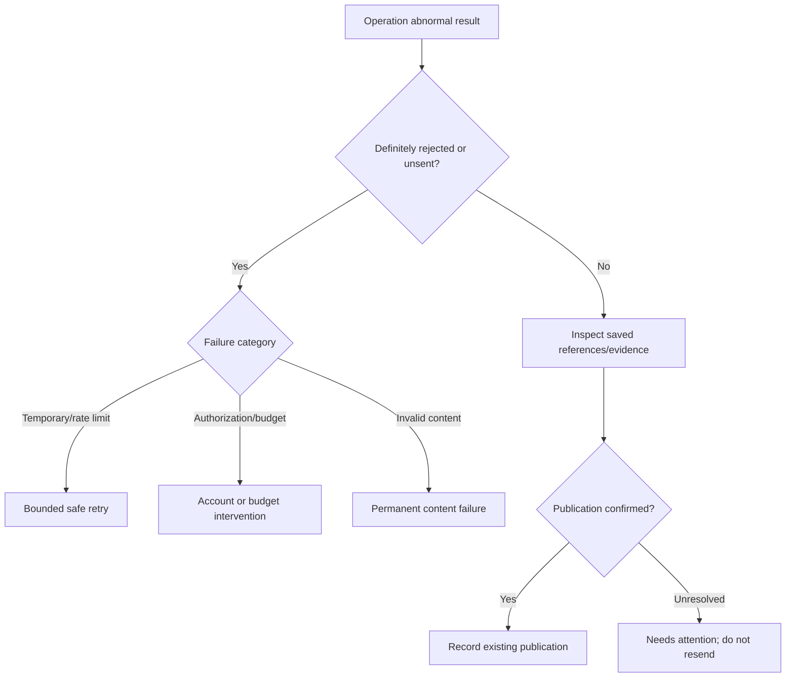

### 19.3 Three idempotency layers

1. **Command layer:** persisted request key/hash/response prevents browser/interceptor duplication. Unique publication/revision and target/account constraints protect even if two clicks use different keys.
2. **Generated-event layer:** stable source key plus monotonically increasing semantic event version prevents duplicate drafts without suppressing legitimate later changes.
3. **External layer:** save every remote checkpoint, classify ambiguous results and reconcile. No inspected API offers a universal exactly-once client key for this whole pipeline.

Manual text matching is not a uniqueness constraint. A person can intentionally publish similar material; they do so through Duplicate/new post, never accidental retry of a success.

### 19.4 Provider reconciliation

| Platform | Evidence and strategy |
|---|---|
| Facebook | Saved video/photo IDs; status/publishing phase; bounded own-Page lookup matching exact text/link/media/time. `client_mutation_id` is correlation unless provider documents deduplication semantics |
| Instagram | Saved container and its `PUBLISHED` state; retrieve media/permalink. A known published container must not be submitted again because local permalink is missing |
| Threads | Saved container; own-post/status lookup; eligible publish webhook |
| X | Returned post ID when available; bounded own-post lookup for ambiguous create; account for paid reads. Absence from one page of results is not proof of no publication |
| TikTok | Saved `share_id`; publish status plus public-availability events; inbox/manual completion remains separate |

Record evidence confidence and matching criteria. A unique strong match can confirm success. Several possible matches or an incomplete lookup stays unknown. An administrator can record a verified existing post through an audited action. Any deliberate retry after unresolved ambiguity requires an explicit risk acknowledgement; it is never routine automatic recovery.

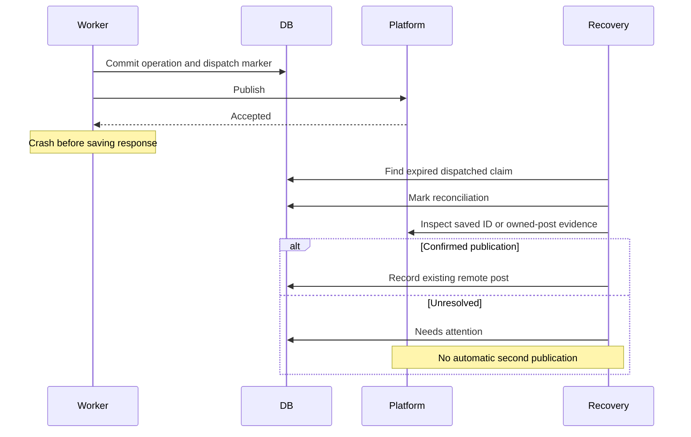

### 19.5 Partial publication and admin retry

```mermaid
sequenceDiagram
    actor Admin
    participant API
    participant DB
    participant Worker
    participant Platforms
    Admin->>API: Publish five selected accounts
    API->>DB: One publication, five independent targets
    API-->>Admin: Accepted/queued
    Worker->>Platforms: Execute targets independently
    Platforms-->>Worker: Four successes; X definite failure
    Worker->>DB: Save each outcome
    API-->>Admin: Partially published
    Admin->>API: Retry X target
    API->>DB: Requeue only X
    Worker->>Platforms: Execute X operation
    Note over Worker,Platforms: Four successful targets are untouched
```

Deletion/rollback is capability-specific. There is no cross-platform atomic rollback. If a factual correction requires removal, the UI lists each supported delete operation and any platform requiring manual removal, then retains the correction history.

## 20. Audit and observability

### 20.1 Transactional history

Write audit events in the same transaction as create/edit/approve/reject/schedule/cancel/account/control changes. Dispatch intent precedes network action; completion evidence follows it. Do not use the existing best-effort separate-session helper as the correctness mechanism.

Record actor or policy identity, exact revision/hash, selected accounts, reason, old/new state, schedule/timezone, whether cancellation was late, operation/result, reconciliation evidence, permission/budget changes and policy version.

Ordinary application roles cannot edit/delete audit events. This is durable append-only application behavior, not a claim of cryptographic tamper-proofing against database administrators. Link the existing admin audit UI to social history later if useful.

### 20.2 Logs

```text
request_id, worker_id, post_id, revision_id, publication_id,
target_id, account_id, platform, operation_id, operation,
attempt_sequence, duration_ms, result, error_code, provider_request_id
```

Redact authorization/cookie headers, access/refresh tokens, OAuth code/state/verifier, signed media URLs and sensitive raw provider payloads. Safe error messages explain action without stack traces.

### 20.3 Metrics and health

Expose compact counts and timestamps:

- worker heartbeat/last scan/deployment version;
- due and overdue targets/oldest due age;
- active/expired claims;
- retry backlog and unknown outcomes;
- permanent failures by category;
- credential and permission health;
- rate/budget state and estimated cost;
- publication start latency and remote-processing duration;
- queue/database metadata egress under the cost profile.

Do not calculate health by repeatedly fetching full target payloads. Use indexed counts, materialized compact counters where justified, and bounded refresh.

Active scans normally detect due work within about five seconds plus execution queueing; idle Publish Now can wait up to about 30 seconds. These are start-latency expectations, not promises of remote video availability. Heartbeat thresholds must reflect active versus idle cadence. Overdue work and unknown outcomes are separate operational signals.

## 21. Deployment and cost

### 21.1 Topology

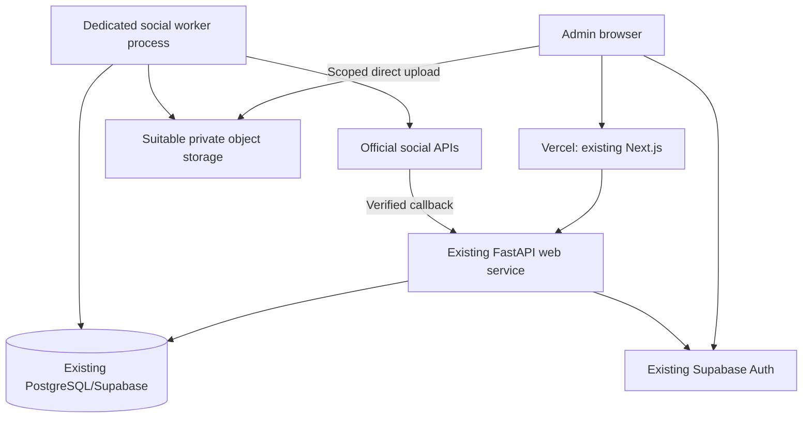

Default: separate background worker using the same backend artifact and a distinct entrypoint. Do not put a scheduler in each web replica. A zero-marginal-hosting option is acceptable only after verifying a paid always-on host with spare capacity and a separately supervised process. Existing Docker/ETL files do not prove that host exists.

Do not add CPU-heavy rendering to the publication worker initially. A separate bounded renderer can be considered later.

Deployment sequence:

1. Compatible schema migration.
2. API/worker deployed with all publication disabled.
3. Health/fake/test execution verified.
4. One approved account connected in a separately authorized implementation session.
5. Controlled manual publication verified.
6. Gradual platform enablement.
7. Generated-content automatic approval remains off.

On SIGTERM, stop claiming and drain bounded in-flight operations; do not pretend a killed network request is definitely unsent. After restoring a database backup, keep publication paused until restored records and external posts are reconciled.

### 21.2 Infrastructure budget

| Component | Existing? | Incremental cost assumption | Limitation |
|---|---|---|---|
| Admin frontend | Yes | $0 within plan | Usage/bandwidth still finite |
| FastAPI | Yes | $0 within capacity | Memory/traffic must fit |
| PostgreSQL | Yes | $0 within capacity | Egress, connections and size measured separately |
| Redis | Not required | $0 | No broker added |
| Worker | Deployed capacity unverified | $0 if suitable existing host; otherwise about $7/month entry Render worker | Actual plan/RAM fit must be checked |
| Media storage | Optional integration exists | $0 within selected provider quota | Repeated fetches/previews create traffic |
| Copy generation | Deterministic templates first | $0 external AI fee | AI services later have separate usage cost |
| Image/video rendering | Later | Existing compute only if proven available | CPU/RAM/egress can dominate |

Render's free web service can sleep and is not a dependable precise scheduler. A paid entry worker is not the same as a free web instance. Cron-style execution has cold-start/latency/concurrency tradeoffs and is not selected for Publish Now. Sources: [Render pricing](https://render.com/pricing), [free-service limits](https://render.com/docs/free), [Render cron](https://render.com/docs/cronjobs), [Supabase Cron](https://supabase.com/docs/guides/cron).

### 21.3 External API budget

| Platform | Treatment |
|---|---|
| Facebook/Instagram/Threads | No published organic per-post tariff found; confirm current terms/access |
| X | Mandatory current usage charges; zero default budget blocks API publishing |
| TikTok Accounts API | No public per-call tariff found; approval/commercial terms unverified |

The honest target is approximately zero **additional infrastructure** cost where capacity permits, with external API fees separate. Exactly zero external spending and guaranteed API publication to X are incompatible under the inspected pricing.

### 21.4 Supabase cost amendment

The subsequent operational investigation observed about 6.084 GB of current-cycle egress against 5 GB and 7.681 GB in the preceding cycle, with the dashboard attributing nearly all egress to Shared Pooler traffic. Database size was small (approximately 91 MB in the usage summary and 75.4 MB in a direct size query). These measurements are recorded and qualified in the companion investigation; cumulative query statistics are not billing-cycle attribution.

Retain Supabase. The social metadata workload does not inherently require migration. Control query shape/polling, avoid repeated full-table responses, and measure incremental queue traffic before enabling production. The baseline queue budget is provisionally at most 200 MB/month, not a proven consumption estimate.

Do not assume video bytes belong in Supabase merely because metadata does. For scale intuition, 30 videos × 50 MB × three complete downloads is 4.5 GB of egress before other traffic. The low-cost profile evaluates an S3-compatible object provider such as Cloudflare R2 for media while retaining Supabase/PostgreSQL for metadata. Any free storage/egress claims and operation quotas must be checked against that profile's sources and actual account configuration.

## 22. Content, graphics and video strategy

### 22.1 Repeatable content categories

| Category | Example structure, not a factual claim | Automation posture |
|---|---|---|
| Dataset availability | New county expenditure data for [period] is available; explore the source and figures | Candidate for deterministic future auto-approval |
| New report publication | [Publisher] released [report]; AuditGava now links its data | Template generation; verify report identity/date |
| Website feature/dataset coverage | [County/year/feature] is now available | Deterministic where release metadata is trustworthy |
| Scheduled neutral glossary | What does an adverse audit opinion mean? | Editorially approved reusable template; periodic review |
| Debt/budget changes | [Metric] changed by [amount/%] between comparable periods | Generated draft, human approval initially |
| County comparisons | Compare [same metric/period/basis] for selected counties | Human review for comparability and context |
| Audit findings | Report identifies [finding] at [entity], with source/page and careful attribution | Human approval; never equate unsupported expenditure automatically with theft |
| Corrections/source revisions | Earlier figures were revised; explain what changed | Editorial/manual approval |
| Data quality/transparency | A source is missing/late; explain the limitation without invented data | Human approval |
| Explainers and interpretation | How debt service differs from total debt; how pending bills work | Editorial content, templates reusable after review |
| Monthly data roundup | New datasets/reports and links | Generate list; human approval initially |

“Fully automatable” means a candidate after evidence and policy validation, not enabled at launch. Accuracy, nonpartisanship and context outweigh volume.

### 22.2 Shared event, platform-specific presentation

```text
Verified source event and facts
  -> Facebook: context and link preview
  -> Instagram: chart/card and caption, accessible description
  -> Threads: concise update, optional carefully controlled replies
  -> X: weighted short copy and cost-aware link
  -> TikTok: reviewed short video/photo narrative under approved API access
```

Share facts, source identity, canonical URL and campaign. Customize length, format, media ratio, link behavior, topic/hashtags and caption structure. Never treat all five as identical text endpoints.

### 22.3 Templates

Initial templates can be versioned application data for National Debt Update, County Audit Finding, Budget Update, New Report, Did You Know and Educational Post. Each defines required facts, text structure, default target formats and media layout references. Do not build a general template language or graphical editor initially.

Duplicate Post provides a simpler manual shortcut while template behavior matures. Numeric placeholders must remain visibly unresolved until real validated facts are supplied.

### 22.4 Lightweight video plan

```text
Verified facts
  -> 15–45 second script with fact IDs
  -> chart/cards from deterministic templates
  -> optional voiceover
  -> timed captions/transcript
  -> bounded 9:16 render
  -> media inspection
  -> admin preview and approval
  -> existing target pipeline for TikTok/Reels
```

Use deterministic charts, local rendering tools such as FFmpeg and a versioned composition/template system. Voiceover can start as optional or manually supplied; external TTS/AI fees are a separate choice. Burned-in captions plus available subtitle tracks improve accessibility. Review the exact rendered media checksum, not just the script.

Do not build this rendering pipeline in the initial publishing work. Keep render jobs separate from time-sensitive API delivery. Avoid unbounded generation retries or uploading a newly rendered asset without renewed approval.

## 23. Implementation phases

| Phase | Backend/database work | Frontend work | Tests and definition of done | Dependency |
|---|---|---|---|---|
| 0: Verify prerequisites | Confirm deployment capacity, DB mode, storage/egress baseline, Meta app route, X budget, TikTok eligibility | Confirm approved UI scope | Recorded evidence and gates; no invented hosting assumptions | None |
| 1: Freeze contracts | Models/states/Pydantic/permissions; migration plan | Shared generated/derived types and fixtures | Inheritance, immutability, schema/transition review agreed | Phase 0 |
| 2: Durable queue with fake adapters | Publications, targets, attempts, claims, audit, receipts, worker, controls | Minimal status/results | Real PostgreSQL race/crash tests; no live API calls | Phase 1 |
| 3: Media and manual composer | Upload intents, inspection, library, draft/edit/validate | Composer, overrides, previews, drafts | Fake multi-target manual publishing E2E | Phases 1–2 |
| 4: Facebook/Instagram manual | OAuth, encryption, adapters, processing/reconciliation | Accounts and Meta-specific controls | Approved test accounts; separately authorized controlled real checks | Phases 2–3 |
| 5: Review and scheduling | Approve/reject, due time, deadlines, reschedule/cancel | Queue-and-preview review, scheduled/history/failures | Restart, edit, cancel and schedule races proven | Phases 2–4 |
| 6: Threads | Auth, adapter, quotas/status and eligible events | Connection/preview/customization | Contract suite plus sanitized provider fixtures | Phases 2–5 |
| 7: X | PKCE, uploads, budgets, paid reconciliation | Weighted counters, cost/access status | Zero-budget blocking and target-only retry | Budget/access decision; core ready |
| 8: TikTok Accounts API | Approved auth/product, verified origin, async status/events | Current privacy/disclosure and processing controls | Access granted; accepted workflow; public availability distinguished | Eligibility gate; core ready |
| 9: Generated drafts | Semantic events, evidence, templates/dedup | Source review/filtering | Repeated ETL produces one draft; auto approval remains off | Stable manual pipeline |
| 10: Selective automation | Immutable rules, shadow mode, cadence, controls | Rule explanations and decision history | Shadow outcomes accepted; narrow allowlist rollout | Phase 9 plus operating evidence |
| 11: Graphics/video/analytics | Derivatives/render jobs, captions, metric collection | Templates, calendar, analytics | Rendering isolated, metrics retain provider semantics | Reliable publication core |

Apply for TikTok access early because approval can take longer than adapter development. X stays modeled but disabled if no budget. A coded adapter is not a definition of done without granted access and safe recovery behavior.

Every phase must state which code/database/frontend surfaces it changes, pin testable contract versions, leave automatic publishing off unless its phase explicitly authorizes it, and avoid unrelated refactors.

## 24. Testing and acceptance

### 24.1 Test layers

| Layer | Required coverage |
|---|---|
| Unit | Override inheritance/empty values; canonical hashing; source event versions; decimals; state transitions; DST; provider counters; retry classification; policy decisions |
| API | Roles, command idempotency, expected-version conflicts, no-store headers, atomic audit/queue writes, safe error envelopes |
| Real PostgreSQL integration | Two-worker claims, SKIP LOCKED, lease expiry, fencing, account admission, budget reservations, cancellation ordering |
| Adapter contract | Every fake/real adapter implements operation/checkpoint/result semantics consistently |
| Provider fixtures | Sanitized success/error/processing/quota responses; no credentials or live posts |
| Frontend | Master/override isolation, invalid subset handling, role actions, partial result UI, accessibility |
| E2E | Manual cascade, scheduled publication, generated review, partial failure and recovery |
| Security | OAuth state/PKCE/ownership; token redaction; signature/replay handling; upload ownership/inspection |
| Recovery | Crash before permit, during send, after response; DB outage and restored backup |
| Cost/regression | Query result sizes, idle poll cadence, no full-table payload scans, media fetch/retention behavior |

Use fake adapters and network guards for normal automated tests. Do not require real publications or credentials. A real-provider smoke check is a separate explicit task with controlled content/accounts.

The current SQLite setup cannot verify PostgreSQL concurrency. Add the real-PostgreSQL lane explicitly rather than placing tests in a directory CI already skips. New model types must also be reconciled with existing global SQLite fixtures without weakening concurrency tests.

### 24.2 Required E2E scenarios

1. Manual cascade: compose, upload, select Facebook/Instagram/Threads/X; fake adapters succeed; one publication and four external references appear.
2. Partial failure: five targets, X definite failure; retry X only; successful adapters are not called again.
3. Scheduled post: no send before due; worker restart does not lose schedule; dispatch obeys deadline.
4. Generated content: semantic event creates pending review; admin edits/approves; same queue publishes.
5. Acceptance crash: remote fake accepts, worker dies before DB success; recovery finds existing remote post and never duplicates.
6. Cancellation wins before permit: zero outbound publication.
7. Pause after permit: UI reports in-flight limitation; no new permits.
8. Invalid selected target: backend queues none; explicit removal/new revision permits valid subset.
9. Editor cannot publish directly; publisher can manually authorize; generated attestation remains required.
10. Repeated unchanged ETL creates one event/draft; A→B→A creates the appropriate new event.
11. Token expiry/revocation affects only the relevant account and gives actionable reconnect state.
12. Ambiguous/nonexistent DST time requires explicit resolution.
13. Different idempotency keys for the same authorized revision cannot create duplicate distributions.
14. Same key with different body returns conflict; same key/body returns original IDs.
15. Old worker's late receipt is preserved but cannot overwrite current state without reconciliation.
16. Zero X budget blocks billable operations; ambiguous charges remain reserved pending resolution.
17. Provider upload complete but not public remains Processing/Needs manual action as appropriate.
18. Media edited/replaced after approval changes checksum/revision and cannot bypass reapproval.

## 25. Parallel-agent handoff

Future implementation can be divided after contracts are frozen:

| Workstream | Owns | Must wait for |
|---|---|---|
| Domain/database | Models, revision/publication invariants, migrations | Agreed state machine |
| Worker/reliability | Claims, leases, retries, reconciliation, heartbeat | Domain and adapter contracts |
| Admin UI | Composer, queue, preview, library/account/status screens | API schemas and fake fixtures |
| Media | Upload/inspection/storage/derivatives | Asset contract and storage decision |
| Meta | Facebook/IG transport, auth and adapters | Credential/adapter contracts |
| Threads | Threads-specific auth/adapter | Same |
| X | PKCE, media, budget enforcement/reconciliation | Budget and access contract |
| TikTok | Approved Accounts API workflow | Eligibility and media-origin decision |
| Generated content | Event detection, facts, templates | Stable internal draft creation API |
| Automation | Versioned policy/shadow decisions | Reliable manual workflow and fact contract |

Single-owner boundaries that must not be independently reinvented:

- schema/migration ordering;
- state machine and exact approval semantics;
- adapter results and replay classifications;
- error codes and API types;
- credential envelope and key rotation;
- permission mapping;
- main router/model registration;
- admin navigation/middleware integration;
- database control and budget lock order.

Every agent receives the frozen schema/API fixtures, state transition table, adapter contract tests, owned file paths, selected versions, definition of done and explicit normal-test prohibition on real social posting. Use isolated branches/worktrees only under the later task's repository workflow; do not reset or overwrite other sessions.

## 26. Decision record and unresolved gates

### 26.1 Architecture decisions

| ADR | Context/alternatives | Decision | Cost/complexity and future consequence |
|---|---|---|---|
| 01 Runtime | Existing Python; Social SDK adds Node boundary | Python services and thin official adapters | Reuses deployment, avoids duplicate runtime; adapters maintained by AuditGava |
| 02 Scheduler | APScheduler/Celery/Procrastinate considered | Narrow PostgreSQL polling worker | No Redis/new queue database; focused reliability tests required |
| 03 Authority | Process-local schedules can disappear | PostgreSQL owns delivery and due times | Deployments preserve intent |
| 04 Claims | Multiple workers and transaction pooling | Row claims, leases, fencing, account admission | No dependency on session advisory locks |
| 05 Content | Manual/generated need common behavior | One post/revision/publication/target model | No duplicated publishing engines |
| 06 Approval | Scheduled content can change | Immutable exact revision/hash authorization | Edits invalidate unsent approval |
| 07 Partial results | Platforms fail independently | One target per account; derived summary | Retry failed destinations only |
| 08 Ambiguity | APIs lack universal idempotency | Reconcile/Needs attention | Sometimes human recovery instead of unsafe automatic retry |
| 09 Credentials | Browser exposure unacceptable | Server encryption and provider-specific refresh | Stable key/rotation operations required |
| 10 Media | Upload placeholder; provider restrictions | Direct private uploads, inspection, immutable derivatives | Separate metadata from byte-storage cost |
| 11 Automation | Public-finance accuracy matters | Central versioned policy; manual first | Shadow evidence before narrow automation |
| 12 Deployment | Web replicas/restarts | Separate supervised worker | $0 only if real existing capacity; otherwise small worker bill |
| 13 External fees | Free source code does not remove API price | Separate X budget and visible eligibility | Exact-zero-budget X is manual handoff |
| 14 TikTok product | Standard Direct Post internal-tool restriction | Accounts API application first | No guarantee until accepted; no browser workaround |
| 15 UI | Fast one-to-many workflow | Master composer, sparse overrides, queue-and-preview | Matches approved direction; no native-platform pixel replication |
| 16 Cost amendment | Supabase pooled egress already exceeds free quota | Adaptive compact queries, explicit metadata budget, media-storage evaluation | Retain Supabase while measuring marginal cost |
| 17 Cancelled publication | One publication/revision uniqueness versus resumption | Resume same never-dispatched record; new content gets new revision | Avoids an accidental second publication identity |
| 18 Policy history | Mutable policy would obscure past decisions | Immutable rule-version rows | Historical approvals remain reproducible |

### 26.2 External gates

| Gate | Required evidence | Until resolved |
|---|---|---|
| Worker capacity | Actual always-on hosting inventory and memory/CPU | Budget separate worker; do not assume zero |
| Storage | Bucket/region/permissions/quota/egress | Uploads disabled |
| DB connection mode | Deployed pooler/direct configuration | Use transaction-safe row locking |
| Meta app route/access | Dashboard grant and managed-business relationship | Account unverified |
| Page/IG tasks/scopes | Actual authorization discovery | Block missing capabilities |
| X spend | Explicit operational API budget | X API publishing disabled |
| TikTok Accounts eligibility | Approved access and scopes | Manual handoff only |
| TikTok automation permission | Accepted workflow/terms | Automatic TikTok authorization off |
| Media origin | Provider domain/prefix verification | Relevant TikTok publication blocked |
| Safe content categories | Shadow decisions/editorial review | Human approval |
| Retention | Storage measurements and evidence policy | No silent removal of referenced bytes |
| Changing API limits | Current docs and runtime account settings | Fail closed on incompatibility |

### 26.3 Corrections made while documenting

The document deliberately clarifies several details that were underspecified in chat:

- Ready-but-unscheduled authorization uses nullable schedule/deadline fields, rather than an invented due time.
- Cancelled never-dispatched publication can resume the same record; the uniqueness rule is not bypassed by a second publication row.
- Automation rules have immutable version rows.
- Incomplete media may have null inspected metadata; only Ready assets require confirmed bytes/checksum.
- Leases and processing/reconciliation states are distinct, so video polling cannot become stranded.
- Idle polling/heartbeat and UI latency follow the low-cost amendment rather than an unsupported always-instant dispatch promise.
- Status staleness thresholds account for idle heartbeats.
- Duplicate of generated material is an admin-created manual draft with linked evidence, not inherited automatic authorization.

## 27. Explicit answers and quality gate

### 27.1 Thirty implementation questions

| Question | Answer |
|---|---|
| What infrastructure is reusable? | Next.js admin, FastAPI/auth, SQLAlchemy/Alembic, PostgreSQL, HTTPX, verified storage and test frameworks |
| Which scheduler? | Narrow dedicated Python/asyncio polling worker over durable target rows |
| Redis required? | No |
| Where do scheduled jobs live? | Publication/target records in PostgreSQL |
| How are jobs claimed? | Short transaction, SKIP LOCKED/atomic update, lease token/epoch |
| How prevent duplicates? | Command receipts, domain uniqueness, semantic event versions and remote reconciliation |
| How retry? | Classified, bounded, jittered, provider-aware; uncertain acceptance is not auto-retried |
| How avoid reposting successful targets? | Independent target state and target-specific retry endpoints |
| How store OAuth credentials? | Server-only authenticated encryption, stable key ring, provider-specific expiries/refresh |
| Facebook limitations? | Page/tasks/scopes, format quotas, restricted edit/native scheduling differences |
| Instagram limitations? | Professional account/media required, format/container/quota restrictions, deletion route/scope-specific |
| Threads limitations? | Separate auth, text/media/topic/quota rules, no established edit |
| X limitations? | Paid usage, weighted text/media/entitlements, restricted replies/editing |
| TikTok limitations? | Accounts API eligibility, owned media origin, asynchronous visibility, no established edit/delete |
| Does X cost money? | Yes for inspected API publication; separate from hosting/Premium |
| App reviews? | Provider/product/account-specific; grant evidence required before enabling |
| Manual posts? | Manual-origin post, immutable revisions, authorized publication and targets |
| Generated posts? | Same objects plus immutable source event/facts and initial review |
| Same engine? | Both converge before authorization/queue/adapter dispatch |
| Master/overrides? | Sparse explicit inherit/replace; resolve and freeze on approval |
| Media storage? | Private object storage; metadata/checksums in PostgreSQL |
| Incompatible media? | Warn/block first; explicit reviewed derivative later |
| Admin UI? | Existing shell, queue-and-preview review, master composer and per-platform tabs |
| Cascade? | One atomic command creates independent selected-account targets |
| Four success/one failure? | Partial status; retry only failed eligible target |
| Scheduling through deployment? | Database state and lease recovery |
| Where worker runs? | Separate supervised process, preferably existing verified paid capacity or small worker |
| What automation changes? | Who/what authorizes an exact revision; downstream pipeline stays the same |
| What kill switch does? | Blocks new public-dispatch permits; keeps drafts/schedules and permits reconciliation |
| Additional cost? | Potentially $0 marginal infrastructure within capacity; otherwise worker/media usage; X charges separately |

### 27.2 Completion and implementation gate

- [x] Existing architecture and actual scheduling paths inspected.
- [x] Reuse, gaps and repository/deployment uncertainty separated.
- [x] Scheduler alternatives and PostgreSQL durability compared.
- [x] Redis/Celery not assumed necessary.
- [x] Facebook, Instagram, Threads, X and TikTok covered with official sources.
- [x] Current access/pricing uncertainties recorded as gates.
- [x] Manual composition, upload/library, overrides, previews and subset publication specified.
- [x] Generated content converges on the same pipeline.
- [x] Manual approval is the initial generated-content behavior.
- [x] Future automation and global/platform/account pauses designed.
- [x] Partial failure, retries, ambiguity, cancellation and duplicate protection specified.
- [x] Schema, APIs, OAuth/security, wireframes, diagrams and testing specified.
- [x] Deployment/cost assumptions and low-cost amendment documented.
- [x] Implementation phases, shared contracts and safe agent boundaries specified.
- [x] This documentation task does not implement, install, migrate, connect accounts or publish.

**First coding milestone:** freeze contracts, then implement the durable domain/worker and manual composer against fake adapters. Prove the failure semantics and incremental database traffic before enabling real publication. Meta comes first operationally; TikTok access work starts early; X remains behind an explicit budget decision.
