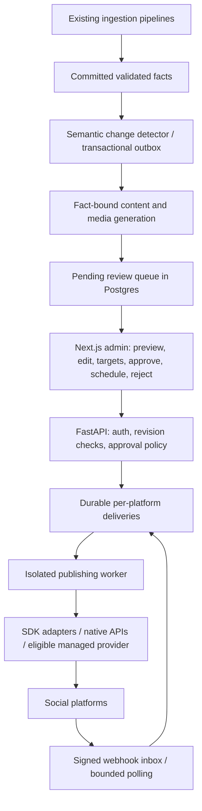

> **Historical record — 2026-10-03.** Preserved from the earlier task artifact. Read the [current engineering blueprint](../ENGINEERING_BLUEPRINT.md) and [low-cost amendment](../LOW_COST_OPERATING_PROFILE.md) before implementation. Earlier paid-provider preferences and preliminary TikTok conclusions may be superseded. Source text is retained; local links were made portable. Private browser screenshots are not copied into the repository.

# AuditGava social setup and publishing design

**3 October 2026 — branding uploaded and verified; Facebook Page created and connected to Instagram; technical research completed.**

Facebook now has a public **AuditGava** organization Page, with an Education website category, bio, website, profile logo, cover and Learn more button. Instagram is a public Business account with the same category. All five platforms have the organization logo and platform-specific bios; X also has its header. Facebook and Instagram appear together as destinations in Meta Business Suite's composer. Automatic posting was not enabled. The Facebook username is now **@AuditGava**, saved after the user completed Facebook's password confirmation. Remaining items are Instagram's mobile-only dedicated website field and TikTok's mobile account/category/link eligibility checks. X remains a standard public account.

No substantive social content was published. Facebook created its normal public profile-photo and cover-photo update activity during branding. No Social SDK integration, OAuth developer application, dependency installation, database change, application-code edit, branch change, server restart or modification of existing background workstreams was performed. Research clones, reports and assets are isolated in this task folder. No passwords, recovery details, phone numbers, 2FA, billing or ownership settings were changed.

## 1. Account audit and verified setup

✓ means observed in the saved profile/settings after the change. The before-change observations are retained in the separate baseline audit.

| Platform | Profile/name | Bio | Website | Category/type | Branding | Cross-posting | Status |
|---|---|---|---|---|---|---|---|
| Facebook | ✓ AuditGava public Page / @AuditGava | ✓ | ✓ https://auditgava.com | ✓ Education website | ✓ Logo and cover | ✓ Page linked to @auditgava; both composer destinations verified | Complete |
| Instagram | ✓ AuditGava / @auditgava | ✓ | URL in bio; dedicated link needs mobile | ✓ Business / Education website; public | ✓ Logo | ✓ Facebook Page connection and Business Suite destinations; Threads badge on | Dedicated website field remaining |
| Threads | ✓ AuditGava / @auditgava | ✓ | ✓ https://auditgava.com | Public; category N/A | ✓ Logo | Instagram relationship/badge verified | Profile complete |
| TikTok | ✓ AuditGava / @auditgava | ✓ | URL in bio; no dedicated website control in desktop editor | Public; business/category controls need mobile | ✓ Logo | N/A | Branding complete; mobile business/link eligibility remaining |
| X | ✓ AuditGava / @AuditGava | ✓ | ✓ https://auditgava.com | Standard public account | ✓ Logo and header | N/A | Profile complete; optional professional category remains |

### Facebook

**Found:** “Audit Gava,” numeric personal-profile ID `61594666427405`, personal About sections, a default avatar, no cover and blank bio. The profile switcher showed only this profile and Create Page. No organization Page was available in the session. Personal audience/security settings were not comprehensively reviewed; active login is not a security audit.

**Changed and verified:** after the user's explicit follow-up authorization, created a **Public Page** named **AuditGava**, selected **Education website**, saved the bio below and `https://auditgava.com`, uploaded the logo and cover, and saved a **Learn more** action pointing to the website. Facebook's “Upgrade existing profile” option retained a personal profile in professional mode; the Public Page is the appropriate organization destination. The existing personal profile remains the managing login. No ownership or manager changes were made.

**Page:** [AuditGava on Facebook](https://www.facebook.com/AuditGava). The public profile uses `61594974935142`; Business Suite links expose asset/Page ID `1364005090126631`. Resolve the authoritative API account ID through future OAuth discovery rather than assuming these UI identifiers are interchangeable.

**Connection:** Facebook Linked accounts confirms “Connected Instagram — AuditGava @auditgava.” Meta Business Suite's empty Create post composer selects **AuditGava and auditgava**, with a separate customization switch for Facebook and Instagram. No post was submitted. Instagram message access in the shared Inbox was explicitly left off; no automatic cross-posting was enabled.

**Other setup:** no address, phone or public email was invented. “No hours available” was selected. WhatsApp and friend invitations were skipped. Page notifications are on; promotional marketing emails were turned off in onboarding. A physical-location checklist item does not apply to this website product.

**Username completed:** Facebook showed `@AuditGava` as available and requested the managing login's existing password before saving. The user completed that dialog directly. The returned URL indicated `edited=username`, and visiting **https://www.facebook.com/AuditGava** resolved to this Page with matching branding/category/bio and @AuditGava follower links. No password was requested in chat or entered by the agent. The Page Terms and upload blockers are resolved. Facebook's cover was retried after the first save did not persist; the final saved cover was verified after reload.

### Instagram

**Found:** @auditgava, name auditgava, Personal account, public, default avatar, blank bio/site and zero posts/followers/following. Account suggestions and Threads badge were on.

**Changed and verified:** converted to **Business**, selected **Education website**, displayed the category label, set **AuditGava**, saved the 121-character bio and uploaded the existing logo. The saved logo was verified after reload. Professional tools appeared. No private login/recovery contact was repurposed as a public business contact. The Facebook Page connection is verified in Page settings and Meta Business Suite's dual-platform composer.

**Remaining / exact limitation:** the desktop Website field is disabled and says links can only be edited on mobile. Add `https://auditgava.com` in the mobile app's Edit profile → Links control. The URL in the bio is an interim direction, not a verified dedicated clickable website field. Public status, suggestions and Threads badge remain on.

### Threads

**Found:** @auditgava, linked to Instagram, public, default avatar, blank bio/site and zero followers. Instagram badge and recent-view display were on.

**Changed and verified:** name **AuditGava**, separate bio, persistent website `https://auditgava.com` and profile logo. Each was checked after reload. Threads adds redirect/tracking parameters to outgoing links. No separate business category or header control was present.

**Instagram relationship:** reciprocal badges and Accounts Center linkage are verified. The Instagram logo did **not** immediately appear on Threads after Instagram was saved and Threads reloaded, so the logo was uploaded explicitly in Threads. Bios and website links were configured separately. Do not assume linkage keeps every profile field synchronized. Consumer linkage does not supply Threads API authorization. [Threads introduction](https://about.fb.com/news/2023/07/introducing-threads-new-app-text-sharing/), [Threads profile links](https://about.fb.com/news/2025/03/new-threads-features-more-personalized-experience-you-control/).

### TikTok

**Found:** @auditgava, name auditgava, public (Private account unchecked), default avatar, blank bio/site and zero videos/followers/following/likes. Comments were Everyone. Business verification was off; that is not proof of a Business account. Desktop editing offered Name, Username and an 80-character bio, without dedicated website/category/account-switch controls.

**Changed and verified:** the earlier round encountered a generic save error. On the follow-up, the 76-character bio was present, the existing logo was uploaded, and **AuditGava** was saved after nickname confirmation. Reloaded profile shows the logo, name and bio. The earlier failed-save state is superseded by this verified result. The nickname editor warns that changes are limited to once per seven days.

**Remaining / exact limitation:** account-type/category and website controls are absent from the inspected desktop editor. Check the mobile app for Business switching, select Education & Training or the nearest actual education category, and check website-link eligibility. Business verification is separate and was not attempted. No identity/business documents or security details were changed. [Account types](https://support.tiktok.com/en/using-tiktok/growing-your-audience/switching-to-a-creator-or-business-account).

### X

**Found:** @AuditGava, name Auditgava, default avatar, no header/bio/site, zero posts/followers and one following; unverified.

**Changed and verified:** **AuditGava**, the 152-character bio, dedicated website, existing logo and matching header. Images and text persisted after reload. Protect your posts was unchecked. Email/phone discoverability and anyone photo tagging were on and left unchanged. No contacts were imported.

**Remaining:** optional professional Business conversion with an Education category if available. The standard public account can serve as the branded profile; paid verification/subscription is outside this setup. The profile now meets the name/bio/picture completeness prerequisite. [Professional account policy](https://help.x.com/en/rules-and-policies/professional-account-policy).

### Upload resolution and audit limits

The earlier local-file upload attempts were blocked because the Chrome extension's **Allow access to file URLs** permission was disabled. The user enabled it and explicitly requested a retry. The file chooser uploads then succeeded. All five logos and both applicable header assets are now applied; this is no longer an upload blocker. [Official upload instructions](https://developers.openai.com/codex/app/chrome-extension#upload-files).

Logged-in accounts permitted normal profile inspection and editing. Developer OAuth scopes, application reviews and production API access were not established. Sensitive security settings were not modified or exhaustively audited. No automatic posting, contact syncing, advertising or aggressive sharing automation was enabled.

## 2. Brand configuration and final copy

Use **AuditGava** everywhere and retain the existing handles. The repository describes a Kenya public-money tracker and civic technology product; the organization logo is appropriate. **Education website** was available and selected on both Facebook and Instagram: it describes understandable public information while the Page/Business types provide management tools. TikTok's closest education category should be selected through its available mobile controls. Threads has no comparable category; X currently has none.

The repository does not establish registered nonprofit status. Public-interest purpose alone does not justify nonprofit. News/media would overstate a newsroom identity, public service/government could imply official ownership, and political/activist categories misrepresent the product. Software/product is a fallback where education is unavailable. Category selection does not itself grant API privileges.

| Platform | Display name | Username | Category/type | Primary destination |
|---|---|---|---|---|
| Facebook — saved | AuditGava | @AuditGava | Public Page / Education website | https://auditgava.com |
| Instagram — saved | AuditGava | @auditgava | Business / Education website | URL in bio; dedicated link pending mobile |
| Threads — saved | AuditGava | @auditgava | Public profile | https://auditgava.com |
| TikTok — saved | AuditGava | @auditgava | Public; mobile business/category check remaining | URL in bio; dedicated link eligibility pending |
| X — saved | AuditGava | @AuditGava | Standard public profile | https://auditgava.com |

**Facebook Page bio — saved**

> Understand where Kenya’s public money goes. Explore government spending, debt and audit findings, with clear explanations and links to the source data.

**Facebook longer About copy — optional prepared copy, not saved as a separate field**

> AuditGava helps people understand Kenya’s public finances. Explore national and county spending, public debt, audit findings and financial data, with clear explanations and links to original sources. Follow for data updates, useful comparisons and public-finance explainers. Explore the full data at https://auditgava.com.

**Instagram — saved, 121/150**

```text
Kenya’s public money, made clear.
Spending • debt • audits
Data updates & explainers for everyone.
Explore: auditgava.com
```

**Threads — saved**

> Kenya’s public money, explained. Follow spending, debt and audit updates with sources and context. Explore the data at auditgava.com.

**TikTok — saved, 76/80**

> Kenya’s spending, debt & audits, made clear. Explore the data: auditgava.com

**X — saved, 152/160**

> Follow Kenya’s public spending, debt and audit findings. Clear explainers, data updates and source links to help you understand where public money goes.

Facebook CTA: **Learn more → https://auditgava.com**, saved. Instagram should use its mobile website link and platform-specific caption CTA. No invented contact, donation or political CTA.

### Assets

The profile asset is the original organization logo copied unchanged. Header variants preserve the emblem and current forest/cream/gold palette with “Kenya’s public money, explained.” No repository asset was overwritten. Headers were generated using the built-in imagegen tool; prompts are in the [asset notes](../assets/README.md).

| Asset | File | Size | Deployment state |
|---|---|---|---|
| Shared profile picture | [auditgava-profile.png](../../../frontend/public/logo-original.png) | 1024 × 1024 | Uploaded and verified on all five platforms |
| Facebook cover | [auditgava-facebook-cover.png](../assets/auditgava-facebook-cover.png) | 2032 × 774 | Uploaded and verified after reload |
| X header | [auditgava-x-header.png](../assets/auditgava-x-header.png) | 2172 × 724, 3:1 | Uploaded and verified after reload |


Instagram, Threads and TikTok use the shared profile image and have no cover in the inspected profile editors. Future graphics should match the website's current ledger-style navigation mark; this round preserved existing PNG identity. [Current brand mark](../../../frontend/components/Navigation.tsx#L14), [palette](../../../frontend/tailwind.config.js#L21).

## 3. Meta connection and cross-posting

**Facebook ↔ Instagram: connected and verified for managed publishing.** The new AuditGava Page's Linked accounts panel confirms **AuditGava @auditgava** and offers account details/disconnect. Meta Business Suite shows both profiles and its empty Create post composer selects **AuditGava and auditgava**, with **Customize post for Facebook and Instagram** available. The composer was closed without publishing. The Page destination is the organization Page rather than the managing personal profile.

**Configuration:** per-post sharing is available through Business Suite; automatic sharing was not enabled. Instagram message access in the shared Inbox remains off. Consumer Accounts Center's Sharing across profiles is a separate surface and was not configured for automatic sharing. The Page connection is sufficient to make the inspected Business Suite dual-platform composer available; it does not prove future developer API grants.

Preview each destination and use text/media appropriate for both. When the future admin publisher exists, coordinate any native cross-posting with its delivery ledger so one event does not create duplicate native/dashboard copies.

**Instagram ↔ Threads:** existing linkage and reciprocal badges are verified. Bio/link edits were separate. Instagram's photo did not immediately propagate in this session; Threads was explicitly uploaded and verified. No automatic Threads publishing was enabled. Separate Threads OAuth remains necessary.

## 4. Social SDK source audit

Recommendation: use Social SDK conditionally as a **server-side adapter library behind an AuditGava-owned interface**, not as the entire publishing subsystem. There is no direct Facebook adapter. Instagram, Threads and TikTok have implemented direct source paths, but the checkout explicitly lacks live adapter verification. No live API call was performed in this round.

Source snapshot: [`a76fb612c8abd5926fbfa40c9a3f556a523531ea`](https://github.com/opencoredev/social-sdk/tree/a76fb612c8abd5926fbfa40c9a3f556a523531ea), latest main commit 29 September 2026. npm latest observed: **0.5.0**, released 24 September. Main's manifest also says 0.5.0, but its Postiz adapter was added later and is absent from that published tarball. The repository was created 8 September and first npm publication was 22 September: young, active, pre-1.0, with limited operating history. Pinned CI reports success using offline/mocked verification; this audit did not execute tests. [Package](https://github.com/opencoredev/social-sdk/blob/a76fb612c8abd5926fbfa40c9a3f556a523531ea/packages/social-sdk/package.json), [registry](https://registry.npmjs.org/@opencoredev/social-sdk), [Postiz addition](https://github.com/opencoredev/social-sdk/commit/2042ce84f62803e06e62c92b48f92ae6da1d8af6), [CI](https://github.com/opencoredev/social-sdk/actions/runs/36629394199).

### Compatibility matrix

“SDK direct” below means implemented source/contract evidence, conditional on actual account scopes and platform approval. Managed-provider coverage requires its own eligibility, plan and operational verification.

| Capability | Facebook | Instagram | Threads | TikTok |
|---|---|---|---|---|
| Auth | Native Facebook Login + Page token, or managed provider; no direct SDK helper | SDK Instagram Login OAuth; Facebook Login token supported but OAuth/Page discovery needs native work | SDK Threads OAuth; separate account ID/token | SDK TikTok OAuth + open ID; eligibility remains a separate gate |
| Text posts | Native Pages API or managed route | No standalone text; media caption | SDK direct, 500-character limit | No standalone text; photo/video caption |
| Image posts | Native Pages API or managed route | SDK direct JPEG; 1–10 media items; matching carousel ratios | SDK direct HTTPS media; up to 10 carousel items | SDK direct, 1–35 JPEG/WebP photos from verified origin |
| Video | Native video/Reels or managed route | SDK direct MP4/MOV; normalized single video is a Reel; native Story/Reel helpers | SDK direct HTTPS video/mixed carousel | SDK direct one video via URL pull; creator-specific duration |
| Local byte upload | Native or managed route | No direct SDK byte upload | No direct SDK byte upload | Direct SDK lacks FILE_UPLOAD; native API needed |
| Scheduling | Own worker recommended; native format support to validate, or managed route | Own durable worker; no direct SDK scheduler | Own durable worker; no direct SDK scheduler | No direct SDK scheduler; policy/consent restrict automation |
| Analytics | Native Insights or managed metrics | SDK post/account Insights, scope/format dependent | SDK post/account metrics, insights scope | SDK video Display counters/account stats; photo metrics unproven |
| Webhooks | Native Meta setup or managed route | SDK signature verification/selected decoding | SDK signature verification; several event types remain unknown | SDK timestamp/HMAC verification and publish/revocation events |
| Published deletion | Native/eligible managed route | SDK Facebook Login only with additional permission; Instagram Login unsupported | SDK own-post deletion with scope | No published deletion in inspected SDK |
| Social SDK support | Managed only | Direct + managed | Direct + managed | Direct + managed; major eligibility limits |
| Native API needed | Yes for direct Facebook behavior | Facebook Login/discovery; quota/product gaps as required | Quota reads/subscription gaps as required | FILE_UPLOAD/cancellation/revocation if needed; not a workaround for eligibility |

Source implementations: [Instagram](https://github.com/opencoredev/social-sdk/blob/a76fb612c8abd5926fbfa40c9a3f556a523531ea/packages/social-sdk/src/platforms/instagram.ts), [Threads](https://github.com/opencoredev/social-sdk/blob/a76fb612c8abd5926fbfa40c9a3f556a523531ea/packages/social-sdk/src/platforms/threads.ts), [TikTok](https://github.com/opencoredev/social-sdk/blob/a76fb612c8abd5926fbfa40c9a3f556a523531ea/packages/social-sdk/src/platforms/tiktok.ts), [managed format declarations](https://github.com/opencoredev/social-sdk/blob/a76fb612c8abd5926fbfa40c9a3f556a523531ea/packages/social-sdk/src/cloud/common.ts#L164). Meta primary references: [Facebook collection](https://www.postman.com/meta/facebook/documentation/r56bjfd/facebook-api), [Instagram collection](https://www.postman.com/meta/instagram/documentation/6yqw8pt/instagram-api), [Threads collection](https://www.postman.com/meta/threads/documentation/dht3nzz/threads-api).

### Authentication and platform requirements

- **Facebook:** publish as the selected Page with an authorized Page access token. Planning scopes include pages_show_list, pages_read_engagement and pages_manage_posts; Insights/webhook permissions only when used. App review, Page tasks and exact permissions need developer-console validation. No browser cookies or personal-profile publishing.
- **Instagram:** a professional account is required. Facebook Login needs the linked Page; Instagram Login does not. SDK OAuth implements Instagram Login, not Facebook OAuth. Plan instagram_business_basic/content_publish for Instagram Login, or instagram_basic/content_publish plus required Page permissions for Facebook Login. Additional Insights/deletion scopes are separate. Account type/category is not an API grant. [Meta Instagram Login](https://www.postman.com/meta/instagram/folder/6raa77c/instagram-api-with-instagram-login).
- **Threads:** threads_basic/content_publish for the initial route; add insights/deletion/replies only when used. Store Threads' own user ID/token, despite Instagram linkage.
- **TikTok:** video.publish for Direct Post; video.upload for draft/inbox workflows, which still require creator completion. Current guidelines exclude an internal utility whose purpose is uploading to accounts its developer/team manages. An AuditGava-only dashboard appears to fit that rule; this is an inference about this proposed product, not a rejection already issued to AuditGava. Keep manual export/native upload initially, or confirm a managed provider's approved, permitted use for this exact workflow. Public Direct Post requires audit approval, current creator information, preview and express publishing consent. An unattended consentGiven=true flag is not consent. [Content Sharing Guidelines](https://developers.tiktok.com/docs/en/content-sharing-guidelines).

TikTok unaudited clients are private-only and limited to five publishing users per day. Official limits include six initialization requests/minute/user token, twenty creator-info requests/minute and thirty status requests/minute, plus creator daily caps/moderation. Its SDK supports verified-origin URL pull, not local upload. Acceptance is not publication. Preserve publish_id and poll/handle events until a valid terminal state; private/inbox completion may have no public post ID. [Direct Post](https://developers.tiktok.com/docs/en/content-posting-api-reference-direct-post), [creator info](https://developers.tiktok.com/doc/content-posting-api-reference-query-creator-info), [status](https://developers.tiktok.com/docs/en/content-posting-api-reference-get-video-status), [media transfer](https://developers.tiktok.com/docs/en/content-posting-api-media-transfer-guide).

Instagram/Threads use platform-specific long-lived access-token refresh, and TikTok uses rotating refresh tokens. Official TikTok lifetimes are 24-hour access and initial 365-day refresh; the SDK does not retain refresh_expires_in, so the app should record refresh expiry. Facebook/Page lifecycle needs native handling. Use credential revision checks and distributed refresh leases. [SDK OAuth](https://github.com/opencoredev/social-sdk/blob/a76fb612c8abd5926fbfa40c9a3f556a523531ea/packages/social-sdk/src/server/oauth.ts), [TikTok token management](https://developers.tiktok.com/docs/en/oauth-user-access-token-management).

### Operational strengths and gaps

The package is TypeScript/ESM, ships declarations, requires Node ≥22.12 and has no runtime dependencies. It has useful typed capabilities, outcomes, injected transport/clock, bounded reads, error categories and mock contracts. Instagram hard-codes Graph v25.0; Threads defaults to configurable v1.0. Version changes and provider formats must be tracked explicitly.

Its workflow, connection, credential and idempotency defaults are in-memory. It supplies neither token encryption nor a production queue/scheduler. Concurrency limits are per instance, not distributed frequency limits. Instagram has a quota helper; Threads' publishing quota requires a small native query. Rate limits should use current platform responses rather than remembered daily caps. [Credential stores](https://github.com/opencoredev/social-sdk/blob/a76fb612c8abd5926fbfa40c9a3f556a523531ea/packages/social-sdk/src/server/credentials.ts), [Threads quota](https://www.postman.com/meta/threads/request/w3x0n4g/retrieve-publishing-quota-limit).

**Idempotency caveat:** fingerprints contain the entire target list. Retrying just failed platforms with the original multi-target key conflicts; replaying the identical request returns saved outcomes, including failures, without redispatching. Claimed-but-unsaved requests become unknown. Outcome-store save failures are swallowed. AuditGava must own durable per-destination intents, reconcile uncertain acceptance and commit its own attempt/receipt records. [Actual client behavior](https://github.com/opencoredev/social-sdk/blob/a76fb612c8abd5926fbfa40c9a3f556a523531ea/packages/social-sdk/src/core/client.ts#L817).

Read retries are bounded; writes have a single transport attempt and uncertain responses need reconciliation. Normalize permission/reconnect, media, rate-limit, billing, approval and unknown-outcome errors. Do not treat every failed request as safe to repeat. [HTTP transport](https://github.com/opencoredev/social-sdk/blob/a76fb612c8abd5926fbfa40c9a3f556a523531ea/packages/social-sdk/src/transport/http.ts#L224).

The server package verifies Meta raw-body HMAC and TikTok timestamped signatures, and decodes selected events. It does not host subscriptions or supply a durable webhook inbox. Unknown events need safe handling and status reads. [Webhook implementation](https://github.com/opencoredev/social-sdk/blob/a76fb612c8abd5926fbfa40c9a3f556a523531ea/packages/social-sdk/src/server/webhooks.ts).

Managed options implemented in npm 0.5.0 are Zernio, Post for Me and PostFast; Postiz exists only on inspected main. Zernio exposes scheduling/media/status/metrics and HMAC webhooks. Post for Me uses a shared-secret header rather than a timestamped body signature. PostFast schedules future posts only, has no webhook route and lacks alt text. Postiz uses status polling because unsigned success hooks are rejected by the SDK. Provider record removal must not be confused with deleting a published social post. Assess price, approvals, internal-brand eligibility, privacy, media handling and deletion before procurement. Self-hosting does not inherit hosted-service app approvals. [Managed source](https://github.com/opencoredev/social-sdk/tree/a76fb612c8abd5926fbfa40c9a3f556a523531ea/packages/social-sdk/src/cloud).

X is an optional later adapter: the SDK has OAuth2/PKCE, text/images/chunk-uploaded video/metrics/deletion, but no direct scheduler. API pricing/access needs a separate cost-capped decision; no billing was configured. [X source](https://github.com/opencoredev/social-sdk/blob/a76fb612c8abd5926fbfa40c9a3f556a523531ea/packages/social-sdk/src/platforms/x.ts), [official pricing](https://docs.x.com/x-api/getting-started/pricing).

Several Meta developer pages returned unavailable/429 responses during research; Meta's official Postman collections supplied primary readable evidence. Exact current review permissions, format-specific scheduling windows and production account eligibility remain implementation validation items. The detailed [SDK audit](social-sdk-audit.md) records source links and qualifications.

## 5. Proposed architecture and admin workflow

Keep the existing **Next.js admin + FastAPI + SQLAlchemy/Postgres/Supabase** architecture. Add /admin/social inside its AdminGuard/React Query shell. FastAPI remains authoritative for permissions, evidence, approvals and state transitions. A small internal Node ≥22.12 publishing service can host selected SDK adapters and a native Facebook Graph adapter without rewriting the Python backend. Use service authentication and a dedicated credential-access role.



The initial UI should provide Pending, Drafts, Scheduled, Delivery history, Account health and Policies/Pause controls. The review detail shows exact platform text/media, a source/page panel, period/basis/units, arithmetic, freshness, warnings and changes since the prior version. Admins can edit/select platforms/approve/schedule/reject; nothing dispatches without approval. Account health exposes status/scopes/expiry/reconnect, never tokens.

Grounded integration concerns:

- Backend require_admin checks Supabase profile roles; enforce it on every API, callback and mutation. UI guards alone are insufficient. [Backend gate](../../../backend/supabase_auth.py#L210).
- Admin actors use Supabase UUIDs while legacy User.id is an integer. Social approval actors must match Supabase identity, not blindly FK to the integer user model. [Audit model](../../../backend/models.py#L1294).
- Current Axios retries network failures for mutations, so approve/publish APIs need server idempotency and expected-revision checks. [Interceptor](../../../frontend/lib/api/axios.ts#L97).
- Existing admin audit logging uses a separate session and swallows failures. Social approval/enqueue/audit records need an atomic domain transaction; mirror actions into the existing audit UI. [Audit helper](../../../backend/utils/audit.py#L48).
- Existing schedulers have distinct ingestion ownership. Give social jobs a separate durable owner; do not restart or repurpose existing workers. Begin with a read-only semantic snapshot detector plus durable watermark/backfill rules, then add transactional source events only at verified producer commit boundaries. [Worker ownership](../../../etl/worker.py#L33).

## 6. Data model

Use normalized rows for independently failing operations, with JSONB for provider-specific payloads. A single publish_results JSON field should not be the authoritative delivery ledger.

| Table | Key data and constraints |
|---|---|
| content_events | UUID, ingestion job, type/entity/period, immutable facts/evidence, observation/publication/detection dates, semantic fingerprint unique, previous/correction event, validation/policy version |
| social_accounts | Provider, stable platform account/Page ID, handle/display metadata, scopes/capabilities, connection health/expiry, connected-by Supabase actor; unique provider/account |
| social_credentials | Server-only encrypted access/refresh tokens or secret references, key version, expiries, credential revision, refresh lease, revocation |
| social_posts | UUID, optional content event for editorial posts, type/title, editorial state, current revision, priority, correction-of, creator/timestamps |
| social_post_revisions | Immutable numbered revisions; shared facts/citations, platform variants, deep links, ordered asset refs, content hash, generator/model/prompt versions, editor/validation |
| social_approvals | Revision/hash, selected account IDs, human actor or named policy identity, decision/reason, policy version, timestamp/expiry |
| social_media_assets | Owned storage ref/hash, MIME/bytes/dimensions/duration, alt text/transcript/captions, render version, factual basis/rights/readiness |
| social_deliveries | Approved revision/account/format, unique intent/idempotency key, UTC schedule + IANA timezone, state, lease/retry, native container/upload/post IDs, permalink/error/publish time |
| social_publish_attempts | Delivery/sequence, request correlation, timestamps, sanitized outcome/error/receipt, no secrets |
| social_events | Append-only atomic transition/audit records: edit/approve/reject/publish/pause/cancel/delete/correct |
| webhook_inbox / outbox | Durable verified event receipt, account resolution, dedup key, processing state; committed producer notifications |

Editorial state: draft → pending_review → approved, plus rejected/cancelled. Delivery state: queued/scheduled → validating → uploading/processing → publishing → published, with retry_wait, failed, needs_reconnect, unknown_outcome, cancelled, deleting/deleted. Overall published/partially_published/failed labels derive from selected delivery rows. Edit content, media or targets → invalidate approval and create a new revision.

Use short row-lease transactions (for example SKIP LOCKED); do not hold a DB lock across media upload. A unique revision/account/format intent blocks duplicate local jobs. Safe retries require proof of non-acceptance or native reconciliation; a timeout is unknown_outcome. Successful destinations remain untouched while failed destinations are retried. Exactly-once public delivery cannot be guaranteed solely by a local key when a provider lacks idempotency.

## 7. Approval model and factual safeguards

| Mode | Appropriate starting use | Required controls |
|---|---|---|
| Manual approval — default | All generated posts; especially audits, comparisons and explanations | Evidence preview, immutable revision/asset hashes/targets, edit invalidation, publish-time validation, delivery receipts, reject/cancel/pause |
| Selective auto-approval — later | Allowlisted deterministic dataset-availability or pre-reviewed glossary templates | Same validations plus versioned policy, significance/dedup/freshness gates, low frequency caps, shadow-mode evidence, immediate human override |

Important existing data constraints:

- IngestionJob completed can include a dry run; exclude dry-run/fixture/withheld/quarantined results. Debt writers count existing rows as updated even when meaning is unchanged. Derive events from semantic hashes, not job success/items_updated. [CLI](../../../backend/seeding/cli.py#L256), [debt writer](../../../backend/seeding/domains/debt_timeline/writer.py#L115).
- The existing audit publication gate checks source URL presence/readable text; it explicitly does not fetch the URL or verify document checksum. It is insufficient for unattended public allegations. Require verified document bytes/hash, page/locator and matching extract. [Gate limitations](../../../backend/services/publication_gate.py#L21).
- Actual, modelled and projected are distinct in FigureBasis. Never call estimates reported actuals or mix bases in totals. Extraction confidence is method-based, not a calibrated probability of truth. [Basis enum](../../../backend/models.py#L68), [extractor](../../../backend/seeding/extractors/oag_blue_book.py#L498).
- Raw KES and billion-KES fields coexist; budget aggregate/component rows can double-count. Use typed Decimal facts with explicit currency/unit/period/basis/coverage and deterministic arithmetic. Source publication, observation and ingestion dates must remain distinct. [Revenue units](../../../backend/models.py#L1067), [freshness semantics](../../../backend/routers/data_freshness.py#L6).

Before automatic approval: require verified source and locator, known units/basis, freshness policy, schema and arithmetic checks, calibrated extraction quality and no contradictions. Compare like-for-like periods/coverage; require configurable absolute and percentage significance with a valid denominator. Deduplicate source events and near-identical variants over a rolling window; consolidate related row changes. Cap posts per account/day/week, enforce minimum intervals/quiet hours and budget API requests separately.

The language model may phrase supplied facts; it must not invent values or infer theft from questioned expenditure. “Unsupported” is not “stolen,” an adverse opinion is not a fraud conviction, and missing data is not zero. Named allegations, sensitive politics/elections, disputed findings, abrupt outliers, corrections and mixed-coverage rankings always require review. No auto-generated replies to complaints or allegations initially.

Run policies in shadow mode while humans approve. Measure factual corrections, reviewer rejection, duplicate rate, source failures and delivery errors; agree on thresholds before enabling one low-risk template/platform. Auto-approved posts still receive a policy approval receipt. Keep TikTok out of Mode B until an explicitly permitted consent/use model is confirmed.

Global/per-platform kill switches are checked at claim and immediately before dispatch. Human override/cancel/reschedule is audited. Deletion is best-effort and capability-gated: Threads supports it; SDK Instagram requires Facebook Login and extra permission; TikTok does not expose published deletion in the inspected SDK. Preserve receipts and publish reviewed corrections where necessary. There is no cross-network transactional rollback.

## 8. Content strategy and platform variants

Registered pipeline domains include national/county budgets, audits, economic indicators, population, debt, pending bills, debt timeline, fiscal summary, revenue sources, learning hub, stalled projects, GDP and IMF WEO. Registration does not establish complete verified production coverage. Use only records that pass the social evidence contract. [Registry](../../../backend/seeding/registries.py#L60).

All examples below are templates with placeholders, not claims about current amounts.

| Recurring category | Example | Future automation class |
|---|---|---|
| Dataset/report availability | “[Publisher]'s [period] report is now available to explore on AuditGava.” Check website actually serves it | Fully automatable after deterministic gates |
| One term, one minute | “A budget allocation authorizes spending. It does not tell you what was spent.” Use reviewed glossary | Fully automatable reviewed-template rotation |
| Source/freshness cards | “This figure covers [period]. The report was published [date]; we last checked it [date].” | Fully automatable structured template |
| Civic quiz | “Who audits public spending? See the answer and source.” Pre-reviewed educational cards | Fully automatable reviewed-template rotation |
| Verified chart releases | “[Measure] across [comparable periods], according to [source].” Explicit units/basis | Deterministic charts automatable; new narrative reviewed |
| Debt change/composition | “Public debt was KSh [X] at [date], [Y] higher/lower than [date], according to [source].” | AI-assisted; approval |
| Allocation versus spending | “[Entity] reported spending [X] of [Y] allocated for [period] ([Z]%).” | AI-assisted; approval |
| Pending bills | “[Entity] reported KSh [X] in pending bills for [period]. Here is what that means.” | AI-assisted; approval |
| Revenue mix/targets | “Out of each KSh 100 collected in [period], [X] came from [source].” | Approval initially; deterministic chart later |
| Audit findings/opinions | “The Auditor-General reported [precise finding] in [entity]'s [period] report, p. [N]. [Response/context].” | Always reviewed |
| County comparisons | Compare development-spending share for same period/basis/coverage | AI-assisted; approval |
| Per-person context | “[X] per resident using [population year/method].” Explain denominator | AI-assisted; approval |
| Stalled-project updates | “[Source] reports [status] for [project] at [date].” | Always reviewed |
| Corrections/methodology | “We corrected [measure] after [source/method change]. Before [X], now [Y].” | Editorial/manual priority |
| New features/coverage | New dataset, county, year, report or explorer feature after release verification | Editorial release event/manual approval |
| Reader questions/interviews | Address common questions, explain methods, host expert conversation | Editorial/manual |

Start with a modest cadence of useful explainers and source-led availability notices; accuracy outranks volume. Link to the relevant AuditGava evidence page where available, using the main website in profile links. Include citations/page/period in every financial card and accessible alt text. Use inclusive plain language and occasional reviewed Kiswahili variants when accurate.

One event shares immutable facts, source/page, dates, units/basis, caveats, event ID and approved narrative. Each platform gets its own hook, length, layout, CTA, alt text/captions and aspect ratio:

| Platform | Variant |
|---|---|
| Facebook | Sourced paragraph, useful context/management response, direct evidence link and chart |
| Instagram | Legible chart/card/carousel, concise caption, citation on image, “Explore via profile link” CTA |
| Threads | Concise fact + one essential caveat + link; longer sequence only when useful |
| TikTok | 15–45-second visual explanation, spoken/on-screen period/units, source/end card and captions; manual native upload initially |
| X | Concise fact/caveat/link with a static chart if API access/cost later justify it |

Avoid copying one unchanged post everywhere. Avoid rankings built from estimated/actual mixtures, dramatic accusation headlines or decorative charts that omit scale/source.

## 9. Lightweight video proposal

Later pipeline: immutable evidence snapshot → deterministic chart/cards → approved short script → optional voiceover → timed captions/transcript → 1080 × 1920 render → admin preview → approval → eligible upload/export route.

Use a separate render worker plus owned object storage, independent of ingestion and API workers. Evaluate template-driven HTML/Remotion or the available HyperFrames workflow, a chart library and FFmpeg encoding during the dedicated video project. First prototype: simple animated chart, two explanatory cards and a source card; voiceover optional. Validate numerals/pronunciation, subtitle timing, contrast, safe areas and readability at mobile size. Retain script, facts, media hashes, transcript and render version as reviewable artifacts. Use rights-cleared audio; handle synthetic-media disclosure per platform. No generated official endorsements or fabricated documentary footage.

The publishing layer should accept ready media rather than render synchronously. TikTok's eligibility/consent model governs its upload route; video generation does not bypass it. No video pipeline was built in this round.

## 10. Security, delivery and failure handling

OAuth authorization code with one-time state bound to initiating admin/provider/session, allowlisted redirects and PKCE where supported (X uses S256). Validate callback/account selection against grants and stable IDs. Only connection managers can attach accounts; editors/approvers/publishers can later be separated. Never trust a frontend-supplied arbitrary account ID.

Keep client secrets in a secret manager. Store access/refresh tokens as server-only ciphertext using a key held separately, with key and credential revisions. Browser responses show metadata/health only. No social tokens in NEXT_PUBLIC variables, React props, HTML, localStorage, browser logs or analytics. Enforce backend authorization and RLS/server-only DB privileges; the browser carries only its existing AuditGava session credential.

Use durable refresh leases, atomic rotation and reconnect/revocation states. Persist asynchronous container/upload/publish IDs and media hashes. Owned HTTPS media must remain fetchable long enough for platform processing; validate MIME/size/duration and prevent SSRF in remote asset fetches.

For webhooks: verify raw-body signatures before parsing, bound body size, resolve account through stored connections, deduplicate in an inbox transaction, quarantine unknown accounts/events and process asynchronously. Meta signatures have no signed timestamp; durable event/body dedup matters. Poll where webhook coverage is incomplete. Do not allow late events to overwrite a confirmed terminal state improperly.

For publishing: independent destination intents, leases, bounded jittered retry, platform quota/frequency budgets, Retry-After handling, dead-letter/reconnect queue and unknown-outcome reconciliation. Confirm success through an actual remote receipt/status rather than an initial accepted response. Show partial success clearly in admin; retry only safe failed destinations. Audit approve/edit/publish/cancel/pause/delete/correct with sanitized details, never tokens.

## 11. Implementation roadmap

| Phase | Outcome | Dependencies / exit criteria |
|---|---|---|
| 1 — Finish accounts | Page/branding/Meta connection completed; finish mobile links/category | Instagram mobile Links; TikTok mobile eligibility; preserve verified account destinations |
| 2 — API strategy and OAuth | Native Facebook + selected SDK/managed routes; encrypted connection health | TikTok eligibility decision first; developer apps/scopes/reviews; pin actual released artifact; controlled account authorization |
| 3 — Manual admin publishing | Compose/preview, human approval, per-account receipts, durable worker | Normalized revisions/deliveries, security, idempotency, pause controls; controlled live publish verification |
| 4 — Pending/scheduled workflow | Review queue, edit/reject/select/schedule, account health and audit trail | Approval invalidation; stale-version rejection; crash recovery/ambiguous response/partial failure tests |
| 5 — Event/content generation | Semantic detector/outbox, facts/citations, platform variants, deterministic cards | Validated actual data and publish-time evidence contract; one domain first; all manual approval |
| 6 — Selective automation | Shadow policies, then one allowlisted deterministic template/platform | Measured factual/reviewer/delivery quality, dedup/freshness/significance/caps, kill switch; sensitive findings remain reviewed |
| 7 — Graphics/video expansion | Reusable charts, captioned short-video worker and previews | Media validation/storage/rights/accessibility; approved scripts; permitted publishing/export routes |

Build encrypted account connections and reliable manual publishing before automated content generation. Establish the evidence contract before pipeline-triggered posting. Do not make Social SDK the policy/state source of truth. The future proof suite should cover edited approvals, browser request retries, concurrent/crashed workers, expired/revoked credentials, rate limits, webhook replay, lost write responses, media continuation and partial deliveries. Live checks require actual platform grants; mock tests alone cannot establish production feasibility.

## Verification evidence and remaining actions

- [Before-change audit](account-audit-before.md)
- Facebook branded Page (historical local evidence attachment; not included in this repository archive)
- Facebook/Instagram connection (historical local evidence attachment; not included in this repository archive)
- Facebook Learn more CTA (historical local evidence attachment; not included in this repository archive)
- Both publishing destinations (historical local evidence attachment; not included in this repository archive)
- Instagram branded profile (historical local evidence attachment; not included in this repository archive)
- Threads branded profile and link (historical local evidence attachment; not included in this repository archive)
- TikTok saved name, logo and bio (historical local evidence attachment; not included in this repository archive)
- X branded profile and link (historical local evidence attachment; not included in this repository archive)
- [Detailed SDK source audit](social-sdk-audit.md)
- [Detailed architecture/content research](architecture-research.md)

Remaining account work: add Instagram's dedicated link on mobile and check TikTok's mobile Business/category/website eligibility. X professional conversion is optional. The earlier Facebook Terms and image-upload blockers are resolved. No sensitive security/ownership changes are implied. Developer OAuth/API eligibility is future implementation work, separate from these consumer profile changes.
