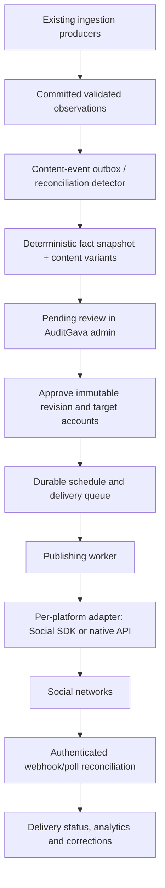

> **Historical record — 2026-10-03.** Preserved from the earlier task artifact. Read the [current engineering blueprint](../ENGINEERING_BLUEPRINT.md) and [low-cost amendment](../LOW_COST_OPERATING_PROFILE.md) before implementation. Earlier paid-provider preferences and preliminary TikTok conclusions may be superseded. Source text is retained; local links were made portable. Private browser screenshots are not copied into the repository.

# AuditGava social publishing: architecture and content research

Research date: 3 October 2026. Scope: read-only inspection of the current local repository; recommendations only. No application code, branches, databases, processes, existing terminals, or background workstreams were changed. No secrets or environment files were read. This note does not establish production deployment state or current dataset completeness; it distinguishes source-code capabilities from verified data ready to publish.

## Product and existing brand assets

AuditGava identifies as “Kenya Public Money Tracker” and a civic technology platform for everyday Kenyans. It aggregates audits, budgets, debt figures, and economic indicators and translates them into understandable language and visuals. That supports education/public-information or software/product categories; the code does not establish nonprofit legal status. Sources: [site metadata](../../../frontend/app/layout.tsx#L16), [mission](../../../frontend/app/about/page.tsx#L105), [terms](../../../frontend/app/terms/page.tsx#L43).

Use an organization mark for social avatars. Existing, visually inspected assets:

- [logo-original.png](../../../frontend/public/logo-original.png): 1024 × 1024 green Kenya/checkmark badge with dark background.
- [icon-512.png](../../../frontend/public/icon-512.png): 512 × 512 same badge on transparent canvas; [icon-192.png](../../../frontend/public/icon-192.png) is another existing size.
- [og-image.png](../../../frontend/public/og-image.png): existing 1536 × 1024 site share image; not automatically suitable for every network's cover crop.
- The current navigation separately renders a simple ledger-lines mark in CSS. Its tagline is “Public money · evidence first.” Reconcile social artwork with the current website before assuming the older PNG is its sole active mark. Source: [BrandMark](../../../frontend/components/Navigation.tsx#L14), [tagline](../../../frontend/components/Navigation.tsx#L131).

Current palette: dark `#101B14`, forest `#174A34`, sage `#176B49`, gold `#B8872D`, sand `#F3EEE4`, cream `#FBFAF6`, copper `#C9473D`. Source: [Tailwind brand tokens](../../../frontend/tailwind.config.js#L21). Prefer restrained cream/forest data graphics; use copper to mark a finding, not party imagery, campaign slogans, flags as the primary identity, or seals suggesting government ownership.

Bio direction: “Kenya's public money, explained. Explore government spending, debt and audit findings. Data and sources: auditgava.com.” Platform wording may vary. Avoid “every number verified” and “new official data every night”: code contains modelled/projected data and nightly runs may reuse fixtures or find nothing new.

## Existing architecture that the feature should fit

| Area | Verified repository pattern | Implication |
|---|---|---|
| Public/admin frontend | Next.js App Router; admin overview uses React Query and shared Axios client. [Overview](../../../frontend/app/admin/page.tsx#L117) | Add `/admin/social` inside the existing admin shell, with a pending count, filters, detail editor, account health, schedule and delivery history. |
| Admin authorization | Middleware checks Supabase `profiles.roles`; `AdminGuard` wraps admin routes; FastAPI `require_admin` verifies the user and checks the same role source. [Middleware](../../../frontend/lib/supabase/middleware.ts#L73), [shell](../../../frontend/app/admin/layout.tsx#L34), [backend gate](../../../backend/supabase_auth.py#L210) | Backend authorization is mandatory on every read/mutation; browser checks improve navigation only. Later split editor/approver/publisher/connection-manager permissions. |
| Identity | Admin actor is Supabase UUID, whereas legacy `User.id` is an integer. [AdminAuditLog](../../../backend/models.py#L1294), [User](../../../backend/models.py#L353) | Store social `approved_by`/`created_by` as the Supabase actor UUID/string; do not blindly FK them to legacy integer users. Auth and data Supabase projects may differ. |
| API/database | FastAPI registers modular admin routers; SQLAlchemy, Postgres JSONB and Alembic baseline schema are already present. [Router registration](../../../backend/main.py#L1379), [models](../../../backend/models.py#L149), [database](../../../backend/database.py#L48) | Add isolated social models/migrations/router/service later; keep Python backend as authority. Do not place credentials or publishing decisions in Next.js client code. |
| Ingestion tracking | `IngestionJob` has domain, dry-run, status, counts, errors, metadata. [Model](../../../backend/models.py#L730) | Link each content event to its ingestion job and evidence; job status alone is not a factual publication trigger. |
| Source/evidence model | Source documents carry URL, fetch date, checksum, verification bookkeeping; extraction records carry page and confidence; figures carry basis, source hash, publication/quarantine fields. [SourceDocument](../../../backend/models.py#L149), [Extraction](../../../backend/models.py#L184), [Audit](../../../backend/models.py#L309) | Preserve these references and their values in an immutable evidence snapshot used for review and publish-time validation. |
| Audit logs | Existing append-only `AdminAuditLog` uses action, actor, target and redacted JSON payload. [Model](../../../backend/models.py#L1285) | Make social actions filterable in the existing audit-log UI. Also add atomic social-domain transition events because the current helper uses a separate session and swallows failure. [Helper](../../../backend/utils/audit.py#L48) |
| Watcher alerts | A backend helper calls a database function to fan out alerts, but inspected Python call sites only show its definition/documentation. [Service](../../../backend/services/alert_service.py#L32) | Useful precedent for event consumers, not evidence that a durable domain-event bus or active ETL alert hook exists. |

The repository has several scheduling paths: GitHub Actions nightly/weekly seeding, backend APScheduler source jobs, and an ETL worker using advisory locks. Parliament explicitly belongs to APScheduler instead of the ETL worker. Sources: [nightly workflow](../../../.github/workflows/seed.yml#L3), [backend schedules](../../../backend/main.py#L6788), [worker ownership rule](../../../etl/worker.py#L33), [config](../../../config/etl_schedule.yaml#L13). Social scheduling should have one independent durable owner and its own locks; do not restart, repurpose or add duplicate ownership to these existing workers.

The nightly workflow already gates frontend revalidation on successful seeding + validation and a non-dry run. That is the appropriate conceptual checkpoint for future content discovery, followed by stronger social-specific validation. Source: [post-validation revalidation](../../../.github/workflows/seed.yml#L650). During implementation, a reconciliation worker can initially detect committed semantic changes without invasive ETL rewrites; transactional producer events can replace polling incrementally.

## Accuracy gaps that constrain automation

1. **Job success does not mean new publishable data.** Dry-run jobs can reach `completed` while data changes were rolled back. Fixture mode is tracked and downgraded to `completed_with_errors`. Source: [CLI finalization](../../../backend/seeding/cli.py#L256). Require `dry_run=false`, acceptable source mode, explicit validation results and a changed semantic snapshot.
2. **Update counts can overstate change.** Debt timeline writer overwrites every existing record and increments `updated`, without checking whether values changed. Source: [writer](../../../backend/seeding/domains/debt_timeline/writer.py#L115). A higher `items_updated` must not produce “debt increased” or “new data” posts. County budget writers already have content hashes, which are a better precursor for an event key. [Hash](../../../backend/seeding/domains/counties_budget/writer.py#L160).
3. **Passing the existing audit gate is insufficient for unattended posting.** The runtime predicate checks a non-empty source URL and unreadable CID text, while explicitly documenting that it does not fetch the URL or check document checksum. The current model now has `Audit.page_ref`, but the predicate still does not require it. Sources: [gate limitations](../../../backend/services/publication_gate.py#L21), [predicate](../../../backend/services/publication_gate.py#L139), [page field](../../../backend/models.py#L340). The social gate must require a verified document, locator, consistent extracted evidence, and review for allegations.
4. **Actuals, models and forecasts must stay distinguishable.** `FigureBasis` defines all three and warns against mixing them in totals. [Enum](../../../backend/models.py#L68). Unknown basis should fail automatic approval. Modelled county data must never be described as county-reported actual expenditure. The website already has explicit modelled warnings. [Existing disclaimer](../../../frontend/lib/i18n/messages.ts#L477).
5. **Units and budget concepts vary.** Debt timeline/fiscal summary money is raw KES; revenue-by-source retains billion-KES columns. Budget lines include totals, aggregates and components, so naive sums can triple-count. [Debt units](../../../backend/models.py#L808), [revenue units](../../../backend/models.py#L1067), [budget discriminator](../../../backend/models.py#L225). Fiscal metadata also distinguishes budget basis and debt-service basis. [Writer metadata](../../../backend/seeding/domains/fiscal_summary/writer.py#L78). All arithmetic should use typed Decimal amounts with explicit currency/unit/period/basis and aggregation rules before generating text.
6. **Freshness has different meanings.** Existing router distinguishes source publication, last pipeline check, and period covered; provenance helper may fall back to fetch date if publication date is absent. [Freshness semantics](../../../backend/routers/data_freshness.py#L6), [fallback](../../../backend/provenance.py#L53). A social post must carry the actual observation period and cannot call an old observation “today's debt” because it was fetched today.
7. **Confidence is not a guarantee of truth.** The OAG extractor assigns 0.90 for pdfplumber and 0.60 for OCR, a method heuristic, not a calibrated probability. [Extractor](../../../backend/seeding/extractors/oag_blue_book.py#L498). Preserve score + method, calibrate later against reviewed extractions, and use deterministic checks and approval in addition.
8. **Existing quality checks favor site availability.** Trust guards return warnings and do not raise; they are useful signals but should become blocking social-policy findings where facts fail. [Guard semantics](../../../backend/services/trust_guards.py#L1). No implemented social models or transactional outbox were found in the inspected backend/ETL/migration Python/SQL search.

## Recommended publishing architecture

Next.js handles editing/preview, FastAPI owns permission, content/review policy and state transitions, and Postgres owns durable work and evidence. The publishing worker is a separate process/service with its own queue leases and restricted access to credentials. If the audited SDK is TypeScript-only, host it in a small internal Node adapter service; keep policy, approvals and database state in Python rather than rewriting the existing backend. The native adapter contract should expose `capabilities`, `connect`, `validate`, `publish`, `lookup_status`, `delete_if_supported`, `refresh_if_supported` and normalized typed outcomes. Unsupported capabilities must return explicit errors.

Transactional outbox producers should insert the source event in the same transaction as committed normalized facts. A worker emits drafts after commit and social validation. Existing writers have different transaction ownership, so do not attach one global callback and assume atomicity; first map each producer's commit boundary. Keep unique event keys such as `(event_type, entity, period, fact_snapshot_hash, policy_version)`. Source reissues/corrections create new linked events rather than mutating historical receipts. An initial read-only detector can compare persisted semantic hashes; it needs a durable watermark, backfill policy and deduplication, not just `updated_at` polling.

## Recommended data model

Use normalized operational rows with JSONB for provider-specific details. Avoid one giant `social_posts.publish_results` JSON object as the authoritative state for independent platform deliveries.

| Table | Essential fields and constraints |
|---|---|
| `content_events` | UUID; event type; ingestion-job FK; typed entity/period/source references; immutable fact snapshot; evidence references; observation/publication/detection dates; semantic fingerprint unique; previous event/correction link; validation verdict and policy version. |
| `social_accounts` | UUID; provider; immutable provider account/Page ID; displayed handle/name; selected capabilities/scopes; connection status; expiry/health; last verification; connected-by Supabase UUID. Unique `(provider, provider_account_id)`. No raw token in normal responses. |
| `social_credentials` | Account FK; encrypted access/refresh token or secret-manager reference; key version; token type/scopes; issued/expiry/refresh timestamps; credential revision; revocation state. Dedicated server-only access. |
| `social_posts` | UUID; optional content-event FK for editorial posts; content type; title; editorial state; current revision; creator; priority; correction-of; creation/update timestamps. |
| `social_post_revisions` | Post FK + monotonically increasing revision unique; shared fact snapshot and citations; platform texts; CTA/deep link; ordered media refs; content hash; generation method/model/prompt version; editor; policy validation results. Immutable once approved. |
| `social_approvals` | Post/revision/hash; explicit selected account IDs; actor UUID or named automated-policy identity; decision; policy version; reason; timestamp; expiry. A content/media/target edit invalidates prior approval. |
| `social_media_assets` | UUID; owned-storage reference; content hash; MIME; dimensions/duration/bytes; alt text/caption/transcript; render version; factual basis and rights/attribution; readiness/expiry. |
| `social_deliveries` | UUID; approved revision + target account + format; schedule UTC plus selected IANA timezone; delivery state; idempotency key unique; attempts; next retry; lease owner/expiry; external post/container/upload IDs; permalink; last normalized error; publish timestamp. Unique intended revision/account/format avoids duplicate dispatch. |
| `social_publish_attempts` | Delivery FK; attempt sequence unique; correlation/request IDs; start/end; normalized error category; sanitized provider response; accepted remote ID; outcome. Never tokens. |
| `social_events` | Append-only domain ledger of approve/edit/reject/queue/publish/delete/pause/correct actions and worker transitions, recorded atomically with domain changes. Mirror human actions into existing admin audit log for discoverability. |

Editorial states: `draft → pending_review → approved`, plus `rejected` and `cancelled`. Delivery states: `queued/scheduled → validating → uploading/processing → publishing → published`, with `retry_wait`, `failed`, `needs_reconnect`, `unknown_outcome`, `cancelled`, `deleting`, `deleted`. The familiar overall `published/partially_published/failed` UI labels are derived from selected deliveries. A timeout after request acceptance is `unknown_outcome`, not permission to blindly send the same post again.

Durable worker claims use short transactions and row leases (`FOR UPDATE SKIP LOCKED` is one implementation option); no DB lock spans a long media upload. Bound attempts with jittered exponential backoff, respect `Retry-After`, and retry only transient transport/server/rate-limit errors. Permission/token-expired failures move to reconnect; invalid content is terminal until edited. Reconcile remote acceptance before retrying ambiguous calls. Database idempotency prevents local duplicates but cannot alone guarantee exactly-once publishing where the provider lacks native idempotency.

Approval endpoints should take revision/expected version and an idempotency key. This matters because the existing Axios interceptor retries network errors regardless of HTTP method; without server idempotency an approval or publish request could execute twice. [Interceptor](../../../frontend/lib/api/axios.ts#L97). Use 409 on stale revisions and atomic approval + enqueue + audit transition. Partial delivery failure never republish the platforms that already succeeded; display remote receipts and retry individual failed targets.

## Manual approval and safe automation

Manual approval should be default for all generated posts initially. Reviewer sees exact platform preview, source document and page, quoted source extract, arithmetic/units/period, actual/modelled/projected badge, date freshness, quality warnings, and differences from prior/corrected posts. Human approval authorizes an immutable revision, chosen accounts and schedule; publish-time checks still block stale/revoked/inconsistent evidence.

Selective automation can later apply only to an allowlist of deterministic, reviewed templates such as “dataset now available” or unchanged educational glossary cards. Every auto-approved post still receives an approval record identifying policy/version/validation. Do not enable accusation/fraud/audit-finding, adverse-opinion, league-table, disputed-source or politically sensitive narratives automatically.

Proposed safeguards:

- Require verified source publisher/document bytes, locator, expected schema, no quarantine, acceptable calibrated extraction quality, and known basis/units.
- Compare like-for-like observations: same coverage, currency, aggregation, accounting basis and time interval. Require configured absolute + percentage significance and a comparison denominator above zero.
- Deduplicate semantic events, template revisions and near-identical posts across a rolling window; group related nightly row changes into one meaningful update.
- Separate publication date from observation date and ingestion date; allow historical explainers only when explicitly dated.
- Store all numbers as deterministic facts; the language model may phrase them but may not invent values, infer theft, or promote questioned expenditure to confirmed loss. Unknown or conflicting facts route to review.
- Set per-account daily/weekly caps, minimum intervals, quiet hours, topic fairness rules and global rate budgets. Start with a low editorial cadence chosen after real platform performance; API quota is a ceiling, not a publishing target.
- Require review for claims about named people/entities, elections, fraud/corruption, disputed data, outlier jumps, source corrections or incomplete county comparisons.
- Emergency global and per-platform pause flags are checked before queue claim and immediately before dispatch. Human cancel/reschedule/reject/override actions are audited.
- Treat deletion as best-effort provider-dependent remediation: retain receipts, issue corrections with source links, and record which remote deletions succeeded. Published content cannot be transactionally rolled back across networks.
- Run shadow mode first: generate auto-approval decisions while humans publish; measure rejection/correction/error rates; enable one low-risk template and platform only after agreed evidence thresholds; expand gradually and revert on drift.

## Security design

Use OAuth authorization-code flows where supported, server-owned one-time state bound to initiating admin/session/provider, PKCE where provider supports/requires it, allowlisted redirect URLs and account selection verified against granted access. Re-check connection-manager permission on callbacks and writes. Store only selected AuditGava account IDs after admin review; never accidentally publish to the logged-in person's personal account.

Keep access/refresh tokens encrypted server-side with a managed key held separately from database rows; record key version and credential revision. Prefer secret-manager references for app client secrets. Public admin responses expose connection status, granted scopes, expiry and account display metadata only. No token goes into `NEXT_PUBLIC_*`, HTML, React props, localStorage, frontend logs, analytics, or audit payloads. The frontend carries its existing AuditGava Supabase session token only. [Current API auth transport](../../../frontend/lib/api/axios.ts#L54).

Separate adapter/worker service identity from end-user sessions; protect internal calls, deny social credential access to anon/authenticated browser roles, and test RLS where tables reside in an exposed Supabase schema. Lease token refresh per account to prevent concurrent rotating-refresh races; handle revocation and reconnect explicitly. Scope credentials to needed publish/read-media capabilities and selected Page/business accounts. A “connected profile” browser session is not an API grant or evidence of app review approval.

Webhook routes need provider verification/signature validation, raw-body verification, durable event deduplication, replay limits and queued processing. Poll for asynchronous video/media results if webhooks are absent. Normalize failures without exposing secrets. Restrict media URLs to owned generated assets with fetch-compatible temporary URLs, validate MIME/size, prevent SSRF for remote asset fetches, and record asset hashes matching the approved revision.

## Repeatable content opportunities grounded in the project

Registered domains include counties/national budgets, audits, economic indicators, population, national debt, pending bills, debt timeline, fiscal summary, revenue sources, learning hub, stalled projects, national GDP and IMF WEO. [Registry](../../../backend/seeding/registries.py#L60). A registered domain indicates intended capability, not that every current record has passed social verification.

| Content category | Existing basis | Initial policy and example template |
|---|---|---|
| New publication/data coverage | Source documents + validated ingestion and coverage metadata | Deterministic candidate for later automation: “The [publisher] report for [period] is now available to explore on AuditGava.” Only say available after the website actually serves verified data. |
| Debt change and composition | `DebtTimeline`, `Loan`, `DebtInstrument` | Approval initially: “Public debt was KSh [X] at [date], [Y] higher/lower than [comparison date], according to [source].” Use authoritative aggregate; do not blindly sum an incomplete loan register. [Model](../../../backend/models.py#L798). |
| Budget versus spending | BudgetLine allocation/actual/commitment, line type and period | Approval initially: “For [period], [entity] reported spending [X] of [Y] allocated ([Z]%).” Same accounting basis and coverage; never modelled actuals. [Model](../../../backend/models.py#L201). |
| Pending bills | PendingBill with amount, aging, eligible/ineligible fields | Approval: “[Entity] reported KSh [X] in pending bills for [period]. Here's what that means.” An unpaid obligation is not automatically theft or public debt of the same measure. [Model](../../../backend/models.py#L997). |
| Revenue mix and targets | RevenueBySource actuals/targets/shares/growth | Approval, later deterministic chart automation: “Out of every KSh 100 collected in [period], [X] came from [tax type].” Declare unit conversion and source. [Model](../../../backend/models.py#L1047). |
| Audit report/finding explainers | Audit amount/query/opinion/management response; document/page extraction | Always review findings: “The Auditor-General reported [precise finding] in [entity]'s [period] report (p. [N]). [Management response/context].” “Unsupported” is not equivalent to stolen; avoid summing repeated references or nested amounts. [Audit](../../../backend/models.py#L309), [extractor](../../../backend/seeding/extractors/oag_blue_book.py#L498). |
| County comparison | Entity + aligned budget/population/economic observations | Review: “[A] and [B]: development spending as a share of reported expenditure in [same period].” Omit unsupported counties and publish coverage limits, avoid rankings from mixed estimated/actual data. |
| Per-person context | PopulationData plus compatible verified financial totals | Review: “[X] per resident using [population year/method].” Denominator years and census/estimate distinctions must remain explicit. [Model](../../../backend/models.py#L520). |
| One term, one minute | Existing glossary definitions, live examples and constitutional references | Pre-reviewed templates can later automate: “Budget allocation means money authorized for a purpose. It does not tell you how much was actually spent.” [Glossary](../../../frontend/data/glossaryTerms.ts#L1). |
| Civic quiz/learning cards | `QuickQuestion` + learning_hub domain | Pre-reviewed educational rotation: “Who checks whether spending followed the law? Swipe for the answer and source.” [Learning pipeline](../../../backend/seeding/domains/learning_hub/__init__.py#L19). |
| Source transparency/data freshness | Source verification, observation vintage, cadence registry | Deterministic template later: “What period does this number cover? Our sources panel separates when data was published from when we last checked it.” A useful brand trust series. |
| Corrections/methodology updates | Source checksum change, previous fact snapshot and corrections links | Human-reviewed, prioritized: “We corrected [measure/period] after [source correction/method change]. Before [X], now [Y]. Details and source.” |
| Stalled projects | `Entity.meta['stalled_projects']` includes values, status and OAG reference | Always review; metadata currently lacks a uniform direct document/page integrity gate. [Writer](../../../backend/seeding/domains/stalled_projects/writer.py#L12). |
| Site releases and new functionality | Editorial release events, validated new coverage | Editorial/manual approval; a release flag is not inferred from ingestion count. |
| Reader questions, partnerships, editorial context | Human curation | Manual. No automatic replies to allegations, individual complaints or politically sensitive comments. |

Fully automatable **in principle after safeguards**: factual new-dataset availability, reviewed glossary/quiz rotation, generated charts from validated structured facts, source/coverage notices. AI-assisted **with approval**: change explanations, comparisons, audit summaries, infographics with narrative, video scripts. Editorial/manual: investigations, disputed findings, response to current political debate, campaign-period posts, corrections, interviews, partnerships and reader interactions. Keep all modes manual at launch; “automatable” describes future suitability, not present permission.

## Cross-platform variants and lightweight video proposal

Shared across variants: immutable facts, units, source/page, period, caveats, evidence link, content-event ID and approved narrative. Platform-specific: length, hook, CTA placement, tags, link behavior, aspect ratio, alt text, video subtitles, thumbnail and audience prompt. Facebook can carry a sourced paragraph and link; Instagram should favor legible chart/card/carousel with a useful caption; Threads gets a concise fact plus context/link; TikTok needs a short visual explanation with on-screen citation. X can use a concise factual post/link and static card where account/API access allows. Native Meta cross-post and dashboard multi-platform delivery must not both publish the same item without coordinated deduplication.

Later video architecture: evidence snapshot → deterministic chart/card render → approved 15–45 second script → optional voiceover → timed captions/transcript → 1080 × 1920 video render → source/end card → admin preview → platform-specific upload/delivery. Use a render worker and object storage isolated from the API and ETL workers. Evaluate template-driven HTML/Remotion or the available HyperFrames workflow, chart libraries and FFmpeg encoding; keep text/subtitles/font sizes/safe areas and audio rights tested. A static chart animation and captions are enough for a first video prototype. Do not rely on generated footage of real officials, simulated endorsements or politically dramatic visuals. This round contains no video-pipeline implementation or tool/platform claims requiring adoption.

## Recommended implementation order and dependencies

1. Complete profile identity, link/category configuration and Meta connection verification. These do not create OAuth API grants.
2. Establish publisher evidence contract and account capability matrix. Choose approved API providers, developer apps, least-privilege scopes, callback domains and platform review requirements before committing to the SDK.
3. Build server-side account connections + encrypted credentials + expiry/reconnect health, with isolated native/SDK adapters. Verify sandbox/test publishing on intended AuditGava accounts before exposing a publish button.
4. Build normalized posts/revisions/approvals/deliveries and durable worker; implement manual admin compose/preview/publish first, including duplicate prevention, asynchronous media, partial failure and pause controls.
5. Add pending queue, scheduling and audit trail. Test approval invalidation, stale revisions, browser retry idempotency, unknown outcome reconciliation, cancellation and credential revocation.
6. Add event detection/outbox and deterministic fact/card templates. Integrate one validated domain at a time; no direct pipeline-to-social network dispatch.
7. Add AI phrasing and video/graphic generation under manual approval; measure extraction/narrative correction rates, citations and data freshness.
8. Enable one low-risk deterministic template in shadow mode, then selective auto-approval only after policy/evidence metrics pass. Keep audit findings, sensitive topics and corrections human-reviewed.

High-value first build: encrypted account connection health + a manual publishing queue with immutable review receipts and independent per-platform outcomes. Automated content generation comes after reliable identity, factual gates and delivery behavior.
