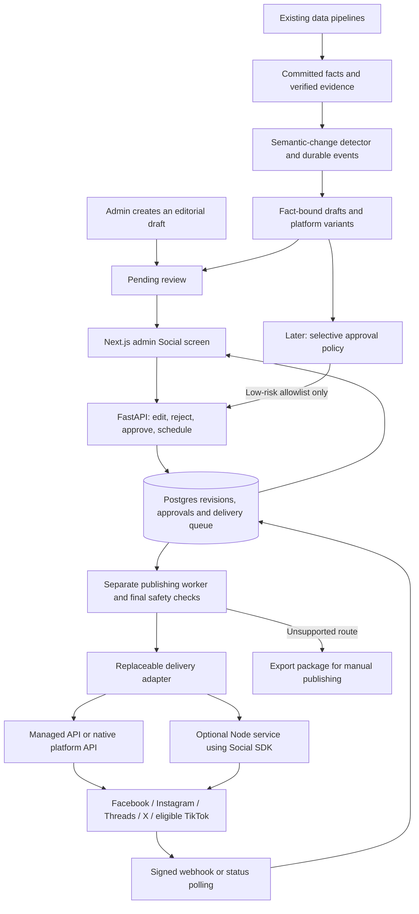

> **Historical record — 2026-10-03.** Preserved from the earlier task artifact. Read the [current engineering blueprint](../ENGINEERING_BLUEPRINT.md) and [low-cost amendment](../LOW_COST_OPERATING_PROFILE.md) before implementation. Earlier paid-provider preferences and preliminary TikTok conclusions may be superseded. Source text is retained; local links were made portable. Private browser screenshots are not copied into the repository.

# AuditGava social publishing implementation plan

Planning only, 3 October 2026. No application implementation, API account connection or publishing has been performed in this round. The existing footer PR and other workstreams are outside this plan's changes. The accompanying admin preview uses illustrative drafts and local simulated actions.

**Decision:** AuditGava can support the requested review/edit/select/schedule/publish workflow and grow toward selective automation. Social SDK can be one delivery adapter, but is not the entire system or the strongest default choice for every platform. First evaluate a managed publishing API directly from the existing Python backend, with AuditGava retaining approval, evidence, scheduling control and delivery records. Keep the delivery adapter replaceable.

**Correction to the earlier TikTok assessment:** restrictions on the standard Content Posting API do not apply identically to every TikTok API. The separate Business/Organic Accounts API documents owned-account publishing as an authorized use. Investigate that route, directly or through a suitable provider. Eligibility and unattended consent conditions remain unresolved for AuditGava; converting the consumer profile to a business profile is not itself API authorization. [Standard route](https://developers.tiktok.com/docs/en/content-sharing-guidelines), [Accounts API route](https://business-api.tiktok.com/portal/docs/accounts-api-overview/v1.3).

**Delivery choice and limitations**

| Option | Role in the proposal | Qualification |
|---|---|---|
| Zernio API | First candidate for a common publishing API from Python | Documents all five platforms and a TikTok Business route; verify actual account grants, consent, delayed processing and cost. |
| Post for Me API | Compare as the lower advertised entry-cost candidate | Approved-app connection flow includes internal tools and a separate TikTok Business option; confirm per-destination counting, X charges and webhook/result handling. |
| Social SDK | Optional server-side TypeScript adapter | No direct Facebook adapter; current package is pre-1.0; durable storage and workflow remain ours. Python backend requires a Node publishing boundary if using this library. |
| Native APIs | Additional or alternative delivery adapters | More feature control and less abstraction drift, with more app-review, OAuth, token, format and version maintenance. |
| Postiz | Ready-made social workspace or delivery backend | Cloud offers a scheduler/API. Self-hosting adds an application stack and own provider apps. Its documented review links do not enforce an approved publishing state. |

As checked today, SDK main is `a76fb612c8abd5926fbfa40c9a3f556a523531ea`; npm latest is `0.5.0`. Main's Postiz integration is absent from that npm release. Post for Me's SDK connection enum does not expose `tiktok_business`; current Zernio TikTok request documentation differs from the SDK's field nesting. These are source/documentation gaps, not live-tested failures. [SDK manifest](https://github.com/opencoredev/social-sdk/blob/a76fb612c8abd5926fbfa40c9a3f556a523531ea/packages/social-sdk/package.json), [connection helper](https://github.com/opencoredev/social-sdk/blob/a76fb612c8abd5926fbfa40c9a3f556a523531ea/packages/social-sdk/src/cloud/post-for-me.ts#L525), [Zernio mapping](https://github.com/opencoredev/social-sdk/blob/a76fb612c8abd5926fbfa40c9a3f556a523531ea/packages/social-sdk/src/cloud/zernio.ts#L410), [current TikTok provider contract](https://docs.zernio.com/platforms/tiktok).

Zernio advertises two free connected accounts and $6/month for each of the next accounts, making five posting accounts $18/month before X usage and extras. Post for Me advertises $10/month for 1,000 successful posts. Confirm current plan, counting and pass-through costs before purchase. [Zernio pricing](https://docs.zernio.com/pricing), [Post for Me pricing](https://www.postforme.dev/pricing). Postiz's approval documentation says review is conversational and has no approved flag preventing publication; our own approval gate is essential. [Postiz approval limits](https://docs.postiz.com/general/approvals).

**Platform behavior to design around**

| Platform | Expected publishing | Material limits |
|---|---|---|
| Facebook | Page text/link, images, supported video/Reels | Publish to the organization Page, not a personal profile. Native Facebook work or managed provider is needed with this SDK. |
| Instagram | Image/carousel, caption, Reels; Stories where eligible | Professional account and approved scopes; no text-only feed posts. Format validation and accessible media hosting required. |
| Threads | Text, image/carousel, video | Separate account authorization despite Instagram relationship. Format/length/quota limits apply. |
| TikTok | Photos/video through an eligible route; manual package otherwise | No text-only post. Business route and any preview/consent/scheduling conditions must be confirmed. Upload accepted is not necessarily public publication. |
| X | Text, images, video | Paid API access/usage and feature-specific limits; budget media reads and analytics as well as publishing. |

Sources for implemented SDK formats: [Instagram](https://github.com/opencoredev/social-sdk/blob/a76fb612c8abd5926fbfa40c9a3f556a523531ea/packages/social-sdk/src/platforms/instagram.ts), [Threads](https://github.com/opencoredev/social-sdk/blob/a76fb612c8abd5926fbfa40c9a3f556a523531ea/packages/social-sdk/src/platforms/threads.ts), [TikTok](https://github.com/opencoredev/social-sdk/blob/a76fb612c8abd5926fbfa40c9a3f556a523531ea/packages/social-sdk/src/platforms/tiktok.ts), [X](https://github.com/opencoredev/social-sdk/blob/a76fb612c8abd5926fbfa40c9a3f556a523531ea/packages/social-sdk/src/platforms/x.ts), [X pricing](https://docs.x.com/x-api/getting-started/pricing). None of those declarations proves the AuditGava account has granted usable API access.

Scheduling should belong to a durable AuditGava worker initially. Immediately before a scheduled dispatch, recheck approved revision, source freshness, account grants, posting caps and global/per-account pause. Vendor-side schedules are possible later, but material already accepted by a remote service may continue even after our pause; cancellation must be reconciled. Published edits and deletions are not uniform across providers or formats. Corrections need an explicit workflow, not a promised universal rollback.

**Fit with the current application**

The current application is Next.js with React Query/Axios, FastAPI, SQLAlchemy/Postgres and Supabase admin authentication. Keep FastAPI as the authority. The admin shell currently has horizontal navigation, so add a Social tab there; retain Overview, Users, Ingestion, ETL Schedule and Audit Log. Proposed routes are additive.

The social browser UI sends AuditGava-owned draft/revision/account identifiers through its existing authenticated API client. It never loads provider credentials. The API authorizes reads and writes, locks an approved revision and atomically creates delivery work. A separate worker owns dispatch and reconciliation. Platform callbacks update records, which the existing React Query pattern can poll or invalidate to refresh the dashboard.

Managed and SDK paths are alternatives where appropriate, not mandatory duplicate services. A managed HTTP API called from Python does not need a Node service. If SDK is chosen for direct adapters, Node is internal and has service authentication; policy, approval and durable records stay in FastAPI/Postgres.

**Admin experience**

- Pending review: meaningful source event, reporting period, title, content type, validation warnings and selected platforms. Reviewer opens a draft without losing the queue position.
- Review workspace: original evidence/page locator, source excerpt, units, actual/modelled/projected basis, timestamps, shared factual snapshot and platform-specific editable text/media previews. Character/format checks run for every selected destination.
- Actions: save draft, approve and publish, approve and schedule, reject with reason. Schedule uses an explicit IANA timezone, stored as UTC. Approval displays the exact accounts and media/content revision being authorized.
- Scheduled: due time, approval/version, account health, cancel/reschedule and reasons a job is held. Editing approved material invalidates approval.
- History: independent receipts, remote URLs, processing states, failure reasons, reconnect and destination-only retry. Unknown acceptance requires reconciliation.
- Accounts: intended AuditGava account/Page ID, provider route, granted scopes, expiry/health and connect/reconnect/disconnect controls. Existing consumer profile connections do not replace OAuth.
- Automation: manual default, shadow mode, allowlisted future rules, source/freshness/significance policies, cadence/budget ceilings and global/per-account emergency pause.
- Optional later: comparable engagement metrics and corrections/removal tools. Comments and DMs would be separately scoped features, not assumed part of a universal publishing API.

Do not allow consumer automatic cross-sharing plus independent API delivery to create duplicate Facebook/Instagram posts. The selected delivery route should determine one intended post per destination.

**Proposed code areas**

All paths below are planned, not newly implemented files.

| Area | Existing integration point / proposed additions | Work |
|---|---|---|
| Admin shell | `frontend/app/admin/layout.tsx`, `frontend/app/admin/page.tsx` | Add Social navigation and a small pending/connection-health entry point. Preserve existing pages. |
| Social routes | `frontend/app/admin/social/page.tsx`, `social/[postId]/page.tsx`, `social/accounts/page.tsx`, `social/settings/page.tsx` | Queue, editor, schedule/history sections, OAuth health and policies. Use shared admin shell and authorization guards. |
| UI and API client | `frontend/components/social/*`, `frontend/lib/api/social.ts`; hooks beside existing query conventions | Typed API DTOs, platform previews, evidence display, target selector, revision conflicts, mutation idempotency and background status refresh. |
| FastAPI endpoints | `backend/routers/admin_social.py`, dedicated OAuth callback and webhook routes; `backend/main.py` router registration | Authorized CRUD/review/approve/schedule/cancel/retry/account/policy operations. Browser must not directly publish. |
| Schemas and models | `backend/schemas/social.py`, social models under the existing model convention, `backend/alembic/versions/*` | Validated payloads, migrations, indexes, account/revision/delivery constraints and server-only credentials. |
| Domain services | `backend/services/social/{evidence,validation,approval,accounts,delivery,policy,content}.py` | Fact validation, immutable approvals, token lifecycle, provider normalization and audit records. |
| Durable worker | Independent social worker/scheduler with Postgres outbox and leases | Due jobs, last-minute safety checks, per-account locking, rate limits, processing continuations and bounded recovery. Do not repurpose existing ingestion schedulers. |
| Delivery | Python managed/native adapters; optionally `services/social-publisher/*` for Node/SDK | Implement capabilities, connection/validation/publish/status and supported deletion. Pin/version contract and normalize outcomes. |
| Storage and configuration | Private credential access, secret manager/encryption key, owned media storage and webhook secrets | Encrypt durable secrets or keep references, rotate credentials safely, allow only approved media assets and callback URLs. |
| Later data producers | Narrow post-commit hooks in selected ingestion domains, or an initial semantic reconciliation detector | Generate events only for committed, verified, meaningful changes; preserve source job and watermark. |
| Later graphics/video | Separate render jobs/assets, reviewed templates and scripts | Generate charts/cards and short vertical videos; no long render within API requests. |
| Operations and tests | Isolated test accounts and CI fixtures; worker monitoring | Authorization, stale approval, duplicate mutation, crash/reconcile, partial failure, webhook replay, refresh race, quota, pause and secret redaction tests. |

**API outline**

Use `/api/v1/admin/social` for admin-owned routes, with backend authorization on every operation. Proposed operations: list/get/create/update drafts; validate revision; approve/reject; schedule/cancel; list delivery/history; retry one eligible failed delivery; get policy/pause; list account health; start connection and reconnect. OAuth callbacks and signed webhook endpoints have their own narrowly defined verification contracts rather than depending on a browser session being present.

Mutations carry the expected draft revision and an idempotency key. Return a conflict if another editor changed the draft. Approval, delivery enqueue and audit event are committed in one transaction. A quick browser response returns durable delivery IDs; it does not wait synchronously for video processing.

**Database proposal**

| Record | Purpose and key data |
|---|---|
| `content_events` | Immutable source change, ingestion job, entity/period, typed facts, source/page/hash, observation/publication/detection times, unique semantic fingerprint and correction link. |
| `social_accounts` / `social_credentials` | Stable account/Page IDs, provider route, capabilities, scopes and health; separate encrypted access/refresh credentials and token revisions accessible only server-side. |
| `social_posts` | Editorial identity/type/status/current revision; optional source event for manual editorial posts. |
| `social_post_revisions` | Immutable approved facts/citations, platform variants, media references, content hash and generator/editor versions. |
| `social_approvals` | Exact revision/hash, selected accounts, actor, decision, reason, policy version and approval expiry. |
| `social_media_assets` | Storage path/hash, format, size, aspect/duration, alt text/captions, provenance and readiness. |
| `social_deliveries` | One intended revision/account/format delivery; schedule/timezone, lease/state, idempotency identity, remote IDs/permalink and last error. |
| `social_delivery_attempts` | Append-only dispatch/reconcile attempts with redacted requests/receipts and known-failed versus unknown-accepted outcomes. |
| `social_events`, outbox, webhook inbox | Atomic action history, durable work and authenticated deduplicated remote events. |

Store actors using the Supabase admin identity, not the legacy integer user ID. Use JSONB for provider-specific variants/metadata but normalized delivery rows for independent failures; one large `publish_results` object is insufficient as the authoritative queue.

Editorial state: draft, pending review, approved, rejected, cancelled. Delivery state: queued/scheduled, validating, uploading/processing, publishing, published, retry waiting, failed, needs reconnect, unknown outcome, cancelled, deleting/deleted where supported. Derive the overall partially-published label from deliveries.

SDK idempotency is not a substitute for these records: its current fingerprint includes the full target list and stored failures can replay without redispatch. One intended delivery per account plus deliberate recovery is safer. If Facebook succeeds and Instagram fails, retry only Instagram. If a publish request times out after remote acceptance might have occurred, investigate status before sending again. Exactly-once remote delivery cannot be promised without corresponding provider guarantees.

**Source safety and automation**

An ingestion job marked successful does not prove new material was found. Current writers can count rewrites of unchanged values; dry runs and fixture mode exist. Detect semantic changes after a real commit. The existing audit publication predicate does not by itself establish fetched source bytes, checksum and page evidence suitable for unattended social publishing.

The social gate should require verified publisher/document/page, explicit currency/unit/period, actual/modelled/projected basis, comparable coverage, source freshness, no quarantined facts and deterministic arithmetic. Language generation may phrase supplied facts but may not invent amounts or interpret questioned expenditure as proven loss. Existing extraction confidence is not a calibrated truth probability.

Begin manually. In shadow mode, automatic rules recommend a decision while humans still review. Measure disagreements, factual corrections, duplicate events and delivery failures. Then enable one low-risk reviewed template on one eligible platform, with a recorded policy approval and agreed caps. Initially suitable: newly verified dataset availability and reviewed educational template rotation. Audit findings, allegations, disputed sources, politically sensitive narratives, incomplete comparisons, corrections and unexpected outliers stay with a human.

Every job rechecks source freshness, approval/hash, target authorization, duplicate ledger, rate/frequency budget, media readiness and pause before dispatch. Support global and per-account pause, human override and explicit correction records. Revoked source evidence or updated facts invalidate stale approval. Platforms with consent obligations remain subject to those obligations even when AuditGava's own policy would auto-approve.

**Cross-platform content and media**

One verified event supplies common facts, source references, period, caveats and relevant AuditGava deep link. It produces different delivery content: Facebook context/link, Instagram readable card or carousel/caption, Threads a concise sourced update, X compact chart/update within its weighted text budget, TikTok an eligible photo/video explainer. The shared fact snapshot keeps every variant consistent while the previews expose each difference to the reviewer.

Short-video work is a later project: approved fact snapshot → script → charts/cards → optional voiceover → timed captions → 15–45-second vertical render → exact admin preview → approval → eligible delivery. Evaluate Remotion or a similar template renderer with FFmpeg in a separate worker. Preserve caption readability, source context, pronunciation and units; check asset rights and platform AI/music/disclosure rules. Start with deterministic cards and reviewed scripts rather than generated synthetic footage. Social SDK does not create the video.

**Implementation order and exit conditions**

1. Connection feasibility: prove intended accounts/scopes/formats and TikTok Business route, compare vendor cost/security/status semantics, choose one replaceable initial adapter. No broad integration before this proof.
2. Publishing foundation: database ledger, credentials, authorization, durable worker, per-delivery idempotency/reconciliation and pause. Verify one reviewed manual post path and processing/failure recovery.
3. Admin manual workflow: pending queue, evidence editor, platform previews, approve/reject, schedule/history and account health. Manual content works without waiting for AI generation.
4. Draft generation: detect meaningful committed changes, preserve evidence snapshots, deduplicate, generate platform variants into pending review only.
5. Selective automation: shadow evaluation, agreed accuracy thresholds, one template/platform allowlist, cadence/budget limits and audited expansion. TikTok automation separately contingent on permission and consent.
6. Graphics: fact-bound chart/card templates, accessibility, owned storage, format variants and review.
7. Video and richer analytics: separate render pipeline, exact video approval, eligible TikTok/Reels delivery and format-specific metrics. Expand inbox/moderation only as a separate authorized feature.

The first usable release should let an admin prepare and approve a sourced post, publish to verified destinations, and see trustworthy per-platform results. Accuracy, eligibility and durable recovery are prerequisites for automation; posting volume is not the success criterion.
